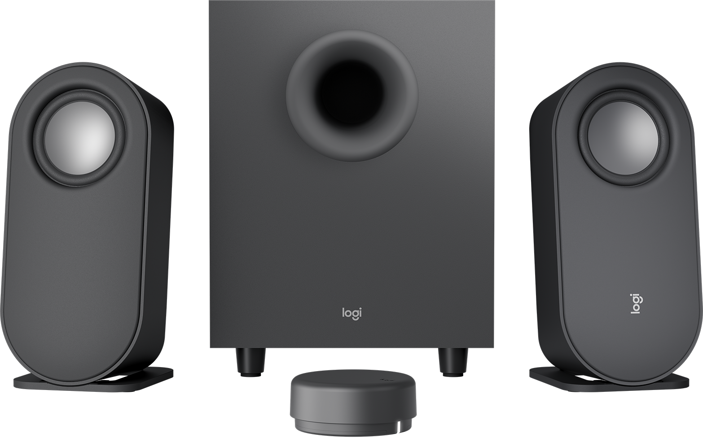

# Getting Logitech Z407 control dial working on Raspberry Pi OS

***

***

I have a pair of Logitech Z407 speakers connected to my Raspberry Pi 4 that I use to watch videos on my dumb TV at home.
The speakers come with a puck (officially called a "control dial") that controls audio volume and toggles between play and pause when clicked.

This feature works natively in VLC, but for some reason the puck doesn't do anything when watching videos in [FreeTube](https://freetubeapp.io), a privacy-focused, distraction-free YouTube player.

Luckily, FreeTube implements the [MPRIS D-Bus Interface Specification](http://specifications.freedesktop.org/mpris-spec/latest/), which means that it can be controlled with the `playerctl` utility.
To get it working on Raspberry Pi OS with `labwc`, you need to bind the `XF86AudioPlay` event to the `playerctl play-pause` command via the `~/.config/labwc/rc.xml` file:

    <keybind key="XF86AudioPlay">
        <action name="Execute">
            <command>playerctl play-pause</command>
        </action>
    </keybind>

For example, my current `rc.xml` looks like this:

    <?xml version="1.0"?>
    <openbox_config xmlns="http://openbox.org/3.4/rc">
        <theme>
            
                <name>PibotoLt</name>
                <size>18</size>
                <weight>Bold</weight>
                <slant>Normal</slant>
            
            
                <name>PibotoLt</name>
                <size>18</size>
                <weight>Bold</weight>
                <slant>Normal</slant>
            
            <name>PiXflat</name>
        </theme>
        <keyboard>
            <keybind key="XF86AudioPlay">
                <action name="Execute">
                    <command>playerctl play-pause</command>
                </action>
            </keybind>
        </keyboard>
    </openbox_config>

Adding this keybind will affect all applications that support MPRIS, which means it will also work in Chromium, Firefox, and most modern music players.
