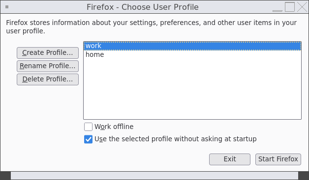

# How I use Firefox profiles in 2026

***

After 15 years of using Firefox on Linux I finally got to a point where I separated my personal browsing from my work.

***

For a long time all my extensions, bookmarks and browsing history lived in a single browser.
At some point I got tired of seeing work-related links and bookmarks every time I open a new tab during out-of-office hours.

Profile support has been in Firefox since, ehh, forever.
But considering the lack of a shiny user-friendly interface, it's still considered beta, I guess?

If you run Firefox as `firefox -P`, you will be greeted with a profile selector:



Choosing a profile will start a browser with the bookmarks, extensions and history entries that are stored for that profile.
Your start page will have all the relevant links.
Your settings will be set accordingly.

## Isn't it neat?

Not really.

Firefox doesn't track which of the profiles it currently uses.
For example, I started a browser with the work profile.
Clicking links in other applications or opening PDFs will behave inconsistently: Firefox may decide to open a new browser window with my home profile.

It's really annoying: it takes more time to start a new app instance, and I may end up in the browser where I'm logged out of the service I'm accessing.

## That's how I solved it

First, I created desktop entries in `~/.local/share/applications` for each of the profiles I use.
The profile is specified via `-P {profile name}` parameter.

Entry for the `home` profile: (`~/.local/share/applications/firefox-home.desktop`):

```
[Desktop Entry]
Version=1.0
Type=Application
Exec=firefox -P home %u
Terminal=false
X-MultipleArgs=false
Icon=firefox
StartupWMClass=firefox
Categories=GNOME;GTK;Network;WebBrowser;
MimeType=application/json;application/pdf;application/rdf+xml;application/rss+xml;application/x-xpinstall;application/xhtml+xml;application/xml;audio/flac;audio/ogg;audio/webm;image/avif;image/gif;image/jpeg;image/png;image/svg+xml;image/webp;text/html;text/xml;video/ogg;video/webm;x-scheme-handler/chrome;x-scheme-handler/http;x-scheme-handler/https;x-scheme-handler/mailto;
StartupNotify=true
Name=Firefox (Home)
```

Entry for the `work` profile (`~/.local/share/applications/firefox-work.desktop`):

```
[Desktop Entry]
Version=1.0
Type=Application
Exec=firefox -P work %u
Terminal=false
X-MultipleArgs=false
Icon=firefox
StartupWMClass=firefox
Categories=GNOME;GTK;Network;WebBrowser;
MimeType=application/json;application/pdf;application/rdf+xml;application/rss+xml;application/x-xpinstall;application/xhtml+xml;application/xml;audio/flac;audio/ogg;audio/webm;image/avif;image/gif;image/jpeg;image/png;image/svg+xml;image/webp;text/html;text/xml;video/ogg;video/webm;x-scheme-handler/chrome;x-scheme-handler/http;x-scheme-handler/https;x-scheme-handler/mailto;
StartupNotify=true
Name=Firefox (Work)
```

And then I have the following snippet of code in my system's startup script:

```
if [ $(date +%u) -lt 6 -a $(date +%H) -lt 16 ]; then
  xdg-mime default firefox-work.desktop x-scheme-handler/https
  xdg-mime default firefox-work.desktop x-scheme-handler/http
  xdg-mime default firefox-work.desktop x-scheme-handler/chrome
  xdg-mime default firefox-work.desktop application/pdf
  firefox -P work &
else
  xdg-mime default firefox-home.desktop x-scheme-handler/https
  xdg-mime default firefox-home.desktop x-scheme-handler/http
  xdg-mime default firefox-home.desktop x-scheme-handler/chrome
  xdg-mime default firefox-home.desktop application/pdf
  firefox -P home &
fi
```

During office hours (Mon-Fri, before 16:00) it assigns the `firefox-work` app to handle all link-related stuff and sets it as a default PDF reader app.
Otherwise, `firefox-home` is used.

Not sure if this is the best way to do it, but it's a setup I've been happy with for the past 6 months.
