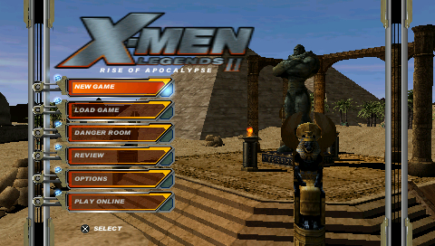
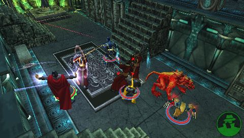
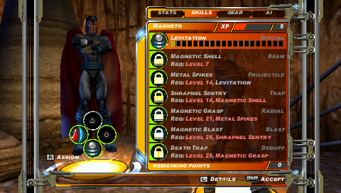
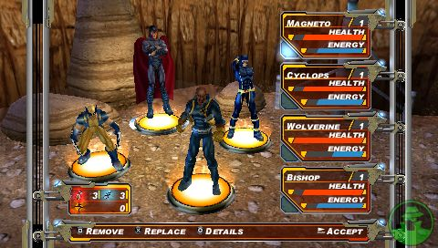
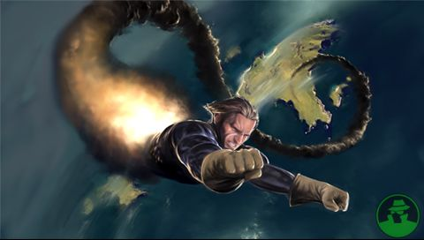

# X-Men Legends II: Rise of Apocalypse | Частное мнение

* * *
Выдалась свободная минутка, и я, решив время зря не терять, стряхнул пыль с давно лежавшей без дела PSP и запустил игру.
* * *

Признаюсь сразу: ожидал увидеть очередную «игру по фильмам» со всеми последствиями подобных рекламных продуктов: музыкой из фильмов, заставками из фильмов, малополигональными моделями, пытающимися копировать образы актеров из фильмов, дубовое управление на две кнопки и недо-сюжет, притянутый за уши, построенный на принципах «наг убивай, а потом убивай наг, поспи под грибом и дальше иди убивать наг» и «собери 10 монеток за 4 секунды».

Тем приятнее было увидеть во вступительном ролике именно Людей Х — героев серии комиксов «Marvel»: Росомаха был Росомахой, а не Хью Джекманом; Гроза — Грозой, а не Холи Бери; Профессор Ксавье — именно Чарльзом Ксавье: крепким и волевым.

И на этом сюрпризы не прекратились — отсюда подробнее, с картинками и графиками.

  
### Сюжет

Сюжет пересказывать не имеет смысла: Апокалипсис сотоварищи задумал очередное злодеяние, грозящее существованию целого мира, и перед лицом этой опасности Братство Мутантов под предводительством Магнито и Люди Х под руководством профессора Ксавье объединяются. Попутно похищенной оказалась Полярис — дочь Магнито.

Изложенное выше — по сути и есть весь сюжет. Немного банально, не так ли? Однако, от игры про супергероев и не требуется ничего иного. Злодеи есть, Добряки есть, Драма присутствует. Дальнейшие крохи сюжетной линии будут подаваться в виде «брифингов» — небольших игровых роликов, кратко описывающих суть следующей миссии.

  
### Геймплей

Большую часть игры придется провести за характерной для приставочных экшнов методичной зачисткой лабиринтов-локаций, поиском ключей, помощью неигровым персонажам и выполнению их квестов, разрушением стратегически важных объектов неприятеля, периодическим стычкам с боссами и сбором различного рода вкусностей, о которых — далее.

Для подобного (хочу отметить — весьма приятного) времяпровождения предоставляется команда из 4 персонажей, места которых могут занять любые мутанты из почти полутора десятков доступных в игре: как со стороны Людей Х, так и со стороны Братства. Единовременно игрок может управлять одним из персонажей, в то время как остальные будут послушно следовать за ним, оказывая посильную помощь в стычках с неприятелем. На заметку: искусственный интеллект сопартийцев реализован великолепно: они не мешают движению, а в бою способны постоять за себя, применяя как навыки ближнего боя, так и суперспособности.

Имеется возможность свободного переключения между персонажами в партии, и оно имеет поистине необходимый характер: в игре очень много мест, куда не попасть без способностей Шельмы к полету, Найткроулера — к телепортации, или Айсмена — к тушению огня.

В «X-Men Legends II» также присутствуют зачаточные элементы RPG: наличествует система уровней, а у персонажей имеется набор характеристик и навыков, доступных для изучения и улучшения, а так же 3 слота под экипировку: пояс, перчатки и верхняя одежда.

  
### Графика

Немного наивно было бы ожидать от портативной консоли отменной трехмерной графики, высокополигональных моделей, зрелищных эффектов и прочего сахара, присущего старшим приставочным собратьям или даже играм на ПК, но…

«X-Men Legends II» выглядит весьма достойно. Модели персонажей выполнены качественно — перенос героев двухмерных комиксов в 3D произошел без ущерба. Чувствуется внимание к деталям: вырисованы даже мельчайшие символы ⊗ на поясах Команды Х.

Анимация персонажей адекватна, движения героев полностью передают их характеры и происхождение: Росомаха движется хищно и агрессивно, Магнит величаво парит над землей, а когда я увидел Курта Вагнера (Найткроулера), передвигающегося на 4 конечностях, появилась даже какая-то гордость за разработчиков.

То, как выполнены сражения — выше всяких похвал: каждая спецспособность проработана до малейших деталей: когти Росомахи оставляют за собой в воздухе сияющие следы, Найткроулер исчезает и появляется с легким облачком черного дыма, быстро рассеивающимся в воздухе, а Шельма привычно взмывает в воздух, чтобы оттуда спикировать на противника.

  
### Дизайн уровней

Немного однообразен — даже в локациях на открытом воздухе свобода перемещения партии персонажей сильно ограничена «естественными» препятствиями. С другой стороны, практически нет откровенно тупиковых мест: у игрока будет возможность повторного посещения абсолютно каждой игровой локации, за исключением нескольких чересчур специфических.

  
### Музыка

Присутствует как фон. Иногда узнается что-то, отдаленно напоминающее музыкальное сопровождение «X-Men Animated Series», но в целом музыка свободно проходит из одного уха в другое: запоминающихся тем нет, но без бодрого фона, меняющегося от локации к локации, игра была бы скучнее.

  
### Управление

Одно из самых узких мест в играх подобного жанра… пройдено без проблем. Управление удобное. Перемещение — на стике, ближний бой — на символьных клавишах, применение спецспособностей раскидано на комбинациях «правый шифт + символьная клавиша».

Никаких монструозных аккордов вида ◯ + △ + R, ломавших мои пальцы еще в Monster Hunter Freedom Unite (всемогущие туфли из синей замши в карамельном соусе, о чем разработчики думали, делая такие дикие комбинации?!), замечено не было. После 4 часов игры не захотелось даже пойти размять запястья, что вообще бывает со мной редко.

  
### Бочка меда

Вкусность заключается в том, что игра делалась действительно для фанатов и за идею.

В «X-Men Legends II» есть множество вещей, не имеющих непосредственного отношения к происходящим событиям, но приятных поклонникам:

- Обложки оригинальных комиксов и тематический арт, находимые в игре в виде разбросанных по уровням листов бумаги;
- Сюжетные и рекламные видеоролики;
- Danger room, в котором можно _убивать наг, спать под грибом, и собирать монетки на время_ и получать за это предметы экипировки, опыт или постоянные увеличения характеристик персонажей;
- Открываемые секретные уровни;
- Playable comics — признаться, сначала этот пункт меня слегка озадачил, но позже оказалось, что это своеобразная «реконструкция» событий, происходивших в конкретном выпуске комикса. Ничего принципиально нового делать не придется — партия из адекватных конкретному комиксу персонажей забрасывается в адекватную же локацию, где стартует мини-миссия;
- Скины. Помните, я уже говорил о внимании к деталям? При смене персонажей в партии есть возможность выбрать для многих из них альтернативный внешний вид: по версии классической или ultimate-версии комиксов. Так, Найткроулер в классической версии будет одет в сине-красное трико, а в ultimate-версии сменит его на желто-синий костюм.

  
### Ложка дегтя

Куда же без этого обязательного пункта.

Первый огорчивший меня момент — медленная загрузка. Очень медленная. Переходы между локациями длятся около минуты, иногда много времени уходит даже на открытие игрового меню. Но тут может быть дело в достаточно дешевой карте памяти, которая, тем не менее, до этого в других играх показывала хорошую скорость работы.

Второе — система сложности. На «Normal» игра проходится без малейшего напряжения. Ну, тут причина очевидна: игра была рассчитана отнюдь не на великовозрастных раздолбаев, а скорее на аудиторию 12-14 лет.

  
### Вывод

Если вы не фанат вселенной Людей Х — вам, скорее всего, игра покажется простым, возможно, даже скучноватым экшном без претензий на сюжет, эпохальность и революционность. В противном случае игра наверняка оставит положительное впечатление — в конце-концов, непосредственно по Людям Х сделано не так много хороших игровых продуктов, а «X-Men Legends II» определенно относится к добротным проектам.