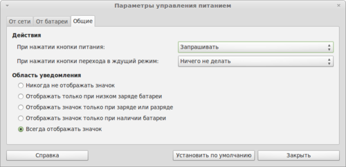

# Баг с кнопкой питания в Linux Mint 13 "Maya"

### Интродукция

_Входит Ромео_

В Linux Mint 13 в качестве одной из оболочек используется Mate — форк от GNOME2. Как следствие, стандартные компоненты GNOME2 (такие, как gnome-power-manager, gnome-settings-daemon, gnome-network-manager) оказались переименованы.

  
### Акт 1

_Входят Меркуцио и Тибальт_

Проблемы начались сразу же после установки. Настройки питания имели вид:

  

Однако, система при нажатии кнопки питания, успев на пару секунд выдать-таки запрос дальнейших действий, все равно выключалась.

  
### Акт 2

_Входит Джульетта_

Решение кроется в следующей последовательности действий:

1. Установка acpi
        
        sudo apt-get install acpi
        
2. Изменение настроек поведения кнопок питания в `/etc/acpi/powerbtn.sh`

    В данном файле необходимо найти строку

        PMS="gnome-settings-daemon kpowersave xfce4-power-manager"

    и заменить ее на
    
        PMS="mate-settings-daemon gnome-settings-daemon kpowersave xfce4-power-manager"
    
    После этого событие нажатия кнопки питания будет замечено, перехвачено и корректно обработано