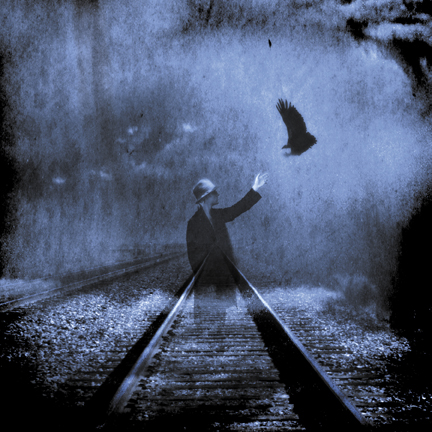
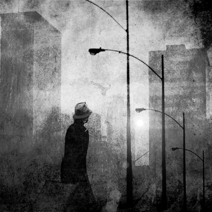
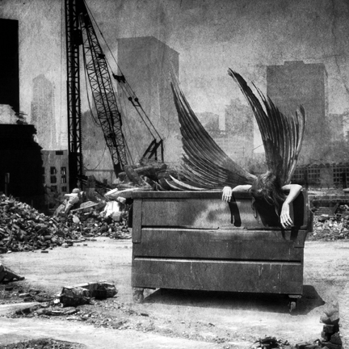
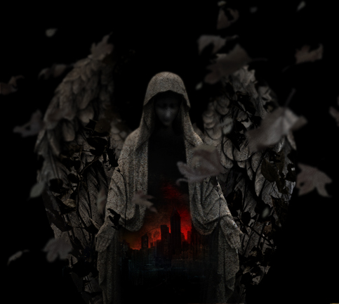

# Katatonia: Танец декабрьских душ длиной в 20 лет

На дворе стояло жаркое лето теперь уже далекого 2007 года. «Радио Максимум» успешно существовало в этом городе несколько лет и несло светлое, мудрое, вечное в умы подростков и молодежи. Под его тлетворное влияние попал и я, тогда еще учившийся в 9-м классе, в результате чего музыкальные вкусы, раньше состоявшие из зарубежного рэпчика, старого попа и русского рока в лице Виктора «Наше Все» Цоя, пополнились легкой альтернативой.

Тогда-то ко мне и попал в руки альбом The Great Cold Distance шведской группы Katatonia. Нужно отметить, попал чисто случайно, благодаря обмену «музыкальными открытиями» с когда-то очень хорошей знакомой.

С непривычки музыка показалось некрасивой, однообразной, композиции — неаккуратно сложенными, а лирика и вокал слишком унылыми. Романтичный вьюноша с восторженно горящими глазами словил заряд чего-то незнакомого, непривычного и испытал резкое чувство отторжения.

Однако, в 2007 году с интернетами было тяжко, а репертуар «Максимума» приелся достаточно быстро. Ничего не оставалось, как вооружиться словарем, наушниками и сесть переслушивать The Great Cold Distance раз за разом. Буквально двух прослушиваний хватило для того, чтобы понять: вот он — целый новый мир, неизведанное ранее сокровище «тяжелой» музыки.

Действуя всеми правдами и неправдами, я нашел официальную дискографию; различные бутлеги и демо собирались буквально всем миром, и где-то через месяц у меня уже было все творчество Katatonia на тот момент. Первые альбомы датировались аж 1992 годом, что вызвало у зеленого неофита своеобразный шок — обалдеть, как давно они играют. Но теперь я точно буду **«тру»**, я прослушаю их с самого начала.

Это был альбом Dance of December Souls. Протяжные, медленные партии (только через год я узнаю, что это называется «дум»), эпические длинные запилы, треки по 10-20 минут, резкие смены ритма, рычаще-ревущий вокал, непонятные тексты — старые альбомы казались невероятно однообразными, скучными и уродливыми. Я бы так и забросил альбомы, вышедшие до Discouraged Ones, если бы не два трека: Without God и Velvet Thorns of Drynwhyl.

Первая композиция чертовски понравилась из-за своего ультимативного лозунга: God is dead and shall forever be! Да и как не понравиться, когда «Антихрист» Ницше тогда был чуть ли не настольной книгой.

Вторая обладала непередаваемой зимней атмосферой, эпичностью скандинавских сказаний. Столь мрачного произведения я не слышал никогда. Очень насыщенный образами текст повествовал о путешествии, вечном мучении, смерти, падших ангелах и прочей невероятно восхитительной ерунде. Я и сегодня без ума от этого трека, поэтому не удержусь и приведу его текст:

> Ten strings of darkness on a violin sad  
> I watch the mountains where the frost begins  
> The northern storm is guiding me  
> To the frost  
> Silently the night birds fly  
> Their last scream my eternal dirge  
> Under the full moon a funeral  
> In the forest  
> Still I walk with open wounds but the third is now rising  
> Through the ashes of a dying love a new soul is born  
> I watch the feathers like snow in the winter  
> The angels that fell, so splended to rape  
> Tall are the shadows that dance before me as they  
> Show the way to the dawn  
> An autumn forest that never reach  
> Condemned to sorrow  
> Chasing the wind / Like a spirit fly  
> Through the autumn trees / Towards the sky  
> Hoofs are pouding / In the clouds above  
> The chariot of sorrow / Watch me die  
> Hear the violin / So sad and blackened  
> Like a breeze / The songs of Drynhwyl  
> Chasing the wind / Like my spirit die  
> Dreaming of the queen / The queen of roses  
> Now they die, pure sorrow flow  
> My souls funeral, too close to the end  
> Now they die, purest blood pours  
> Forever die, but I must…  
> I must die  
> Through the sky  
> And the forest  
> Follow the wind, go north my child  
> To the purest of winters  
> Go to the forest that never ends  
> There you’ll find your fate  
> And to the north I rode, on the coldest of winds  
> I watched the mountains where the frost begun  
> Where no angels ever dared to tread  
> Where death is all mine

Так, через постоянное переслушивание я открыл для себя еще один целый новый мир в этот раз действительно тяжелой музыки — от альбома к альбому музыка становилась быстрее, а вокал грубее и жестче (слово «дэт» я тоже узнал немного позже).

Время шло, прослушивание Katatonia не прекращалось, и когда в 2009 году у меня появился бас, неудивительно, что первыми композициями, которые я сыграл, стали I Break и Without God.

Любая новость, связанная с группой, замечалась и обсуждалась.  
Любой новый сингл немедленно находился и слушался.  
Любой концерт просматривался.

Нужно отметить, что в Katatonia привлекала не только музыка. Огромное удовольствие приносило художественное оформление обложек и буклетов дисков — работы Тревиса Смита, мрачные, однотонные, «тягучие», будто застывшие во времени и пространстве, вызывали чувство настоящего восхищения. Пожалуй, те два альбома, что пылятся сейчас на моей полке с дисками — именно заслуга мистера Смита. Если бы не столь впечатляющие обложки, я и дальше довольствовался бы оцифрованными версиями. Вот несколько моих любимых работ Тревиса Смита для Katatonia:

Другие работы Смита доступны на его сайте: <http://www.seempieces.com/GalleryFrameset.html>

  
Однако, праздник не мог продолжаться вечно. Пришел 2009 год и Katatonia выпустила альбом Night is the New Day, которого я ждал с таким нетерпением почти полгода. Сказать, что альбом меня разочаровал, означало ничего не сказать. Я никогда не испытывал столь жуткого отвращения. Альбом вышел мягким, легким, слишком «сопливым» даже для новой Katatonia.

В этот момент я понял, что мир, мягко говоря, уже не торт, и никогда не станет прежним. Альбом был отложен далеко и с тех пор слушался всего 2 или 3 раза — нет, он по-прежнему мне не по нраву.

Более того, Тревис Смит отошел от уже сложившегося «стандарта» обложек для Katatonia и на диске красовалось нечто, не вызывающее никакого восхищения:

Когда спустя пару недель я узнал, что братья Норрманы уходят из группы, я подумал, что группе пришел конец. Так Katatonia пропала из моего поля зрения на целых три года.

И буквально месяц назад меня спросили, как мне новый альбом Katatonia, Dead End Kings. Невероятно! — подумал я. — Они еще живы? Ну ничего себе. Так или иначе, терять было нечего и я приступил к прослушиванию.

И знаете, что? Альбом мне понравился.

Это определенно не уровень Viva Emptiness и The Great Cold Distance. Это даже не первые «легкие» альбомы и синглы. Тем не менее, альбом хорош. В нем есть все то, что было и в Night is the New Day. Композиции с Dead End Kings мелодичны и мягки, но в них нет той приторности и слащавости, которой просто истекал предпоследний альбом. Да и уход братьев из группы не слишком сказался на Katatonia.

  
И сейчас, дописав эти строки, я знаю, чем займусь. Я выключу компьютер, поставлю в плеер диск The Great Cold Distance и как и 5 лет назад буду получать удовольствие от музыки, с самого первого трека — Leaders и вплоть до меланхоличного закрывающего Journey Through Pressure.