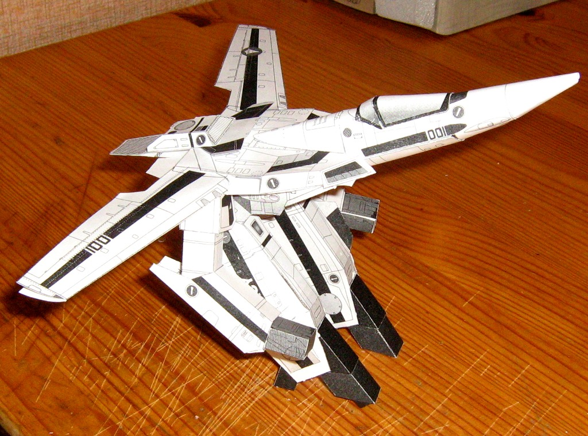

# Бумажная Valkyrie VF-1S

* * *
Собрал тут на досуге бумажную модель истребителя Valkyrie VF-1S в Gerwalk-форме из сериала Super Dimension Fortress Macross.
* * *

На сборку ушло 2 дня.

**Примечание:** плотность принтерной бумаги низковата, модель лучше собирать из чего-нибудь более плотного, например, листа А3. В частности, опоры вышли слишком гибкими и в результате хромает баланс — следует опустить нос модели намного ниже, чтобы Валькирия не валилась назад.

В целом, модель достаточно простая: если выбрать подходящий материал, немного доработать оригинальную схему и делать все в правильном порядке, получится очень годно.

Для всех желающих повторить, привожу оригинальную схему: [VF-1S.pdf](./bin/VF-1S.pdf)