# «Феникс-2013»

* * *
В этот раз фестиваль, который я посещаю ежегодно с 2011 года, прошел с особым размахом, оставив неописуемо приятное чувство.
* * *

  
### Статус мероприятия

Фестиваль продолжает играть роль инструмента международного и межкультурного сотрудничества — уже во второй раз его посещает представитель Японии, в этот раз — заместитель посла Кейдзи Идэ. Также были замечены делегаты из Турции и Ирана — Казань идет в направлении культурного сближения с этими государствами, поэтому их присутствие вполне объяснимо. Господин Идэ прочитал длинную речь, из которой можно было понять, что он весьма польщен развивающейся традицией проведения масштабных фестивалей японской культуры.

  
### Организационная сторона

Нужно отметить, что в этот раз организаторам фестиваля удалось сделать все возможное, чтобы фестиваль прошел отлично.

Во-первых, фестиваль начался вовремя, что вообще редкость для мероприятий подобного рода.

Во-вторых, без факапов. Отсутствующие номера вытеснялись следующими по программе, и ситуации, когда зал сидел в неведении, будет ли следующий номер, или нет, не сложилось. Проблем с аудиоматериалами и видеофонами также не было.

В-третьих, в кои-то веки на «Фениксе» была хорошая и качественная работа со светом. Я слышал недовольные отзывы мимо проходящих фотографов, но, сидя в зале и наблюдая за сценой, я видел все необходимое.

В-четвертых, ведущие научились читать японские названия почти без запинок. Большой успех. Один из ведущих, заменивший привычного по прошлым годам весельчака и балагура, оказался лютым петросяном, но, должен признать, под конец у него даже получилось несколько раз хорошо пошутить. Аж три раза.

В-пятых: курилка была вынесена подальше от туалета и по первому этажу ДК можно было перемещаться без респиратора.

Ну, и куда же без минусов: плохой звук. Видимо, в этот раз звукач заменял осветителя, поэтому и был неплохой свет, но не было хорошо вытянутого звука.

  
### Сцена

«Феникс-2013» запомнится мне как фестиваль с самыми масштабными, продуманными и технически сильными номерами.

В частности, косплей-бенд с номером по JRPG «Dissidia» показали захватывающую экшн-сцену «с перекатами и укрытиями». Экспрессия зашкаливала, боевые действия были поставлены очень живо и яростно. Получил настоящее удовольствие от номера, как такого, а не от сеттинга, как это бывает обычно.

Ребята, делавшие номер про «пустынного демона» Сунабозу, показали вообще высший класс в плане актерской постановки и работы с декорациями. Несколько курого (рабочие сцены, одетые в чёрное и считающиеся «невидимыми») разбрасывали в моменты стрельбы куски пенопласта и тряпки, изображающие отлетающие частицы и поддерживали актеров во время различных трюковых сцен. В этом же номере была показана классная работа с костюмами, бутафорским оружием, декорациями различных сюжетных локаций, видеовставками и звуком. Однозначно, самый технически продвинутый номер за 3 фестивальных года.

Отголоски «Феникса-2012» докатились до нас в виде нескольких эпичных косплеев с крыльями, а суровые брутальные будни вылились в групповое дефиле аж по «Warhammer 40.000».

В этот раз, кстати, многие неанимешные номера были получше тематических: появление полудесятка косплееров в образах нежити из «World of Warcraft» вызвало в зале бурные овации, а выступающие, делавшие номер по «Wakfu» здорово подняли настроение своим танцем.

В последнем блоке под названием «Большая игра» было показано несколько номеров, не имеющих никакого отношения к аниме, как таковому. Оттуда запомнилось абсолютно бешеное выступление команды из Ижевска по мультсериалу «Adventure Time». Классные костюмы, забавные песни, построк, время приключений! Ребята сумели передать атмосферу сериала на все 100%.

Также отличились «Важен Дан», сделав уже во второй раз номер по мотивам «My Little Pony», полностью поправ все принципы оригинального мультфильма. За что им огромное спасибо, плюсик в карму, плюшку с полки и медаль на шею. В этот раз в своей работе они использовали весьма продолжительный и достаточно качественный видеоряд — чувствуется, что номер готовился не на коленке. **РАЗРУШАТЬ! УБИВАТЬ! УНИЧТОЖАТЬ! КАААААЙФ!**

О! Огромный плюс. Не было ни сценок, ни косплея по «Темному дворецкому», исполненных яойных пассажей и обмусоливания Греля и/или Гробовщика. Единственное выступление было максимально зажатым и строгим. Пустышка этого сериала была высосана в прошлые годы, и я этому несказанно ряд.

  
### Тем временем, в зале…

Пока бродил по ДК, видел множество костюмов, которые были куда оригинальнее, интереснее или просто сложнее, чем номера на сцене. Так, например, колдуны из «Magica» регулярно мелькали то там, то тут, вызывая всякий раз улыбку. Вот их бы я хотел видеть на сцене вместо очередной гендерно-дизориентированной версии «One Piece».

  
### Караоке

В этот раз — очень вяло. Его было просто мало. Эд-сан снова озвучил свою версию опенинга к «Юной революционерке Утене», выбив из меня скупую слезу, милейшие девочки из хора милейшим образом спели главную тему «Моего соседа Тоторо», пустив лучи умиления по всему залу, а под конец, в блоке «Большой игры», была исполнена авторская версия пиратской песни из аниме «One Piece» — исполнена, хочу заметить, очень и очень качественно. Я не являюсь поклонником данного аниме, но был восхищен звонким и чистым голосом исполнительницы и качественным, стилистически выверенным авторским переводом.

  
### Кавер-денс

Нет, я все еще не понимаю, почему кей-поперш пускают выступать на аниме-фестивалях.

  
### Дедпул!

Как и в 2011 году, на сцене, точнее, за ее кулисами, присутствовал Дедпул, выходя в перерывах между номерами или же вовсе присоединяясь к откровенно комедийным номерам выступающих. И снова, каждое его появление было весьма живым. Благодаря ему, было разрешено несколько натянутых моментов. Я продолжаю оставаться в неведении, кто кроется под маской этого весельчака в красном, но считаю, что он достоин того, чтобы считаться уже своеобразным маскотом «Феникса».

  
### Ярмарка

Ассортимент прошлых лет — печально, все те же знакомые лица — радует. Затишье на рынке манги сказывается: никаких новинок в продаже почти не обнаружено. Ожидаемые манга-пираты, увы, не приехали, а потому неофициальных изданий в продаже не было.

Миниатюры, бывшие в продаже, по большей части были представлены вечной классикой по франшизам-гигантам «Evangelion», «Меланхолия Харухи Судзумии», «One Piece» и другим. Было несколько вещей по «Steins; Gate», но от покупки воздержался — слишком большой формат фигурок делал покупку весьма спорной.

Снова на фестивале присутствовал ролевой магазин, в этот раз выставив на прилавки просто невероятное количество настольных игр — и на третьем этаже, как обычно, засели настольщики, обкатывая свежие приобретения.

  
### Заключение

«Феникс-2013» стал самым ярким и позитивным событием с начала года. Вернулся домой с фестиваля отдохнувшим физически и морально. Большое спасибо организаторам и участникам!

  
### Фото

Ну и наконец — несколько фото, сделанных в ходе фестиваля.

[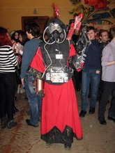](./img/img_0371.jpg)
[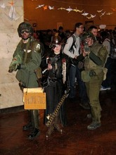](./img/img_0372.jpg)
[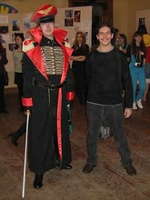](./img/img_0373.jpg)
[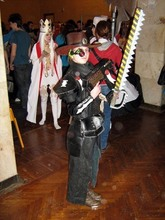](./img/img_0374.jpg)

[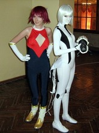](./img/img_0471.jpg)
[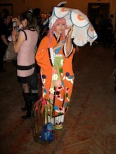](./img/img_0480.jpg)

[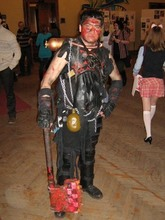](./img/img_0483.jpg)

[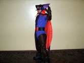](./img/img_0472.jpg)
[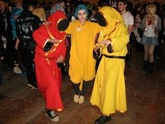](./img/img_0479.jpg)

[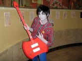](./img/img_0487.jpg)

[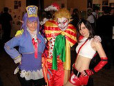](./img/img_0482.jpg)
[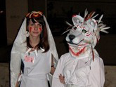](./img/img_0489.jpg)
[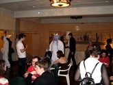](./img/img_0490.jpg)
