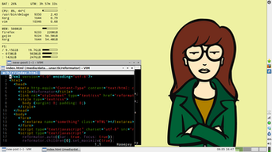
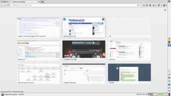

# Переезд с Mate на Openbox

* * *

* * *

В течение целого года в качестве DE использовал Mate. С недавнего времени, наблюдая за экспериментами моего доброго товарища [Гончарова Глеба](http://gongled.ru/all/how-i-met-awesome-wm/), тоже решил переехать на нечто более легковесное.

В качестве альтернативы был выбран Openbox по ряду причин:

- малый размер и незахламленность лишними зависимостями;
- долгое время существования данной DE, как следствие — стабильность;
- множество готовых инструкций по настройке всего и вся;
- простота настройки: все в одном конфиге;

Вдобавок ко всему, я уже имел дело с Openbox, когда работал с Crunchbang Linux и со средой окружения LXDE, и впечатление о нем сложилось положительное.

Возможных проблем при переходе также было множество, благо большая часть из них касалась исключительно визуальной стороны Openbox:

- графическая убогость: ужасные темы GTK и кошмарные стандартные иконки;
- отсутствие настройки сглаживания шрифтов через GUI;
- отсутствие утилиты для настройки клавиатурных сочетаний;
- отсутствие менеджера автозапуска приложений;

Да что уж там, в голом Openbox даже панелей инструментов нет.

В ходе переезда все эти проблемы решились в полной мере:

- mate-panel с ее апплетами сменилась на lxpanel;
- на место mate-terminal пришел rxvt-unicode;
- SpaceFM (форк от pcmanfm) окончательно вписался в окружение, полностью вытеснив Caja/Nautilus;
- scrot для снятия скриншотов оказался даже быстрее и удобнее mate-screenshot;
- за установку обоев на рабочем столе отныне отвечает feh;
- автозапуск прописан в autostart.sh в стандартной папке настройки ~/.config/openbox;
- клавиатурные сочетания настроены через rc.xml в той же папке;
- уродливые иконки и элементы управления были «вылечены» пакетом lxappearance — он позволяет использовать установленные в системе GTK’шные компоненты;
- на основе имеющейся в составе Openbox темы окон Clearlooks была создана новая, похожая на ту, что я использовал в Mate, но без скруглений и градиентных заливок (раздражали они меня). Благо создание темы элементарно, все сводится к редактированию текстового файла themerc в соответствующем каталоге в /usr/share/themes. Желающие, к слову, могут скачать и установить ее в Openbox из указанного архива: [Clearlooks-Grey.obt](http://files.torunar.tk/soft/Clearlooks-Grey.obt)
- сглаживание шрифтов было настроено в файле ~/.Xdefaults;
- привычная со времен Gnome2 цветовая схема Tango была перенесена в urxvt через тот же файл. Примерно так:

        ! Сглаживание
        Xft.dpi:          96.5
        Xft.antialias:    true
        Xft.rgba:         rgb
        Xft.hinting:      true
        Xft.hintstyle:    hintslight
            
        ! Цвета
        ! color0          BLACK
        URxvt*color0:     #000000
        ! color1          red
        URxvt*color1:     #CC0000
        ! color2          green
        URxvt*color2:     #4E9A06
        ! color3          yellow
        URxvt*color3:     #C4A000
        ! color4          blue
        URxvt*color4:     #3465A4
        ! color5          purple
        URxvt*color5:     #75507B
        ! color6          cyan
        URxvt*color6:     #06989A
        ! color7          white
        URxvt*color7:     #D3D7CF
        ! color8          darkgray
        URxvt*color8:     #555753
        ! color9          red
        URxvt*color9:     #EF2929
        ! color10         green
        URxvt*color10:    #8AE234
        ! color11         yellow
        URxvt*color11:    #FCE94F
        ! color12         blue
        URxvt*color12:    #729FCF
        ! color13         purple
        URxvt*color13:    #AD7FA8
        ! color14         cyan
        URxvt*color14:    #34E2E2
        ! color15         lightgray
        URxvt*color15:    #EEEEEC
            
        URxvt*background: Black
        URxvt*foreground: White
        URxvt*saveLines:  5000
        URxvt*scrollBar:  false
        URxvt*font:       xft:Monospace:pixelsize=16
        URxvt*boldFont:   xft:Monospace:bold:pixelsize=16
                
        ! Исправляет неработающие в vim Ctrl+стрелка комбинации
        URxvt.keysym.M-Up:      \033[1;3A
        URxvt.keysym.M-Down:    \033[1;3B
        URxvt.keysym.M-Right:   \033[1;3C
        URxvt.keysym.M-Left:    \033[1;3D
        URxvt.keysym.M-Prior:   \033[5;3~
        URxvt.keysym.M-Next:    \033[6;3~
        URxvt.keysym.M-End:     \033[1;3F
        URxvt.keysym.M-Home:    \033[1;3H
                
        URxvt.keysym.C-Up:      \033[1;5A
        URxvt.keysym.C-Down:    \033[1;5B
        URxvt.keysym.C-Right:   \033[1;5C
        URxvt.keysym.C-Left:    \033[1;5D
        URxvt.keysym.C-Prior:   \033[5;5~
        URxvt.keysym.C-Next:    \033[6;5~
        URxvt.keysym.C-End:     \033[1;5F
        URxvt.keysym.C-Home:    \033[1;5H

Как оказалось, Openbox, выступая средством декорации окон, умеет автоматически эти окна размещать, масштабировать, назначать и убирать рамки и разворачивать во весь экран.

Принимая это во внимание, назначил приложения на запуск на определенных рабочих столах с нужными параметрами (у Firefox, например, отключил декорацию, получив +26px к рабочему пространству по вертикали).

Не обошлось и без маленьких неприятностей:

- Отсутствовало меню действий при выключении ПК (спящий режим, перезагрузка, выключение). Решено сборкой из исходных кодов и настройкой под себя пакета obshutdown. Возможно, вам повезет, и он уже есть в ваших репозиториях.
- Openbox умеет подхватывать Debian’овское меню, но формирует его иначе, нежели Mate. Поэтому в меню появились лишние категории, а многие приложения были продублированы. Не желая ставить дополнительные пакеты, просто отредактировал соответствующие desktop-файлы в /usr/share/applications.
- Стандартный апплет раскладок lxpanel все-таки облажался. Он тупо не влезал в панель. Ни в формате флага, ни текстом. Пришлось убрать его, заменив на легко настраиваемый xxkb, знакомый еще со времен xfce.
- Openbox, как выяснилось, умеет стандартный для многих других DE механизм автозапуска через папку ~/.config/autorun. В результате все ранее назначенные приложения, в том числе служебные программы Mate, запускались при старте системы. rm -rf наше все.

С переездом на Openbox основные пакеты Mate были удалены, однако, в силу собственных предпочтений я оставил ряд привычных и более удобных пакетов. Благо, <strike>брат жив</strike> глобальных зависимостей у этих пакетов никаких:

- network-manager-gnome. Я так и не смог переехать на wicd. Network Manager просто удобнее и приятнее.
- mdm. Оставил ради красивого и простого экрана входа в систему, не буду скрывать.

Переезд и настройка Openbox с нуля заняли суммарно около 5-6 часов. На настройку Mate в свое время у меня ушло куда больше. К слову, потребление ЦП в режиме простоя упало с 8% до 3%, а вместо прежних почти 400 мегабайт ОЗУ система в голом виде со всеми сервисами, висящими в фоне, занимает всего 250.

Что касается интерфейса, то сейчас он полностью копирует Mate’овские настройки и выглядит так:

В общем, не так страшен Openbox, как о нем рассказывают. Немного терпения и знание компонентов решают.