# «Риддик»: мысли и впечатления

* * *

Сегодня выбрались с товарищами на новый фильм о Риддике. Скажу сразу: фильм мне пришелся по нраву — и я надеюсь, что многие поддержат меня в моем мнении. Поэтому, дабы не портить удовольствие от просмотра тем, кто еще не видел новую работу Вина Дизеля, постараюсь воздержаться в заметке от спойлеров.
* * *

  
### Pitch Riddick

Собираясь в кино, я ожидал увидеть новую часть «Хроник Риддика» или относительно серый их сиквел. Однако, Риддик — это Риддик, а значит, стоило сходить хотя бы ради удовлетворения собственного фанатского интереса. К великому моему удивлению, авторы решили не делать прямое продолжение и особо развивать сюжет «Хроник Риддика», самой известной работы этой франшизы, а напротив, уделили внимание незаслуженно забытому фильму «Pitch Black» (в надмозговом русском прокате он обозван «Черной Дырой»), с которого, собственно, начиналась киноистория безжалостного лысого убийцы.

Новый «Риддик» полон заимствований из «Кромешной тьмы» — как ситуационно, так и визуально.

В обоих фильмах присутствует концепция людей в замкнутом пространстве, неизбежно приближающейся опасности и Риддика, стремительно сокращающего численность населения на и так не слишком людной территории.

В обоих случаях Риддик играет роль бесшумного убийцы, кружащего вокруг лагеря неприятеля и ведущего партизанскую войну. Похищения, диверсии, ловушки, внезапные послания — мы видели это в первом фильме, где Риддик наносил скрытные удары экипажу транспортного судна, мы видим это и в новой работе, где его противниками выступают два отряда наемников, явившиеся на незаселенную планету по его душу.

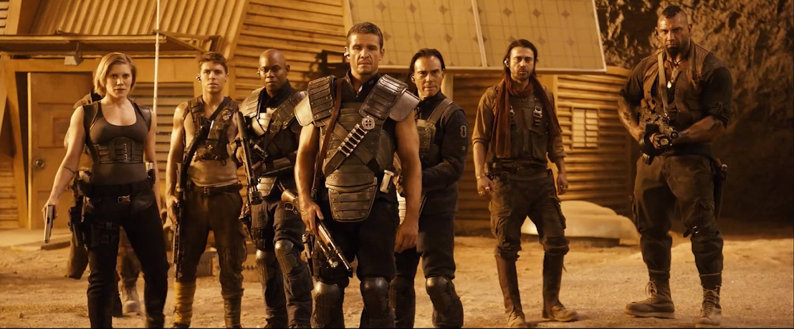

В обоих фильмах предлагается одна и та же концепция противостояния: есть Риддик, есть враги, но и враги эти делятся на «хороших» и «плохих». И к чему убивать их самостоятельно, если они и так замечательно перегрызут друг другу глотки?

И что самое главное, и в «Pitch Black», и в «Риддике» мы видим компромисс между животным стремлением Ричарда Риддика к уничтожению и необходимостью идти на сотрудничество с неприятелем ради собственного выживания.

Однако, в новом фильме нам дается шанс увидеть Риддика с новой стороны — Риддика, идущего на сотрудничество не только и не столько ради собственного выживания. Введение в фильм «домашнего животного», если так можно назвать гигантского пса, следующего за главным героем — это своеобразная попытка показать, что даже расчетливому и методичному убийце не чуждо ничто человеческое. Сцены с псом вышли весьма умилительными и трогательными, если в фильме о Риддике вообще может быть хоть что-то, не звенящее сталью.

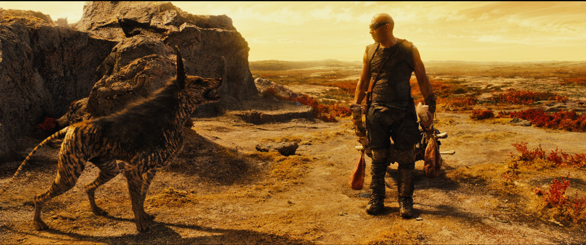

  
### Графическая сторона

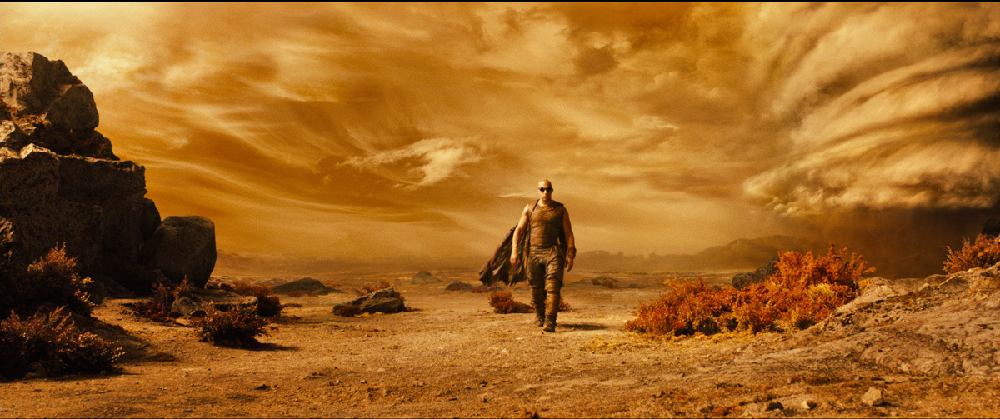

Визуально фильм очень крут. Одни декорации чего только стоят: кислотно-контрастная пустыня, поросшая бурой травой, отвесные скалы, тигровые собаки, донельзя странные двуногие ядовитые твари, живущие в грязевых ямах и уничтожающие другие виды.

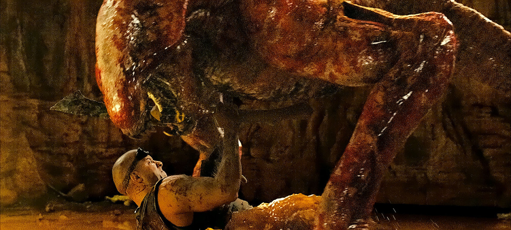

Не спорю, почти все это уже было в «Pitch Black», но здесь, будучи приправленным изрядной долей компьютерных спецэффектов, смотрится намного объемнее и солиднее. Нет былого чувства закрытости и замкнутости — планета наконец-то воспринимается в полном объеме, приходит осознание масштаба событий, разворачивающихся в сценах фильма. Однако, наступает час «Х» — и планета преображается: из огромной и необъятной, она становится крохотной и темной, настоящим логовом смертельно опасных тварей — и через эту тьму героям предстоит прорываться. Этот переход происходит настолько быстро, что его не успевают осознать и хоть как-то подготовиться даже герои фильма.

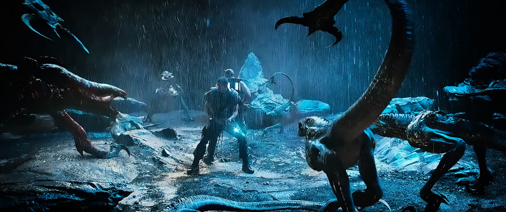

Не менее приятно, что при таких впечатляющих декорациях планеты создатели ответственно отнеслись и к облику героев киноленты: одеяния наемников, их вооружение, одежда и аксессуары самого Риддика — все проработано с замечательной детализацией, на героев смотреть действительно интересно.

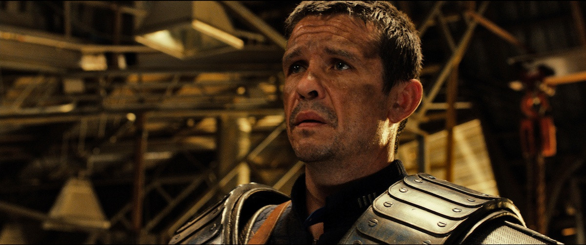

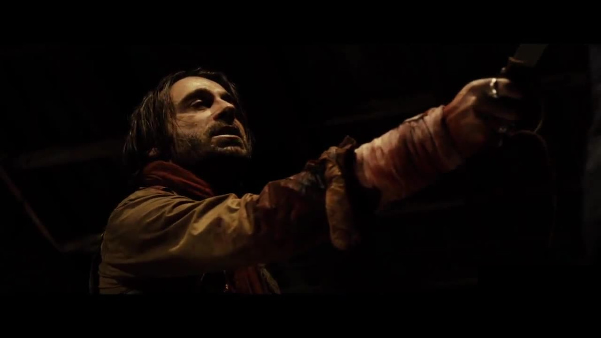

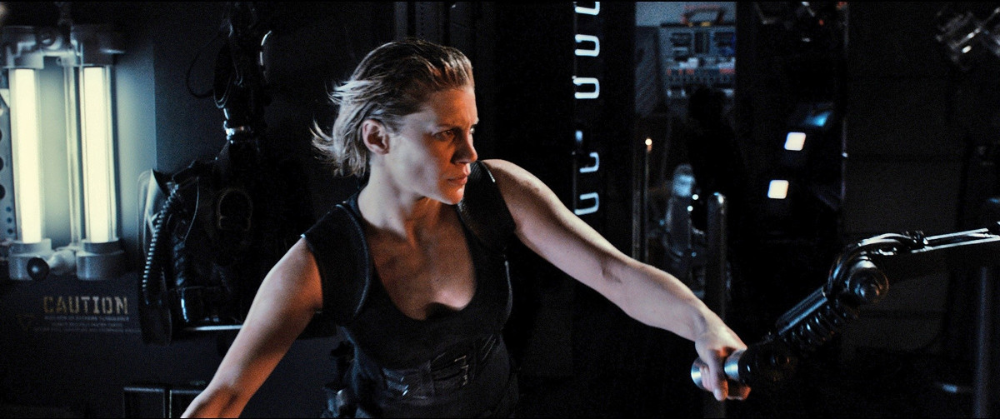

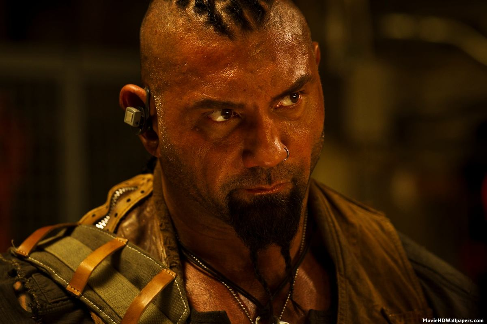

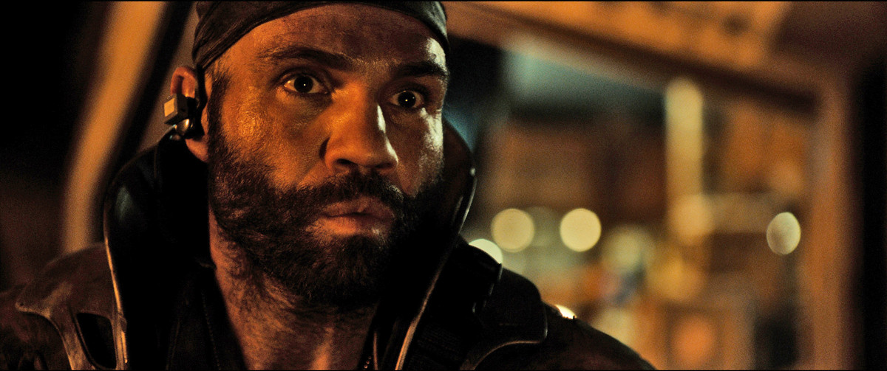

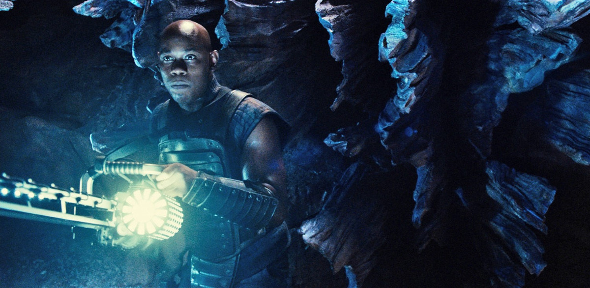

  
### Краткий итог

Если вы видели «Pitch Black», и он вам понравился — несомненно, есть смысл сходить на новую работу.

С другой стороны, если вы уже видели «Pitch Black» — стоит ли вам ходить на него еще раз?

Если первая часть трилогии прошла в свое время мимо вас, учтите, что сюжет фильма «Риддик» сильнее связан с ней, нежели с продолжением — «Хрониками Риддика», поэтому потратить несколько часов на просмотр «Кромешной тьмы» все-таки рекомендуется.

Все же, на мой взгляд, «Риддик» вышел неплохим фильмом — и замечательным почти-ремейком «Кромешной тьмы».