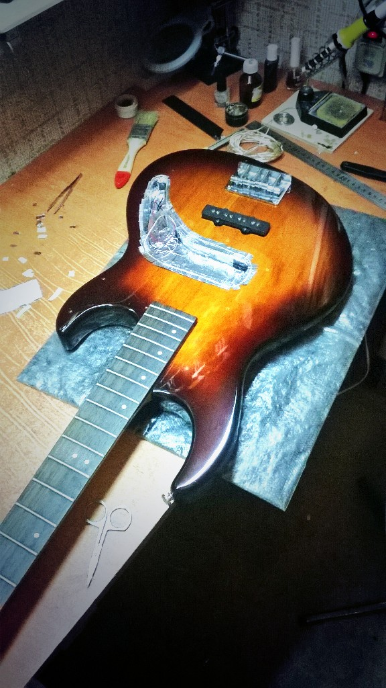

# Экран для баса

* * *
Устав слушать надоедливое жужжание, решил все-таки сделать себе экран на басу.
* * *

Из-за омской формы полости под звучок и крутилки вариант простой коробочки из латунной пластины отпал, пришлось извращаться с фольгой. Когда проклеил полость, понял, что на оклеивание накладки фольги уже не хватит. Приклеив напоследок серебряный шнур по периметру, сворачиваю работу на неопределенный срок.

