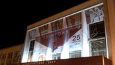
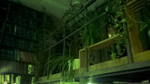
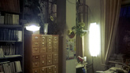
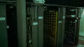
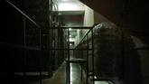
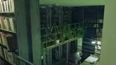
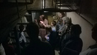
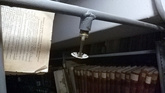
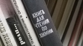
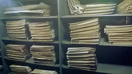

# «Антигона» в Драматическом театре и «Ночь библиотек» в Дворце книги

* * *
Выходные, насыщенные непривычным для меня количеством событий, позади, да и первый рабочий день тоже закончен. Значит, самое время завалиться на диван и, превозмогая особо острое весеннее обострение лени, все-таки написать небольшую заметку о делах дней минувших.
* * *

Пятница. Пятница. Пятница ознаменовалась сразу двумя событиями: нашим с Мари походом в Драматический театр на «Антигону» Софокла и Ночью библиотек, с которой оказались связаны сразу несколько мероприятий.

Перед походом в театр заскочили в «Читай-Город», в котором как раз началась распродажа, и жадные до скидок в 30% личности (и мы в том числе) наводнили магазин, выстроившись очередью во всю его длину. Перехватив по паре книг, заняли места и стали ждать. Бабушки и тетушки брали в основном дамские романы и книги по эзотерике. Набегающие школьники покупали пособия к ЕГЭ. Хмурые молчаливые юноши брали фантастику и фентези. Очередь потихоньку двигалась.

Самая востребованная у современной молодежи книга Рэя Бредбери, кстати, называется «Что-то там по Фаренгейту» или «Сколько-то там по Фаренгейту». Замечено Мари, подтверждено походом в книжный. Кстати, когда Бредбери снова стал популярен у школьниц? Неужто смерть идет на пользу популярности не только поп-звезд, но и писателей?

Покинув с покупками магазин, двинулись в Драмтеатр.

Спектакль был, ну… неплох. Реально, сказать больше нечего, не проникся я как-то. Ну да, экспрессия, ну да драма, ну да, актеры и костюмы. Но как-то мелочно все, нет масштабности. Будто за беседой людей за столом пронаблюдал. Беседой, которую было чертовски хреново слышно. Пацаны, берите билеты в партер, балконы — не для бояр.

Покинув театр, двинулись в сторону Дворца Книги, намереваясь заскочить на букинистическую распродажу, пройтись с экскурсией по книгохранилищу и отправиться домой.

В библиотеке было по-уютному пустовато. Было немало молодежи, но основная часть посетителей, все-таки — люди средних лет с детьми.

На стендах со списанной литературой действительно удалось перехватить кое-что стоящее — я наконец-то заимел в домашнюю коллекцию сборник Лорки.

После поторчав с несчастными лицами у дверей книгохранилища, таки были туда допущены доброй тетушкой, которая провела нас мимо десятков стеллажей с книгами, примкнув к текущей экскурсионной группе.

Ну а дальше началась чистая магия.

Нас провели по всем уровням книгохранилища, мы были и в отделении редких изданий, и на раритетные издания посмотреть довелось, и даже в удаленный уголок с периодикой заглянули. Сознание расширилось неимоверно, уходить не хотелось вовсе. А какой там запах! Подумал даже, что хотел бы устроиться в библиотеку чисто ради возможности бывать в книгохранилище.

Поскольку фотоаппарат я взять не додумался, с экскурсии удалось вынести лишь десяток кусков мыла с моей Люмии и несколько хороших фото, снятых Мари.

После экскурсии прогулялись немного по самой библиотеке.

Ах да, я говорил, что до этого в ней никогда не был, прожив почти всю жизнь в этом городе? Вот так вот.

Внутри Дворец книги выглядит очень круто — светлые просторные помещения и аккуратный ремонт решают.

В общем, пятница однозначно удалась. После была также весьма активная суббота, но это уже совсем другая история…