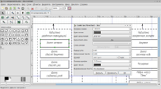
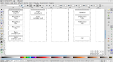

# Графика для диплома своими руками

* * *
В то время, как мои товарищи Глеб и Валентин трудятся над шаблоном для диплома в LaTeX, я решил рассказать о таком небольшом аспекте, как графическая часть диплома.
* * *

Поскольку диплом делался целиком под линухой, ПО соответствующее — кроссплатформенное, без костылей в виде Wine. Собственно, нам понадобятся:

- Dia — отличный диаграммный редактор с готовыми элементами для создания блок-схем и работы с UML;
- Inkscape — векторный редактор;
- GIMP — растровый редактор.

При желании сюда можно добавить qCAD — САПР для создания чертежей, однако, в своей работе я ее не использовал — много приятных вещей о ней может рассказать [Глеб](https://gongled.ru/).

LaTeX по сути своей — штука весьма неординарная и удобная, но со своими недостатками. Один из самых существенных — отсутствие поддержки SVG при включении графики в документ.

Данный недостаток, впрочем, можно обойти одним из трех методов.

Самый простой и очевидный — использование растровой графики. Мы теряем возможность масштабирования без потерь качества и вынуждены тратить время, подбирая верный коэффициент заполнения, однако, получаем возможность быстро вносить изменения в содержимое.

Второй способ — экспорт векторного объекта в набор линий и примитивов, перевод их в описание на tex и вставка полученной каши в документ. Как ни странно, [некоторые векторные редакторы](http://epb.lbl.gov/xfig/printing.html#export) это даже умеют.

Третий — экспорт векторного изображения в PDF (данная возможность есть как в Dia, так и в Inkscape) с последующим включением созданного документа в тело:

    \includegraphics{image.pdf}

Чтобы заменить изображение в подобном документе, придется потратить время на создание нового PDF-фрагмента.

При подготовке чертежей, которые, к слову, нужно было отпечатать на формате А1, я решил использовать решение проблемы «в лоб», получив на выходе PDF с векторным изображением, пригодным для печати в любом размере.

Итак, нам понадобятся:

- [шрифт ГОСТ, тип А](./bin/fonts-gost.tar.gz) — для выполнения надписей;
- [рамки для формата А1](./bin/frames-a1.tar.gz) — в альбомной и портретной ориентации;
- Dia — для рисования блок-схем;
- Inkscape — для объединения рамок и содержимого в готовый чертеж.

Создание чертежей шло в следующем порядке:

- Нарисовать блок-схему в Dia.  
  Шрифт для блоков лучше сразу выставить ГОСТовский порядка 12mm, а заполнение блоков — в 0, чтобы не иметь гигантских полей.
- Экспортировать результат в формате SVG Plain.
- Вставить полученный объект в документ Inkscape с рамкой, отмасштабировать и разместить его.
- Разгруппировать объект, получив набор текстовых и графических объектов.
- Выделить все текстовые объекты и применить к нему наклонное начертание, задав нужный размер.  
  Я использовал размеры 20, 30 и 40pt.
- Выделить все объекты, задать толщину 0.5mm.
- Распечатать полученный документ в PDF-файл.

P.S. При экспорте растровой графики из Dia лучше использовать Pixbuf PNG, а не Cairo PNG — последний формат криво рендерит текст.