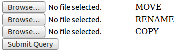

# Особенности поведения файловых функций в PHP

* * *
Работая с загружаемым контентом, заметил интересные особенности в работе файловых функций copy, move\_uploaded\_file и rename.
* * *

Для демонстрации поведения набросал простой скрипт:

    <?php
    
    if (!empty($_FILES)) {
        $path = '/var/tmp/php_test_files/';
        @mkdir($path, 0777, true);
            
        $move = $_FILES['move'];
        $rename = $_FILES['rename'];
        $copy = $_FILES['copy'];
            
        if (move_uploaded_file($move['tmp_name'], $path . 'move')) {
            echo "move: ok\n";
        } else {
            echo 'move error: ' . $move['tmp_name'] . ', ' . $path . 'move' . "\n";
        }
        
        if (rename($rename['tmp_name'], $path . 'rename')) {
            echo "rename: ok\n";
        } else {
            echo 'rename error: ' . $rename['tmp_name'] . ', ' . $path . 'rename' . "\n";
        }
        
        if (copy($copy['tmp_name'], $path . 'copy')) {
            echo "copy: ok\n";
        } else {
            echo 'copy error: ' . $copy['tmp_name'] . ', ' . $path . 'copy' . "\n";
        }
    }
    ?>
    <form method="POST" enctype="multipart/form-data">
        <input type="file" name="move"> MOVE 
        <input type="file" name="rename"> RENAME 
        <input type="file" name="copy"> COPY 
        <input type="submit">
    </form>

Пользователь, от которого запущен PHP FPM на сервере — php_fpm_user. Он состоит в группе www.

    $ ls -l /var/tmp/php_test_files
    -rw-r--r--  1 php_fpm_user  root   6727 Jul 17 09:37 copy
    -rw-r--r--  1 php_fpm_user  www    6727 Jul 17 09:37 move
    -rw-------  1 php_fpm_user  www    6727 Jul 17 09:37 rename

Таким образом:

- copy меняет группу, но не меняет права.
- move\_uploaded\_file не меняет ни прав, ни группу.
- rename меняет права, но не меняет группу.

Данное поведение считаю весьма необычным.