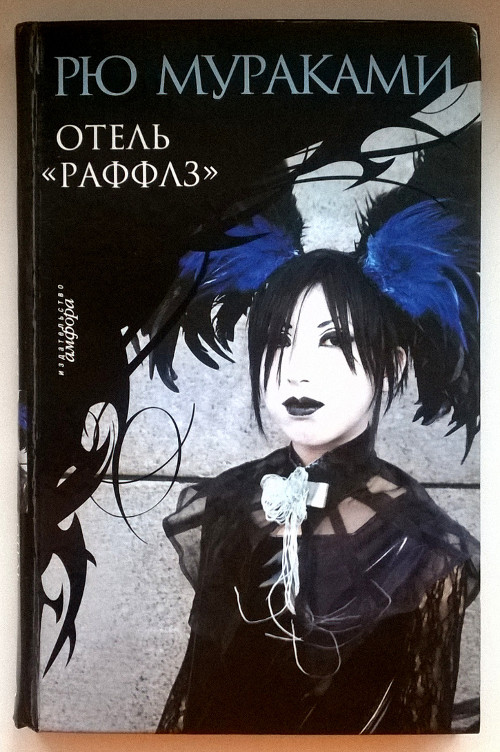

# Новые книги: Рю Мураками и Дэвид Митчелл

* * *
Вот и прибыли подарочки от Мари.
* * *

Коллекцию книг Рю Мураками с фриковыми обложками пополнил детективный роман «Отель Раффлз», экранизированный в 1989 году. С данным произведением ранее не сталкивался, но уверен, что оно получилось насыщеннее и злее предыдущего «киноромана», который я у него читал — «Киоко».

Вторым подарком оказался «Сон №9» Дэвида Митчелла, прочитанный почти 8 лет назад и с тех пор не дававший покоя. Эту книгу (в издании именно с такой обложкой) я безуспешно искал в книжных магазинах который год, но переизданий ее не было, а потому она так и оставалась недостижимой мечтой.

Нахожусь в предвкушении сочной литературной годноты, а пока почитываю «Американских богов» Нила Геймана.

Слава интернету, раздвигающему границы торговли.