# Волга и Парк дружбы народов

* * *

* * *

Итак, устав мерзнуть дома из-за беспредела коммунальщиков, выбрались с Мари на прогулку.

Сначала проехались до Речного порта и прошлись по спуску Минаева, где было крайне оживленно, дойдя до Волги. Повернув налево, двинулись вдоль берега в сторону Парка дружбы народов. Был отлив и достаточно безлюдно — видели пару-тройку рыбаков и несколько парочек, прогуливающихся по камням и песчаным холмам. Несколько подростков даже загорали.

[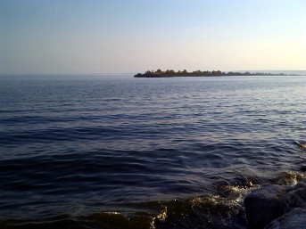](./img/02.jpg)
[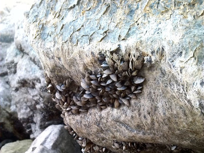](./img/06.jpg)

К слову, несмотря на близость центрального пляжа, купание именно на этом участке побережья запрещено — что неудивительно, ибо Волга тут может порадовать не только болотистого вида лужами, но и непригодными для перемещения камнями, за которыми река набирает глубину достаточно резко. В этих камнях, кстати, видели существо, похожее на черную выдру — зверек совершенно спокойно пробежал вдоль воды, перепугав Мари.

[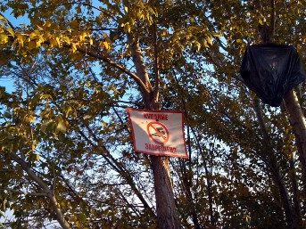](./img/03.jpg)
[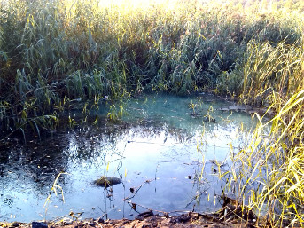](./img/04.jpg)

Пройдя центральный пляж, начали подниматься в Парк дружбы народов.

Что это место заброшенное, я знал давно — парком никто не занимался уже с начала 2000-х годов, когда на волне всеобщего разброда и шатания из него было вывезено все ценное, включая распиленную на части бронзовую статую зубра. Однако, масштаб разрушения и запустения я очень сильно недооценил.

[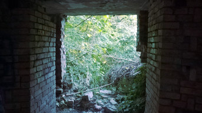](./img/07.jpg)
[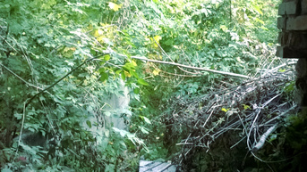](./img/08.jpg)

Так получилось, что буквально в центре города у нас есть настоящий блэковый лес с очень густым подлеском, покрытым хмелем, плющом и виноградом, старыми искореженными деревьями, мрачными тропинками, руинами, развалинами и заброшенными памятниками. И модной ливневкой, конечно же.

[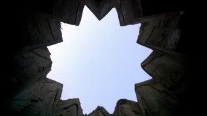](./img/09.jpg)
[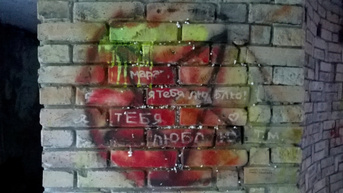](./img/10.jpg)

[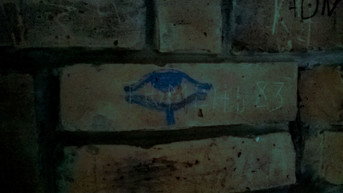](./img/11.jpg "Those eyes, whose are they?")
[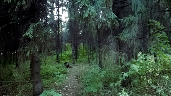](./img/14.jpg)

[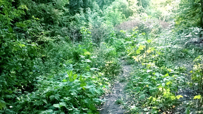](./img/15.jpg)
[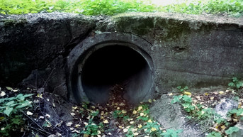](./img/16.jpg)

Думаю, в 1980-1990-х гг. эти места были очень красивы, сейчас же они производят слегка мрачноватое впечатление — особую роль в этом играет полное отсутствие людей. За все время пребывания в парке, мы не встретили никого, кроме мелкой лесной живности, шуршащей по кустам.

До легендарной «беседки сатанистов», увы, не добрались.

[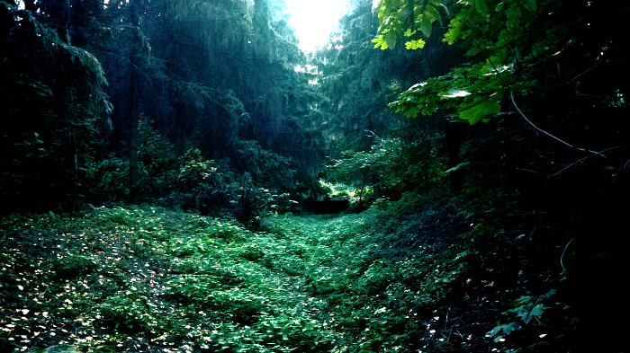](./img/17.jpg)

Прогулявшись по нижним лесным, полным гримдарка и крипоты, уровням, выбрались наверх — там парк уже облагорожен и вполне подходит для неспешных спокойных прогулок.
