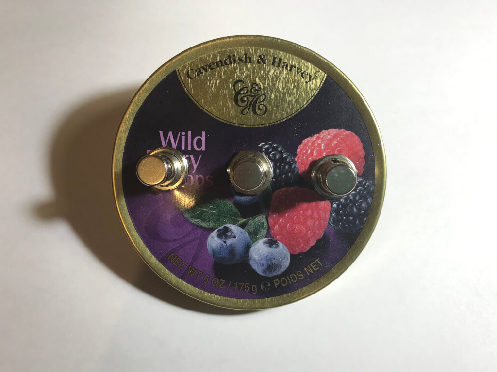

# «Ягодка»: самый вкусный пульт для переключения треков в плеере

***

***

Наш андерграундный рабочий кавербенд The S¡ms уже который месяц выживает без живого ударника.
Периодически поднимаем вопрос о покупке драм-машины, а пока играем под минусы, сделанные из midi-файлов в Reaper.

На носу выступление: переключать руками партии ударных между треками совсем несолидно, поэтому запилил пульт-педальку, чтобы делать это с ноги.

## Главные герои

Для пульта мне понадобились:

* Кнопка с фиксацией нажатия, три штуки.

	Брал кнопки гитарных педалей для полной аутентичности, но цена кусается: 150 ₽ за штуку в местном радиомагазине.
	Их можно заменить на любые кнопки с фиксацией.

* Arduino Leonardo.

* Корпус.

	Я для своих целей приспособил жестяную коробку из-под леденцов, но подойдет любая тара с жесткими стенками и крышкой.
    Сначала я думал покрасить ее в какой-нибудь нейтральный цвет (черный или очень черный), но отказался от этой идеи на полпути — так педаль сохранила свой ягодный внешний вид.
	
* Всякая мелочь для разводки проводов: кабельные стяжки, канифоль, припой.

## Кузовные работы

Самым сложным было прорубить отверстия в корпусе под кнопки и кабель Ардуинки. 
Сверла по металлу диаметром под сантиметр дома не нашлось, поэтому я использовал шило, канцелярский нож (удивительно хорошо режет жесть) и круглый напильник для стачивания заусенцев с краев.
С чистовой обработкой особо не заморачивался, края отверстий все равно закрыты шайбами переключателей:

После разработки гнезд вкрутил в них переключатели и хорошенько затянул шайбы, чтобы кнопки не гуляли:

Спаял и вывел общим проводом землю, на каждый из переключателей напаял перемычку:

Подвел перемычки в соответствующие гнезда на Ардуинке:

## Запуск

Все минусовки мы храним в Google Drive, поэтому управление сделано для интерфейса местного аудиоплеера: нажатие кнопок на педали посылает на подключенный компьютер события клавиш «влево», «пробел» и «вправо».

В планах есть установка дополнительного переключателя и доработка прошивки под возможность отправки событий медиа-клавиш переключения треков и паузы.

Скетч сделал на основе [предыдущего эксперимента](/2018/07/01/arduinopad/) с Leonardo. 

[Полный код скетча на Bitbucket](https://bitbucket.org/torunar/yagodka/src/master/).

## Полевые испытания

[тут видео с репетиции]
