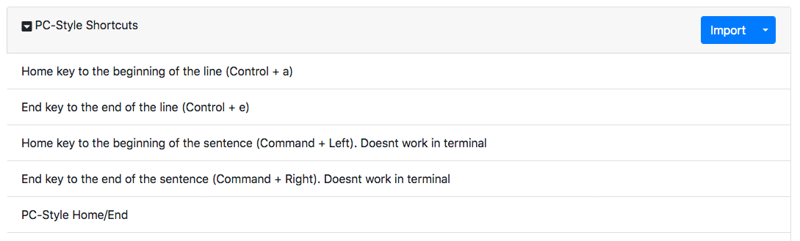
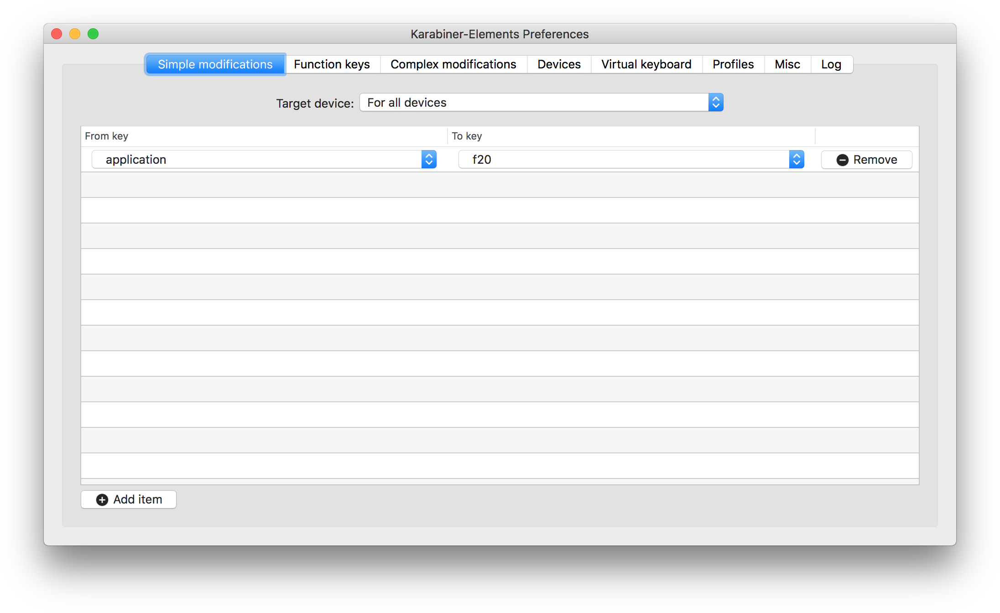
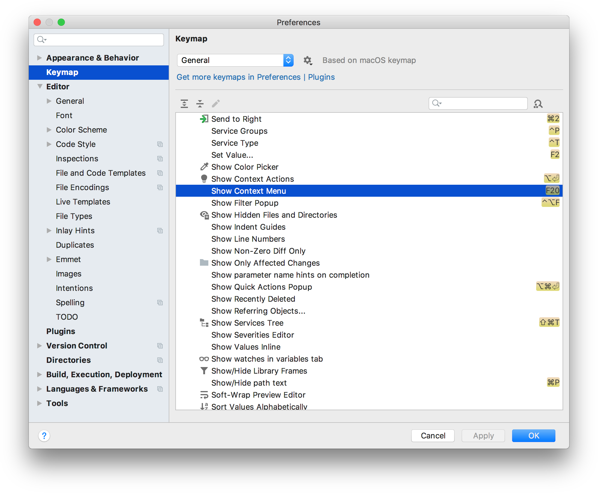

# Прощай, оружие!

***

***

[👉 **Пропустить грустные истории и перейти к сути**](#hatehatehate)

В начале этого года я обратил внимание на боль в запястьях при долгой монотонной нагрузке на руки.

Ревматолог послал меня на анализы и УЗИ, после чего диагностировал бурсит, выписал противовоспалительные и дал мудрый совет: «Следи за собой, будь осторожен».
Я перестал играть на басу, начал флексить разными эспандерами и всячески контролировать состояние своих рук.

**При этом я продолжал работать с Apple Magic Mouse 2 и Apple Magic Keyboard 2 по 8–10 часов в день.**

В конце этого года я обратил внимание на онемение в пальцах и скованность в запястьях к концу рабочего дня.

Я посмотрел на руки, заломленные на 40 градусов над плоской клавиатурой, и мизинец, впившийся в торец гладкого скользкого обмылка мыши и понял, что дело в них.
К клавиатуре и особенно мыши от Apple у меня уже давно были [претензии](https://twitter.com/torunar/status/1044504386767073282), поэтому они были торжественно <del>утилизированы</del> отданы в чужие руки, а им на замену пришли эргономичные клавиатура от Microsoft и вертикальная мышь от Delux.

И на этом историю можно было закончить, руки не болят, программисты счастливы, улыбаются, хлопают друг друга по плечу, код течет рекой, но как в анекдоте, есть нюанс.

Техника Apple умеет нормально работать с двумя видами клавиатур:

1. Проприетарные клавиатуры, сделанные для техники Apple.
2. Пошел нахуй.

Естественно, при подключении обычной ПК-клавиатуры я огреб по полной.

## Home и End (не) работают

На ANSI-клавиатуре клавиши Home и End и все возможные сочетания с ними работают максмально космически.
Во всех IDE от JetBrains они работают нормально, перемещая курсор в начало и конец строки, работает выделение текста.
В терминале они работают нормально.
В Firefox работает только навигация по странице, в полях ввода курсор не перемещается.

Коллега, сидевший некоторое время за маком на обычной пекашной клавиатуре, подсказал в качестве решения [Karabiner-Elements](https://pqrs.org/osx/karabiner/) — ПО для переназначения клавиатурных событий.
Ну да, ну да, пошел я красноглазить.

Karabiner-Elements поддерживает сложные модификации: хоть целые макросы на отдельные кнопки навешивай.
Есть целый сайт c готовыми сценариями, где юзеры прикручивают к macOS клавиатурные сочетания из emacs'а или делают все «шоб как в винде было»: [https://pqrs.org/osx/karabiner/complex_modifications/](https://pqrs.org/osx/karabiner/complex_modifications/).

Беглый поиск показывает, что в сборнике сценариев PC-Style Shortcuts вроде как есть все необходимое:

Первый вопрос, который возникает при взгляде на все это великолепие: зачем столько разных правил для одного и того же действия?
Второй: что из этого мне нужно?

Спойлер: ничего из этого нормально не работает или требует каких-то хитрых шаманств с порядком подключения.
Часть правил работает во всех приложениях, но только при включенной английской раскладке (huh, weird).
Другая часть работает только в одном приложении и ломается во всех остальных.
Кстати, примечательные правила с пометкой Doesnt work in terminal вполне себе work, только вместо перемещения курсора вкладки переключают.

В комментариях на GitHub я нашел набор правил, который путем явного разграничения совместимых приложений добавлял возможность работы с Home и End как в этих ваших виндузах и люнексах: [https://github.com/pqrs-org/Karabiner-Elements/issues/970#issuecomment-329756606](https://github.com/pqrs-org/Karabiner-Elements/issues/970#issuecomment-329756606).

## Клавиша вызова контекстного меню делает н-и-ч-е-г-о

Я постоянно использую клавишу контекстного меню в Windows и Linux.
Я очень страдаю от отсутствия этой клавиши на маке, особенно при работе в IDE.
Если кто знает, почему этой кнопки нет на эппловских клавиатурах, а macOS принципиально ее не поддерживает — напишите в комментах, будет познавательно.

Но эта клавиша успешно определяется Karabiner-EventViewer'ом как `application` и ее можно переназначить на что-то более традиционное, например, `F20`:

И во всех IDE от JetBrains есть возможность настроить сочетание клавиш для вызова контекстного меню:

## Раскладкопроблемы

Если указать тип внешней клавиатуры ANSI (United States and others), то в русской раскладке нет буквы «ё».
Не то, чтобы она была нужна, но за державу обидно.
Если использовать ISO (European), в английской раскладке нет символа `~`, вместо него знак параграфа.
Европейские программисты, how do they work?

В macOS достаточно просто создать собственную раскладку.
Для этого можно использовать [Ukelele](http://software.sil.org/ukelele/), но я воспользовался готовым [руководством](https://www.iphones.ru/iNotes/pc-keyboard-on-mac-osx-guide) с iPhones.ru.

## Вместо заключения

Немного перефразирую уже озвученную ранее мысль.

Есть два способа работать с продукцией Apple:

1. Vendor lock-in.
1. Пошел нахуй.
