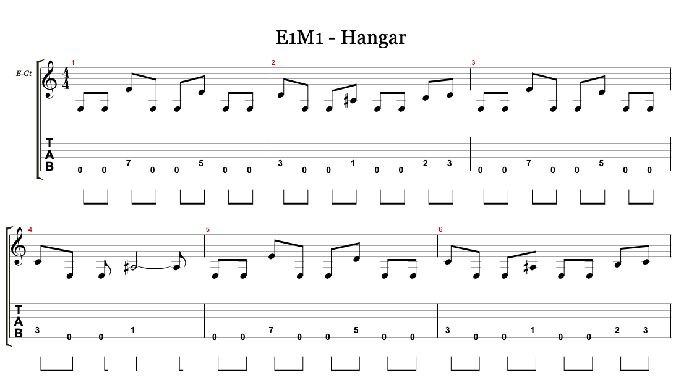

# Музыкальная коробочка из Arduino

***

> Дай человеку рыбу, и он будет сыт один день.
>
> Дай ему PC-спикер, и он подключит его к Arduino.
***

[👉 **Пропустить охуительные истории и перейти к сути**](#doom-cool)

Каждый мужчина в своей жизни должен сделать три вещи:

1. Купить Arduino.
1. Подключить к ней кнопочки.
1. Приделать к ней PC-спикер.

Первыми двумя вещами я занимаюсь уже давно, собирал на базе Arduino Leonardo всякую [дичь](/2018/07/01/arduinopad) и разную [хтонь](/2018/10/24/yagodka).
Добрался наконец и до пиликанья пиликалкой.

В целом пиликать на Arduino несложно: с помощью функции [`tone()`](https://www.arduino.cc/reference/en/language/functions/advanced-io/tone/) запускается генерация квадартной волны заданной частоты на заданном пине,
длительность определяется последующим вызовом [`delay()`](https://www.arduino.cc/reference/en/language/functions/time/delay/), а выключается звук функцией [`noTone()`](https://www.arduino.cc/reference/en/language/functions/advanced-io/notone/).
Полифонии нет — за раз может звучать только одна нота, поэтому цикл `tone`, `delay`,`noTone` нужно повторять для каждой ноты в композиции.

Таким образом, задача сводится к тому, чтобы найти нужную монофоническую мелодию, посчитать частоты нот в ней, их длительность и запрограммировать это на Arduino.

## Понапридумывают себе задач дурацких...

Что будем играть? Не гонять же гаммы. Нужно что-то светлое, доброе, вечное. Например, E1M1 из DOOM.

<iframe width="100%"
        height="415"
        src="https://www.youtube-nocookie.com/embed/BSsfjHCFosw"
        title="E1M1 (видео)"
        frameborder="0"
        allow="accelerometer; autoplay; clipboard-write; encrypted-media; gyroscope; picture-in-picture"
        allowfullscreen
></iframe>

В сети ее можно найти в виде партитуры для Guitar Pro.
В нем удобно будет удалить из композиции лишние дорожки, оставив одну гитару, выпилить все эффекты и экспортировать в монофонический трек.

Следующий момент — подобрать частоты нот для использования в виде констант в коде.
Можно частоты эти посчитать, если вы ходили в музыкалку, а можно просто нагуглить все эти октавы, диезы и бемоли.

Длительность нот обозначим по долям целой ноты.
Целая нота — 1, половинная — 2, четвертная — 4 и так далее.

15 минут трудов и [прошивка, которая делает из Arduino пиликалку](https://github.com/torunar/arwave), готова!
Сама композиция подключается как [заголовочный файл](https://github.com/torunar/arwave/blob/master/examples/c-major/melody.h) с нотами и их длительностями.

Круто.
Круто-круто-круто.
Но чего-то не хватает.

Ну да, как из MIDI-файла прошивку-то делать?

## ... и пишут программы на Петоне!

А не написать ли конвертер, который будет принимать на вход MIDI, а на выходе давать желанный заголовочный файл?
Тем более, что в Python есть отличная библиотека для работы с MIDI — [`mido`](https://mido.readthedocs.io/en/latest/).

С ней проблем нет, проблемы есть с MIDI как таковым.
Когда-то мне рассказывали, что MIDI «прямо в себе ноты хранит» и поэтому такой универсальный и переносимый, поэтому я ожидал, что сделать партитуру из MIDI-файла будет крайне просто.
Boy, was I wrong.

MIDI, как выяснилось, хранит композицию в виде сообщений.
Буквально все, что происходит в треке (начать издавать звук, перестать играть, добавить эффекты типа вибрато, поменять громкость, задать темп) — это сообщения.
У сообщений есть тип, длительность и другие специфические для каждого типа служебные параметры.

Поскольку нужно работать с однодорожечными MIDI-файлами без полифонии, нас интересуют только события, связанные с включением и выключением звука и заданием темпа (BPM) композиции.
[Конвертер](https://github.com/torunar/arwave-converter) в итоге получается не сильно страшный.

Высота звука задается не сочетанием ноты и октавы, а в виде целого числа.
[Октаву определяем](https://github.com/torunar/arwave-converter/blob/master/__main__.py#L3-L7) как целую часть от деления на 12, а ноту — как остаток.

Длительность звука (и тут проявляется гениальность инженеров, что придумали MIDI), задается не в миллисекундах, а в тиках внутреннего осцилятора.
Зная, сколько тиков на удар (ticks per beat) задано в свойствах файла, [можно посчитать](https://github.com/torunar/arwave-converter/blob/master/__main__.py#L9-L11), какую длительность имеет нота в принятой нами нотации.
В попытках найти объяснение, зачем так странно, наткнулся на аргументацию: «Если вам нужно сделать ноту длиной 2,743 секунды, не влезающюю в размер, то в MIDI все получится!».
С таким и не поспоришь ведь.

## А теперь слайды

Конвертим MIDI в прошивку, билдим и заливаем на девайс. Корпус опциональный, для души.

<iframe width="100%"
        height="415"
        src="https://www.youtube-nocookie.com/embed/GXm8zZLNcrw"
        title="DOOM круто (видео)"
        frameborder="0"
        allow="accelerometer; autoplay; clipboard-write; encrypted-media; gyroscope; picture-in-picture"
        allowfullscreen
></iframe>
