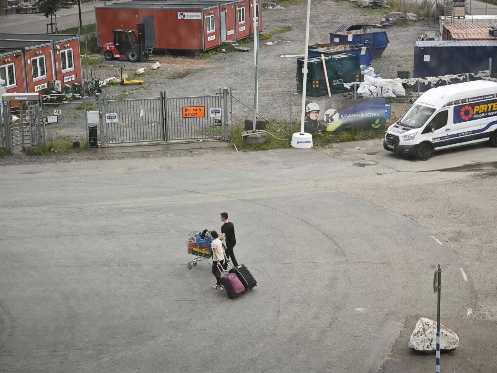

# Мы переехали на новую квартиру!

***

***

## Рынок съемного жилья в Швеции

Как и в целом в Европе, рынок съемного жилья тут своеобразный, со своими закидонами и приколами.

В Швеции есть два типа аренды: first hand rent и second hand rent.
На самом деле есть еще и серые схемы типа субаренды, когда ты пересдаешь уже снимаемое жилье, но про них я не буду рассказывать.

В случае first hand rent вы снимаете жилье напрямую у компании, которая строила жилье.
Во втором случае жилье снимается либо у компании-посредника, либо у текущего квартиросъемщика с first hand rent.

Second hand rent найти проще и квартира как правило полностью готова для жизни в ней, но у него есть минусы: из квартиры могут попросить в любой момент (с уведомлением минимум за три месяца), если жилье снимается у жильца, то с ним может быть намного сложнее решать какие-то бытовые вопросы, плюс он дороже процентов на 15-30.
Наш первый контракт был как раз-таки second hand rent у местной фирмы-посредника Home Rental.
Квартира была в отличном состоянии, но по какой-то причине в ней не было ни мебели, ни посуды, ни техники, кроме холодильника и посудомойки.

First hand дешевле; пока вы платите квартплату и не творите дичь на хате, никто по закону не сможет вас выгнать; лендлордов в случае косяков могут достаточно сильно нагнуть, поэтому обычно с ними не бывает проблем, а еще там вы не привязаны к чужой собственности и можете купить себе собственный удобный диван.
Все это делает first hand крайне востребованным вариантом, поэтому желающих на каждую такую квартиру сильно больше, чем доступных вариантов.

Для причинения социальной справедливости существует сайт [Boplats Syd](https://www.boplatssyd.se/).
Основная его идея — создание равных возможностей на съем жилья для всех, независимо от их происхождения и дохода.
На Boplats Syd используется система очереди: ты регистрируешься, платишь за членство, ищешь квартиры, в которых хотел бы жить, встаешь на них в очереди и **ждешь**.

При приближении к первой десятке мест в очередях начинают звать на просмотры: приходишь в указанное время по нужному адресу, там тебя встречает представитель лендлорда, показывает красивое, а ты смотришь, что вообще за квартира; после осмотра нужно либо отказаться от жилья, либо согласиться и стоять в очереди дальше.
Кто дошел до первого места в очереди, сможет подписать договор аренды.

Есть еще новое жилье, но строят его не так много, и очереди на него просто конские: после того, как новье вкидывают на рынок, очередь в 200+ человек выстраивается в первый же час, и своей очереди можно ждать несколько лет.

Помимо Boplats Syd есть несколько других, менее популярных сайтов для поиска жилья, они могут использовать другие системы распределения, некоторые дают лендлордам возможность самостоятельно решать, кому достанется квартира.

Более того, некоторые лендлорды вообще не выставляют свои квартиры на сайтах-агрегаторах, а узнать о доступных опциях вы можете, только позвонив или **написав им лично**.

## Как мы нашли новую квартиру

**В сентябре 2022-го** я зарегистрировался на Boplats Syd, настроил уведомления о появлении квартир с определенными условиями и стал **ждать**.
Я искал жилье в том же районе, где живу сейчас, потому что тут и работа рядом, и природа в виде ферм и прудов с утками недалеко, и станция рядом — очень удобно ездить за семь минут в центр Мальмё и за 27 минут в центр Копенгагена.
Начиная примерно с октября нас стали звать на просмотры, но все квартиры были либо в хлам удроченные, либо всратые по планировке, либо не сильно отличающиеся по цене от нашей текущей.
В нашем районе много социального жилья от местного гиганта MKB: их квартиры полность отвечают жилищным стандартам, но из-за часто сменяющихся владельцев все-таки устают достаточно быстро.
Еще одна часто встречающаяся проблема — квартира-кишка, где вдоль длинного узкого коридора приклеены крошечная спальня в шесть квадратных метров, зачем-то большая кладовая, туалет и гостинная, совмещенная с кухней.
Выглядит это как-то так (привет любителям Dwarf Fortress):

    +-+-------+
    |o|       |
    |_|       |
    |   +-----|
    |       (o|
    |   +-----|
    |     [][]|
    |   +-----|
    |   |     |
    |   ______|

**В конце декабря 2022-го** мой коллега, живущий в том же доме, что и я, сказал, что наш застройщик хоть и не выставляет квартиры на агрегаторах, но можно попробовать написать им просто на почту и спросить, есть ли доступные варианты под first hand rent.
В тот же день я набацал письмо на английском, попросил добавить меня в какой-нибудь их внутренний список ожидания и получил ответ, что пока у них нет доступных квартир.

**В марте 2023-го**, до меня дошло, что ни в какой список ожидания меня не добавили.
В то время на диком хайпе был Chat GPT, поэтому я решил использовать LLM для того, в чем она действительно хороша: анализ и генерация текстов.
Я накидал тезисы к эссе на тему "Чем мне нравится моя квартира, и почему я хочу жить в чем-то таком со своей семьей и дальше", попросил сгенерировать из них сочное письмо с диферамбами лендлорду и перевести его на шведский (из прошлых контактов с нашим лендлордом я знал, что она предпочитает общаться по-шведски).

**В начале апреля 2023-го** я получил письмо, что, мол, с одной из их квартир текущие жильцы съезжают, интересново?
Используя какие-никакие навыки письменного шведского написал ответ: да, мол, интересново, куда сосать, чтобы квартиру посмотреть?
Мне дали номер текущего съемщика, мы посмотрели квартиру и я тем же днем ответил, что квартира топ, будем брать.

И уже спустя неделю после судьбоносного письма мы пришли на подписание контракта.
Лендлорд ожидала натурализовавшихся флюент спикеров, договор был составлен на шведском без перевода, но вместо героев в белых плащах пришли мы с Машей — две картошки.
Благо, галочки для подписей одинаковые во всех языках.

**В середине июля 2023-го** текущие жильцы передали нам вымытую квартиру, ключи и пожелания хорошего настроения.

Если бы я продолжал стоять в очереди, то и дальше переплачивал бы на старом месте.

## Как мы переезжали

За год в Швеции мы успели немного обрасти хламом, в том числе крупногабаритным: диваном, кроватью, столами, техникой.
Как я уже упоминал, квартира стоимостью примерно в треть моей зарплаты изначально была еще и голая, без мебели, телевизора, посуды.

Всякую мелочь типа книг, одежды, посуды и мелкой техники мы отвезли за следующие пять на обычной тележке из супермаркета, запаркованной рядом с домом.
В день у нас выходило по четыре-пять ходок, огромные тканевые сумки из Икеи и коробки немного облегчали нашу участь.

День окончательного переезда приближался, а вопрос перевозки мебели оставался открытым.
Моим изначальным планом был угон грузовой тележки из Икеи и перевоз всякого тяжелого на ней, благо от старой квартиры до новой 700 метров по прямой.

Маша была сильно против и в итоге упросила меня не корчить из себя клоуна и заказать доставку.
Я посмотрел в интернетах цены местных грузчиков — перевозка дивана, кровати и столов вставала минимум в **3,500 крон**, больше трети стоимости аренды на новом месте.
Еще столько же предстояло отдать за генеральную уборку старой квартиры, так что переезд становился просто золотым.

В этот момент Маша уже начала более благосклонно смотреть на угон тележки, но на помощь внезапно пришел мой начальник, который сказал, что может просто пригнать свой минивен, мы арендуем прицеп и все оттарабаним за один вечер.
Прицеп встал мне в 120 крон, а с учетом затрат на сопутствующие социальные штуки типа пива и пиццы переезд встал всего в **500 крон**.

И вот, спустя неделю работы челноком, с больной спиной и руками, гудящими ногами и загаром серфингистов, мы живем на новом месте.

Лучше всех переезд перенесла кошка: для нее это выглядело как стремительно пустеющая старая квартира, прогулка по вечернему Мальмё в переноске и ночь, полная неисследованных территорий на новом месте.

## Вместо заключения

Без связей тяжело, со связями легко.  
Постарайтесь не оказываться в другой стране без друзей или хотя бы знакомых, которые помогут словом и делом.  
Учите язык страны, в которой живете, это определенно сделает жизнь проще и, возможно, даже спасет вашу жопу.  
Оставайтесь тунцов!