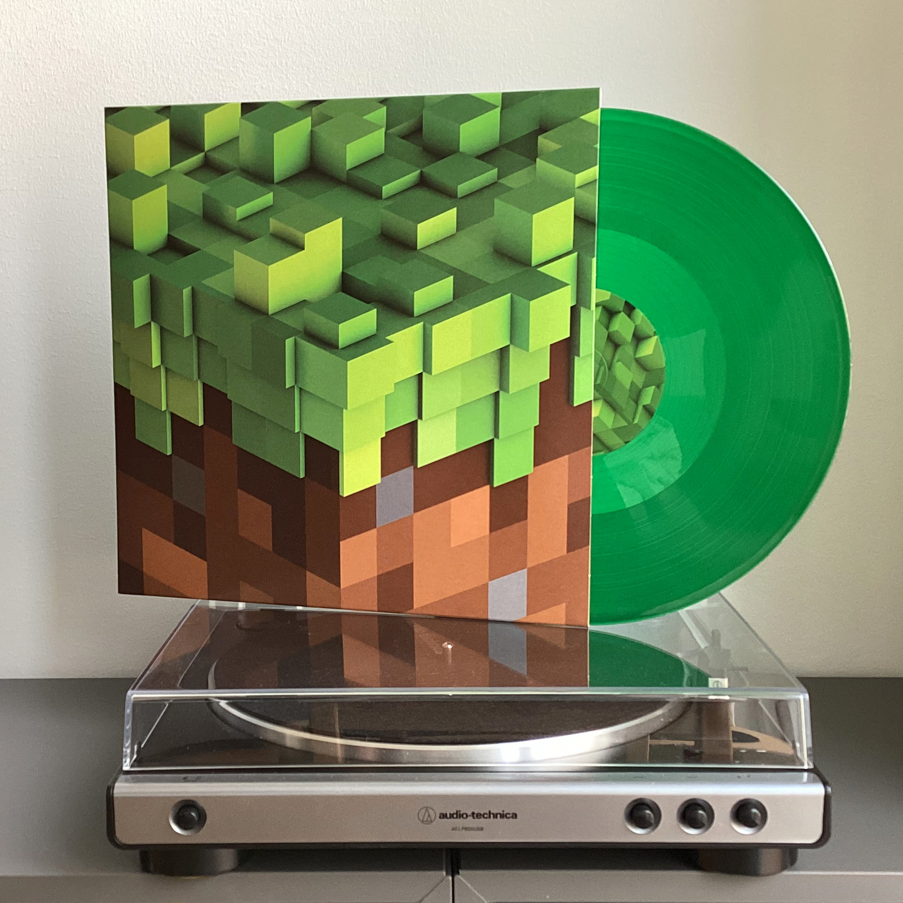
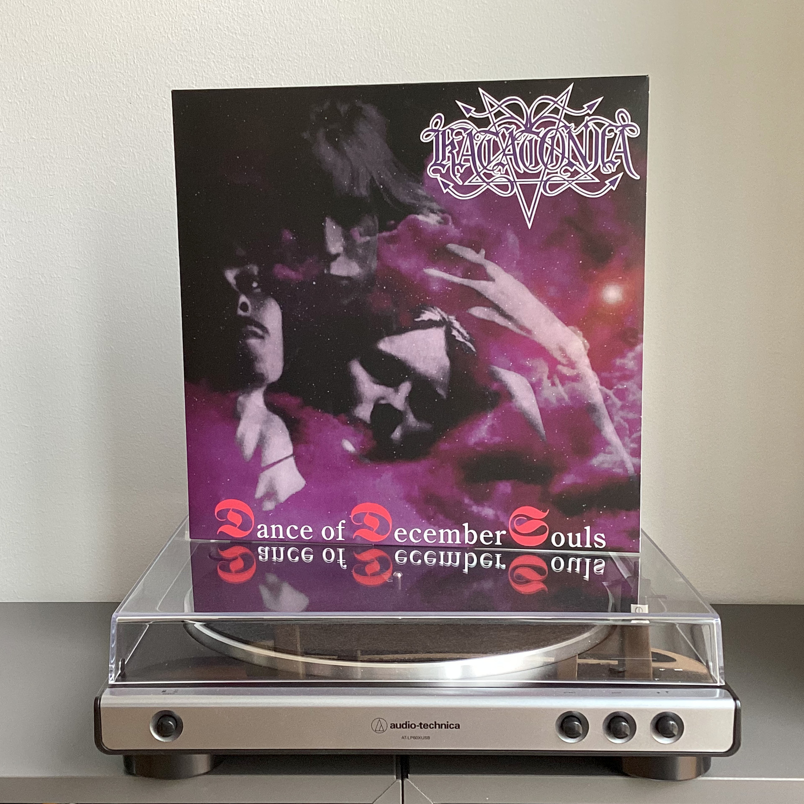
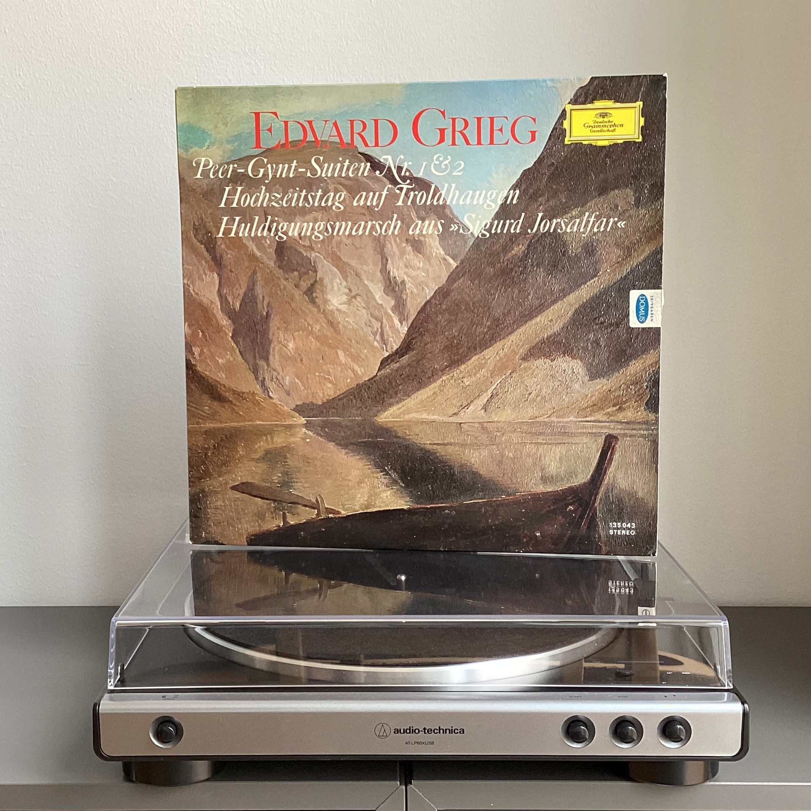

# Чего там по винилу? Отчет за октябрь 2023

***

Раз уж я стал обладателем проигрывателя, то почему бы не попробовать запустить в блоге регулярную рубрику про новые пластинки, которые прибывают на полку.

***

## C418 — Minecraft Volume Alpha

За все время, что я играю в видеоигры, я встретил всего три, музыка которых живет отдельно и имеет для меня ценность в отрыве от сюжета, персонажей и мира: Morrowind, Persona 5 и Minecraft. 

Саундтрек к третьей части The Elder Scrolls настолько хорош, что Джереми Соул продал его Bethesda еще дважды для Oblivion и Skyrim; про бешеный драйв Persona 5 я [уже писал отдельно](https://t.me/misha_talks/19); а вот Minecraft не только открыл мне игровые песочницы, но и стал по сути окном в жанры electronica и ambient. 

На зеленом полупрозрачном виниле музыка из легендарной игры звучит в 2023-м так же свежо, как и в 2011-м.

## Katatonia — Dance of December Souls

Baby's first death-doom. 

Забавно, но когда я первый раз услышал этот альбом почти 15 лет назад, то подумал, что это полнейшая дрисня, и чтобы слушать такое, нужно быть особенным образом угашеным об сосну.

Спустя столько лет после первого знакомства все же треки, что помогли полюбить этот альбом, заставляют возвращаться к нему снова и снова: под Without God все еще восхитительно орется, а Velvet Thorns of Drynwhyl все еще очень эпичная и образная.

## Edward Grieg — Peer Gynt

Неиронично считаю Эдварда Грига прадедом современного норвежского блэк-метала. 
Нет, серьезно, если вы посмотрите на то, какие приемы использованы в композиции &laquo;В пещере горного короля&raquo;, то вы поймете, о чем я.

Пластинка была откопана в местном секонд-хенде за двадцать крон (для сравнения, цена на новый винил — 350-450 крон), и особых ожиданий в ее отношении не было: издание 1967-го года, и конверт очень сильно потрепан.

Вопреки всему, запись оказалась в хорошем для своего возраста состоянии: с легким шумом, за который Маша так любит старые пластинки, без заеданий и скипов.
Слушаем, проникаемся.