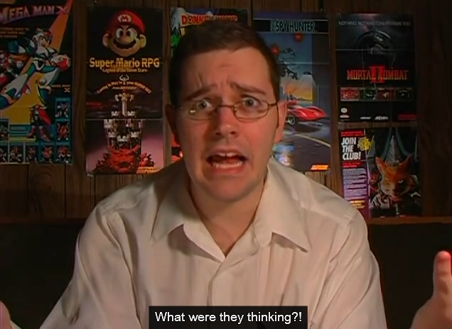

# Экспертная аналитика по Apple Pay

***

Веселее, чем потешаться над прорывными технологическими достижениями Apple может быть только потешаться над кабинентыми дедами, которые не понимают, как компьютеры работают вообще _(я тоже не понимаю, как компьютеры работают вообще, но это совсем другая история)_.

***

Когда в 2017-ом году я узнал, что Apple Pay — это не платежная система, а фактически просто замена вводу пин-кода, я подумал, что Apple выбрали просто ужасное название для своего продукта.
Ты не платишь через Apple Pay, ты подтверждаешь свои права на использование платежной карты, добавленной в кошелек, это же совершенно разные вещи.
Почему то, что фактически не является платежной системой имеет слово "pay" в названии?

Вот аналогия: есть у тебя велосипед, который ты пристегиваешь замком.
Приходит компания Apple и говорит: вот, мы разработали ключ для твоего замка, мы зовем его Apple Bicycle!

К сожалению, стоит одному сделать глупость, остальные бегут ее повторять, поэтому теперь у нас есть Google Pay, Samsung Pay, Mi Pay и Mir Pay (нейминг у двух последних двух — просто вах, смотри не перепутай).
И ничего из этого не является платежной системой, это просто способ притворяться физической картой для банковских терминалов!

Очевидно, я не один такой потеряный: австралийские политики тоже труба шатали разбираться, что такое этот ваш Apple Pay, приравняли его к платежному средству и хотят заставить Apple соблюдать соответствующие правила:  
[https://appleinsider.com/articles/23/10/11/apple-objects-to-australia-plan-to-regulate-apple-pay](https://appleinsider.com/articles/23/10/11/apple-objects-to-australia-plan-to-regulate-apple-pay)

> Australia is set to treat digital wallet apps such as Apple Pay under the same regulations as credit cards

Дело в том, что Reserve Bank of Australia хочет создать собственный платежный инструмент с NFC и преферансом, информацией о счете и прочими приколами, но для этого им нужен прямой доступ к NFC, который Apple им не дает и гонит в Apple Wallet.
И как же это так, бухтят в RBA, Apple не хочет пускать нас на рынок платежей, при том, что ни о каком рынке платежей речи попросту идти не может:

> Apple does not have access to a cardholder's account to determine whether funds are available. Apple does not collect any transaction information

Я целиком понимаю озабоченность RBA вендор-локом, особенно вендор-локом на технологии Apple, но австралийцы тут явно не в ту сторону воюют.

P.S. Я провел 15 минут, насилуя креативные возможности ChatGPT, пробуя придумать лучшее название для Apple Pay, которое было бы понятно простому человеку, а не только программисту-финансисту, у которого борода вросла в свитер с гроссбухом.
Единственный вариант, который можно с натяжкой считать адекватным — это Apple Tap, потому что "users should **tap** their phone to authorize a payment".
