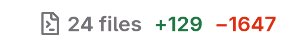
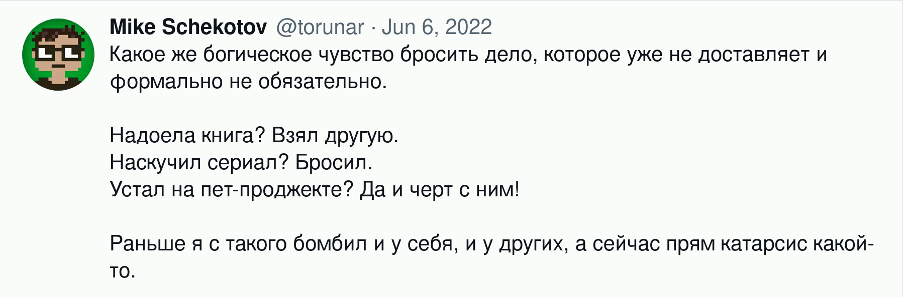

# У-вэй от мира разработки

***

> The best code is no code at all.

<cite>Jeff Atwood, Effective Programming: More Than Writing Code</cite>

***

Это и похожие высказывания можно встретить в различных сборниках программисткой мудрости: мол, самый лучший код — это код, который ни ты, ни твоя команда, ни рандомный чел из интернета не написал. Эту цитату любят приводить в статьях о чистом коде, подразумевая под этим следование лучшим практикам, принципам, и фреймворкам разработки (SOLID, DDD и прочим КГ/АМ). Мол, не наваливай хурмы в код, пиши чисто и минималистично — и будет тебе в жизни счастье, не будешь сопровождать лишнего, будет твоя система подобна золотому храму, а сам ты в своем познании настолько преисполнишься, будто бы уже сто триллионов миллиардов лет проживаешь на триллионах и триллионах таких же планет, как эта Земля.

Подобный подход понятен, но если взять все пулл-реквесты, которые прошли через меня за последние два года, самое большое удовольствие я испытываю, глядя на этих красавцев:

Каждое такое изменение рассказывает одну и ту же историю: что-то утратило свою актуальность и было удалено. Кто-то сел, посмотрел на сделанную им работу и сказал: «Мне это больше не нужно, оно идет под нож». Этот процесс очень хорошо резонирует с мыслью, которую я озвучивал когда-то в Твиттере:

Когда этот самый Твиттер поменял правила работы с их API, я просто пошел и удалил свою утилиту для архивирования аккаунтов. Да, я потратил несколько недель на ее создание, но я знал, что не буду ее обновлять и поддерживать, good riddance. Когда я понял, что мне уже не так интересно разбираться с особенностями сервиса Fly.io, я удалил почти законченный сервис-сидбокс. Мне стало скучно, а значит я уже вряд ли вернусь к этому проекту. С Гитхаба долой, из сердца вон.

Разработчики, вы молодцы и лапочки, вы самые обучающиеся и развивающиеся, вы художники и **создатели**, но не забывайте, что на программировании свет клином не сошелся. Жизнь не сводится к количеству строк кода, звездочкам на Гитхабе или цифрам на банковском счете.

Миру не нужно больше программ, миру нужны программы, которые действительно работают.  
Миру не нужно больше компьютеров, миру нужны компьютеры, которые справляются с новыми задачами в их текущей конфигурации.  
Миру не нужно больше IT-стартапов, миру нужно решать реальные задачи.

Начни свой день не с реализации новой подсистемы по TDD, а с того, чтобы дропнуть тысячу-другую строк кода, которые не нужны. Удаление кода — это и есть у-вэй от мира разработки.
