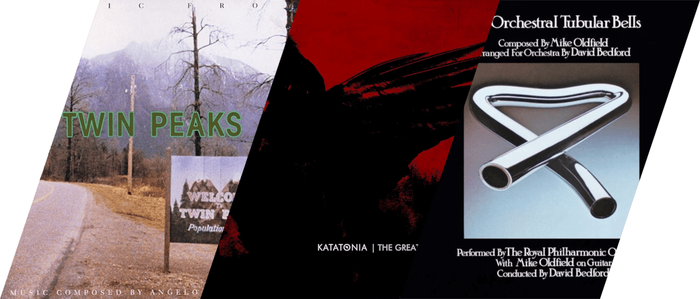
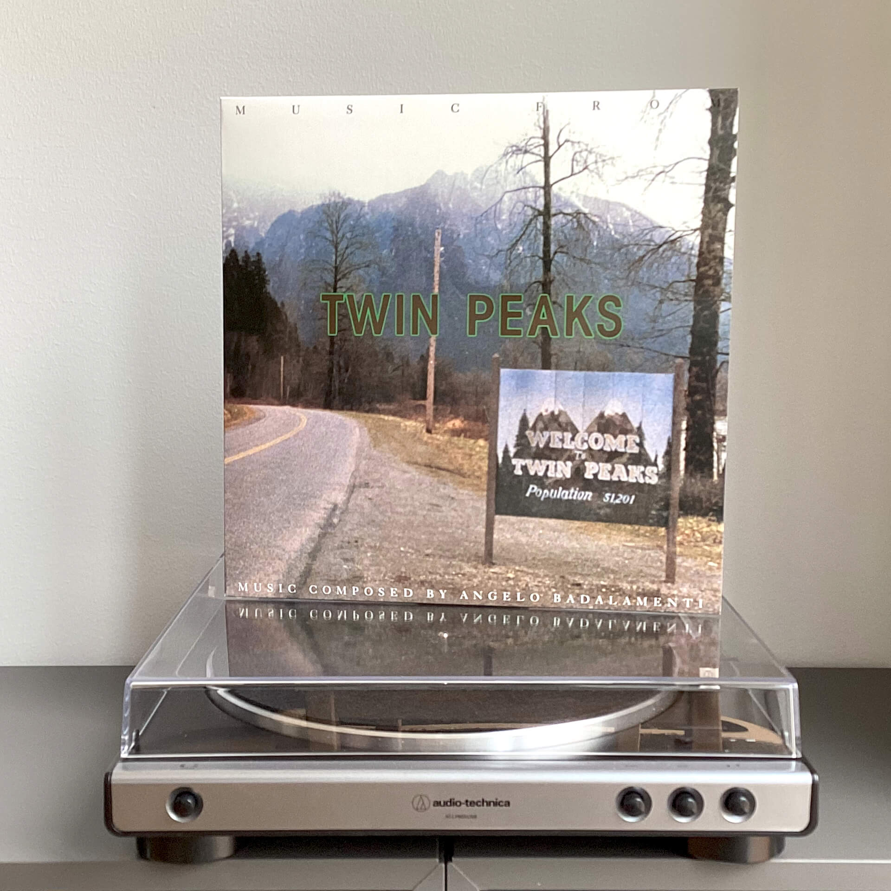
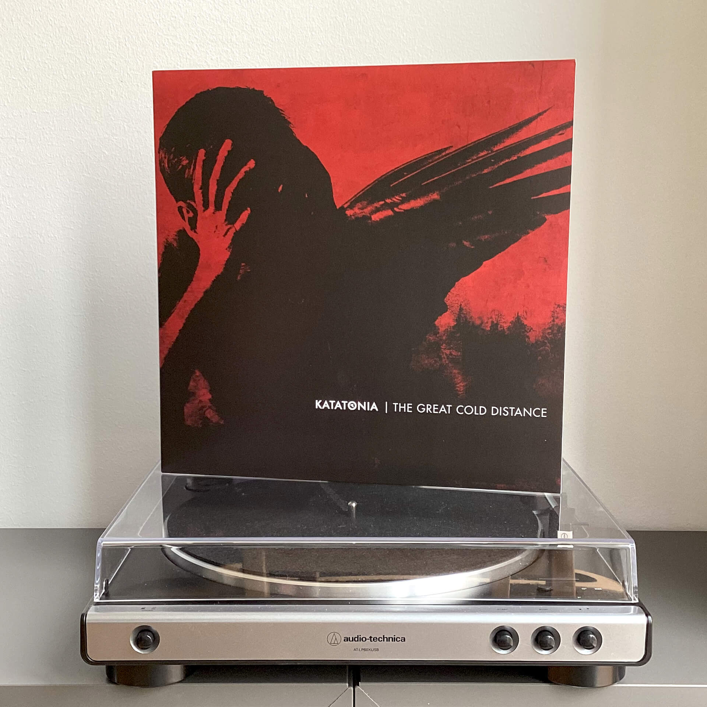
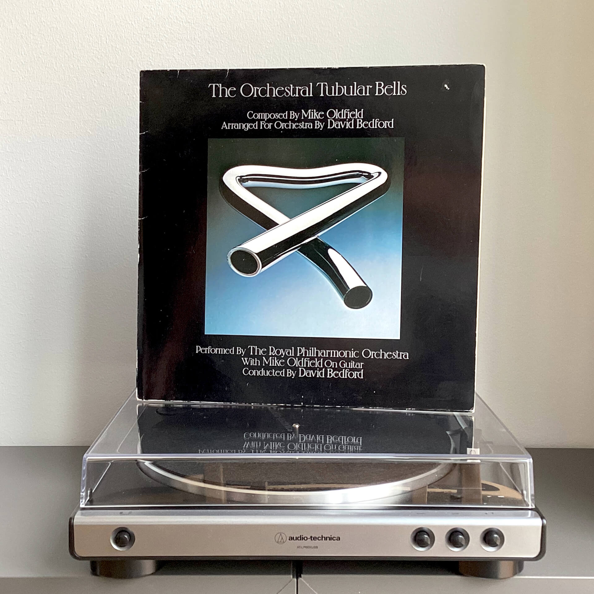

# Чего там по винилу? Отчет за декабрь 2023

***

***

Когда я сел писать этот пост, я понял, что все это время я придерживаюсь одной и той же схемы: один саундтрек, одна пластинка Katatonia и одна старая запись. Я не задумывал такую структуру изначально, просто меня очень легко зацепить музыкой из фильмов и игр, старье резонирует с моим внутренним дедом, а Katatonia — так и вовсе моя любимая группа на протяжении последних 17 лет, поэтому нет ничего удивительного, что я теперь закупаю всю их дискографию.

## Angelo Badalamenti — Music From Twin Peaks

Как говорил Карлик в Твин Пикс: «Там откуда мы пришли, птицы поют чудесные песни, и воздух наполнен музыкой».
В данном случае музыка состоит из мощного баса заглавной темы, тревожных синтезаторов темы Лоры Палмер, сексуальных ударных танца Одри и вкрадчивого пения Джули Круз.

Как и все, связанное с Твин Пиксом, музыка эта предназначена для особого настроения: когда время течет вязко, солнце светит тускло, а едва ощутимое чувство нереальности происходящего заставляет сердце биться чуть чаще, то есть она идеально подходит для вечных зимних сумерек.

Именно этот альбом заставляет меня жалеть об ограничениях винила как носителя, потому что каждые 20 минут музыка прерывается и пластинку нужно переворачивать.

## Katatonia — The Great Cold Distance

Вот я и добрался до альбома, с которого больше 15 лет назад началось мое journey through pressure, икона, эталон и мерило, с которым я сравнивал и сравниваю каждый метал-альбом: некоторые из них лучше, некоторые хуже, но ни один не такой же.

Именно The Great Cold Distance открыл для меня метал в целом и во многом сформировал мой современный музыкальный вкус.  
Именно The Great Cold Distance протащил меня через эмоционально нестабильный подростковый период, полные дивных открытий студенческие годы и оставил в зрелости с тревожным мироощущением завтрашнего дня.  
Именно The Great Cold Distance подарил мне тот самый интерес к Швеции, который в итоге привел меня в эту страну.

Если вы неосторожно упомянете Katatonia в разговоре со мной, то я буду до хрипоты рассказывать вам о влиятельности и безупречности The Great Cold Distance. И вы не сможете меня остановить.

## Mike Oldfield / David Bedford — The Orchestral Tubular Bells

Когда я нашел эту пластинку в букинистическом магазине, я настолько обрадовался и поспешил ее купить, что совершенно не обратил внимания на слово orchestral в названии. 
Tubular Bells Олдфилда я люблю с той поры, как услышал ее первый раз в фильме «Экзорцист» 1973-го года, и иметь ее в коллекции было бы почетно.
Плюс, исходный альбом прямо-таки создан для пластинок: цельное произведение аккуратно разделено на две связанные композиции по 20 минут.

Ошибку я осознал уже дома, но реальность оказалась не так уж и далека от ожиданий, прогрессивный рок зачастую выигрывает от оркестрового исполнения, а тут еще и сам Майк Олдфилд исполняет гитарные партии.

На полочку ставлю, слушать буду, но и искать оригинальные Tubular Bells на барахолках не перестаю.
