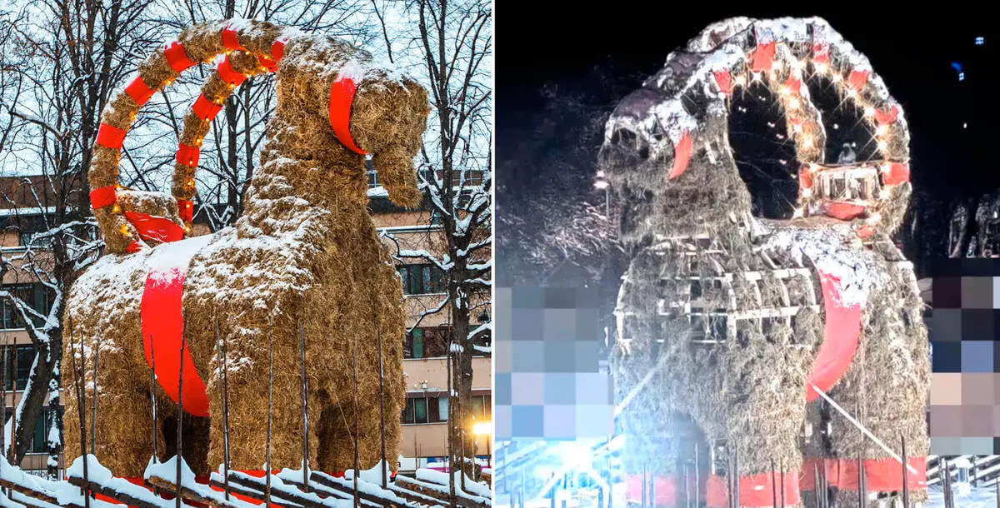
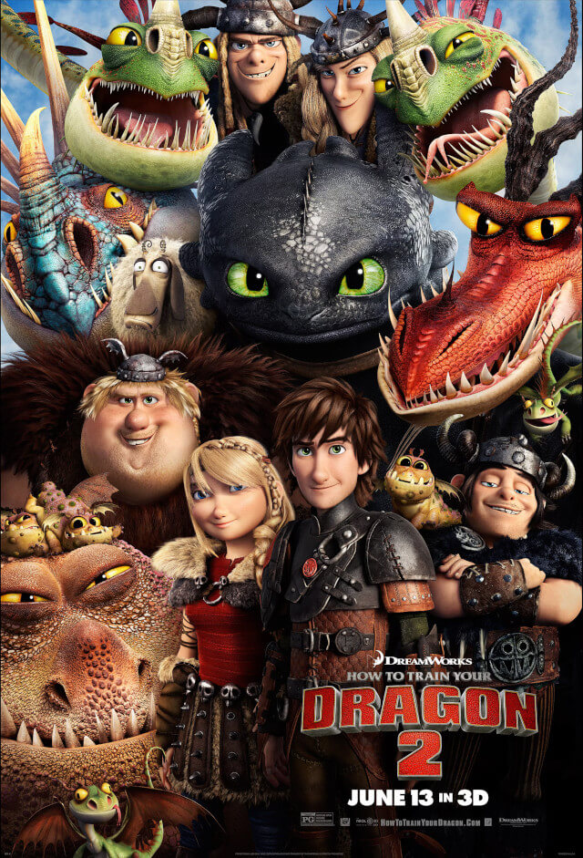
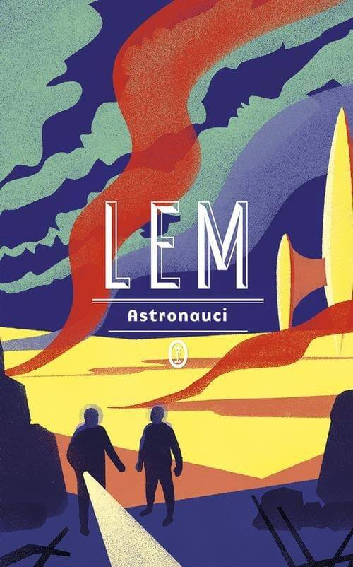
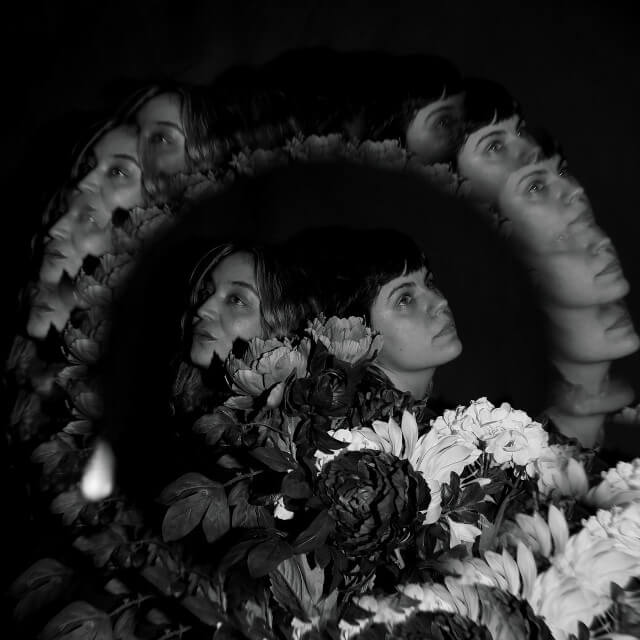
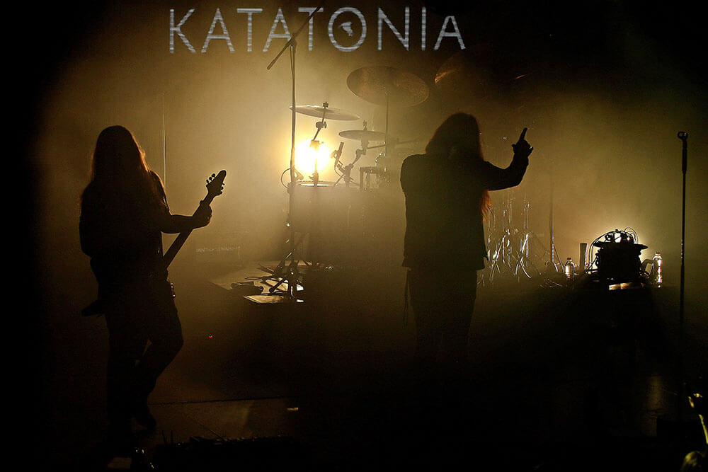
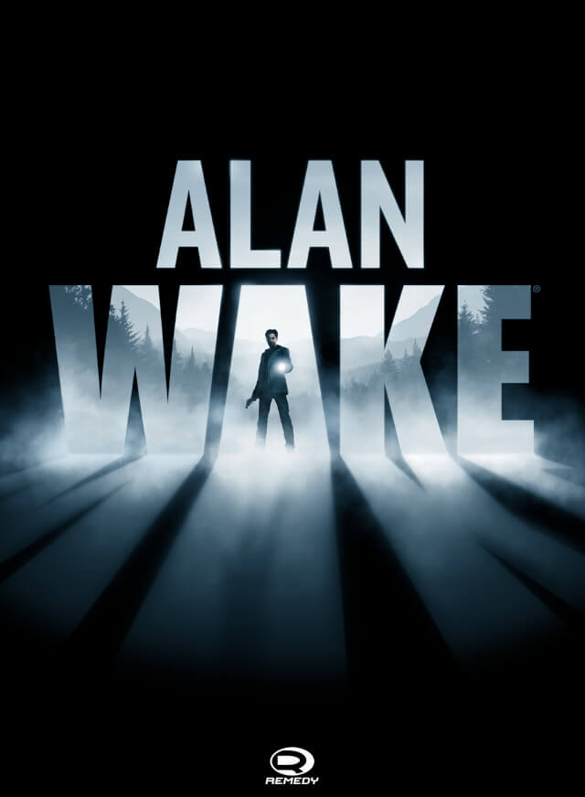
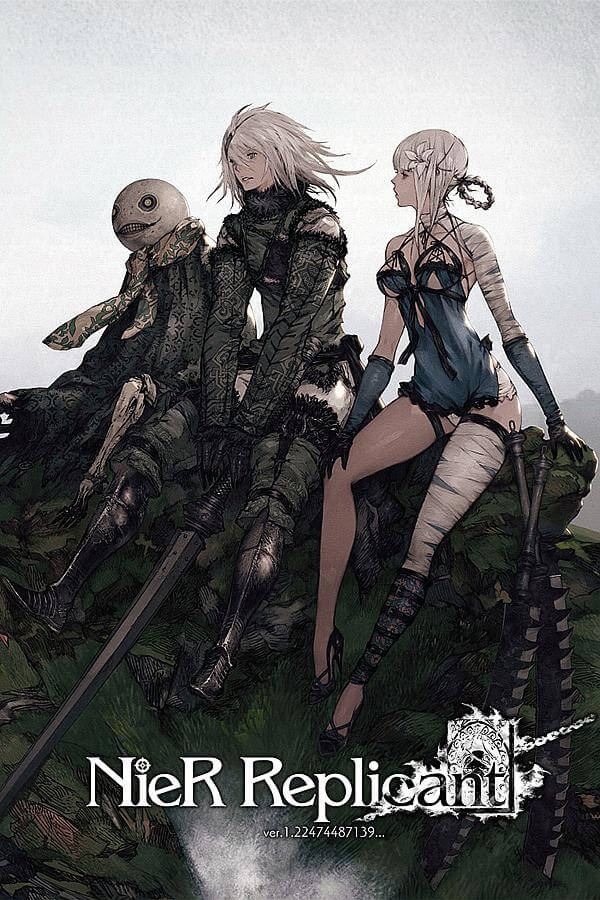
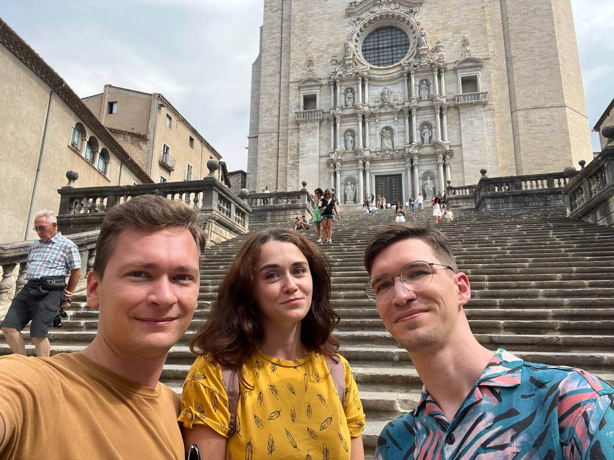

# Мы сделали это, профессор! Итоги 2023 года

***

***

Попытки впихнуть опыт целых двенадцати месяцев в один текст заранее обречены на провал, но я постараюсь. Год выдался богатым на события: к работе прибавилась учеба, социальных связей стало сильно больше, переезды и путешествия были и нервными, и радостными одновременно. Я, если честно, уже и сам путаюсь в хронологии событий, поэтому попробую разбить чувственный опыт на какие-то категории без привязки ко времени и попытаюсь выделить что-то запоминающееся.

## Фильмы

Из 50+ фильмов и мультфильмов, что я видел в этом году, лишь немногие вышли в этом году и запомнились: это «Братья Супер Марио в кино», «Подземелья и драконы: Честь среди воров» и последний (во всех смыслах) «Флэш».

Все они, ну допустим, окэй, но фильмами года ни один назвать не получится. А вот «Как приручить дракона — 2», да и всю драконью трилогию в целом — очень даже. Красивый, интересный даже сейчас и очень трогательный мультфильм о семье и ответственности.

## Книги

В этом году я больше, чем раньше, читал на шведском: это и адаптированные версии «Каллокаина» и сказок про муми-троллей, и короткие оригинальные истории. Книг на английском тоже хватало, но книжным (пере)открытием стал Станислав Лем, которого я начал читать в хронологическом порядке под конец года.

Просто удивительно, как книги, написанные в 50-х и 60-х годах, точно описывают концепции технологий, появившихся два, а то и три десятилетия спустя: микроэлектронику, интернет, бытовое применение ИИ.

Особенно хотел бы выделить по сути первый (по факту — второй) его роман «Астронавты», в котором просматривается столь типичная для более позднего Лема тема космоса опасного и непонятного, но потому притягательного и захватывающего. Жанрово «Астронавты» мечутся между триллером и агитационным плакатом с коммунистической пропагандой, но поскольку книга затрагивает универсальные темы гуманизма, то читается на одном дыхании даже сейчас.

## Музыка

Многие из моих фаворитов выпустили в этом году новые альбомы: это и очень антивоенные «Камни» Tequilajazzz, и Sky Void of Stars от Katatonia, но музыкой года ни один из них не стал.

А вот совершенно безысходный, буквально воющий от отчаяния [Desolation Flower](https://ragana.bandcamp.com/album/desolations-flower) американского дуэта Ragana вполне прочно занял место самого прослушиваемого альбома уже под занавес года. Начинай свое утро с чашечкой бодрящего блэк-метала!

## Концерты

Продолжаем музыкальную тему. В этом году было много концертов, хороших и разных:

* Мы ездили на Depeche Mode и, возможно, видели эту группу вживую в последний раз. Никто не молодеет, а люди внезапно смертны.
* Я был на Meshuggah, и реальность оказалась лучше мемов: эти ребята превращают мозг в фарш только так.
* Очень много маленьких концертов в клубе Plan B дали возможность послушать в первый раз Enter Shikari, Skynd, Lake Malice и Knife Bride.

Но все это ерунда и мелочи по сравнению с главным событием года — концертом Katatonia в Копенгагене. Услышать на концерте группу, которая определила мой музыкальный вкус на последние полтора десятилетия как минимум, ощущать музыку всем телом, петь любимые песни в толпе стоит многого. Я рад, что это наконец случилось и особенно ценю этот опыт; даже если впереди будут еще отличные концерты Katatonia, так, как было в первый раз, уже точно не будет.

## Игры

Как и в случае с фильмами, ничего нового из игр в этом году до меня не дошло. Я преимущественно разгребал бэклог из игр с раздач в Стиме и ЕГС, плюс проходил некоторые игры с PS4, взятые в библиотеке на дисках. Было много проходняка: это и Horizon Forbidden West, и Fist of the North Star: Lost Paradise, и Deliver Us Mars, но и хорошего хватало. Трудно выделить одну «самую-самую» игру, поэтому пускай их будет две. 

Первый Alan Wake, который как с самого начала взял меня за шкирдяк, так и не отпускал следующие 15 часов своей атмосферой фильмов Линча и заманухой в конце каждого эпизода. Очень хочу верить, что физическое издание второй части все же случится, и я когда-нибудь ее пройду.

Nier: Replicant уже по традиции игр от Йоко Таро вынул из меня все кишки и эмоционально уничтожил. Очень хорошо, давайте еще! Серия Nier умудряется делать безысходность, распад и отчаяние увлекательными и захватывающими, истории отдельных людей (и машин) в них всегда запоминаются, а в целом от игр остается ощущение шекспировской драмы, когда в каждой главе ты погружаешься все глубже и глубже в пучину, но концовка всегда ощущается как некий катарсис, даже при том, что ее нельзя назвать счастливой.

## Путешествия

В прошлом году мы дорвались до внутреннего туризма и посетили кучу соседних городов и заповедников. В этом году запал будто бы утих, но все же запоминающихся событий хватило:

* Поездка к тюленям в Моклэппен удостоилась [отдельного поста в блоге](/2023/01/28/see-the-seal/).
* Автомобильный музей Симрисхамна в самую пору выделять в отдельную категорию «Винегрет года», потому что такой огромной и неупорядоченной коллекции автомобилей я еще не встречал.
* Поездка в зоопарк Сконе, кажется, становится ежегодной традицией. Все еще считаю его отличным сочетанием нацпарка и зоопарка, отличным местом и для взрослых, и для детей.
* В этом году мы начали осваивать Сконеледен — муниципальную сеть маршрутов для хайкинга в нашем регионе. Прокладывать пути самостоятельно все еще очень сложно, потому что приходится ограничивать себя прогулками на 3-5 часов с привязкой к автобусным станциям в начале и конце, но пару раз за лето все же удалось выбраться.

Главным же событием наверное была поездка в Испанию к моим котанам. Терапевтический тур по небольшим городам Каталонии в отличной компании, вкусная еда, хорошая погода  — первый настоящий отпуск за я уже не помню какое время.

* * * 

Оставайтесь тунцов, земляне! Увидимся в следующем году.