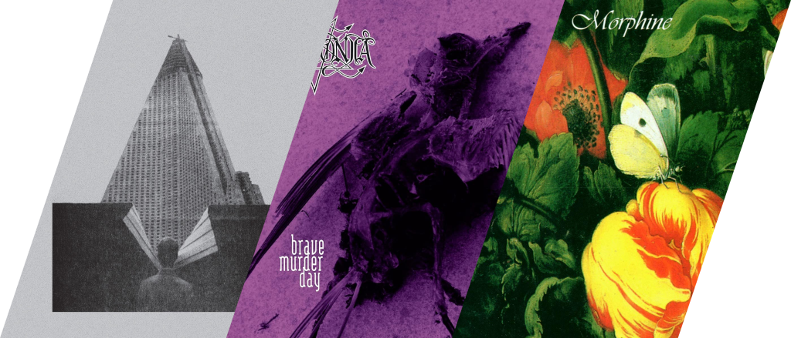
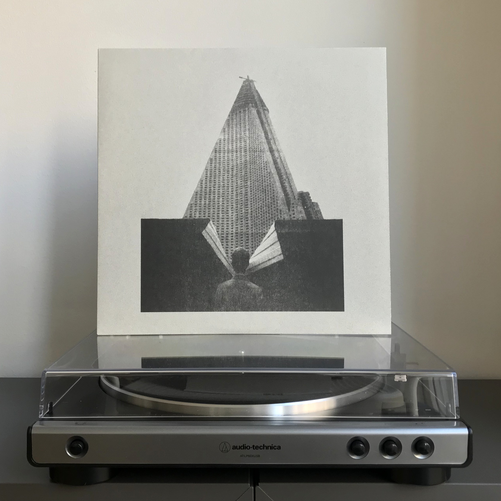
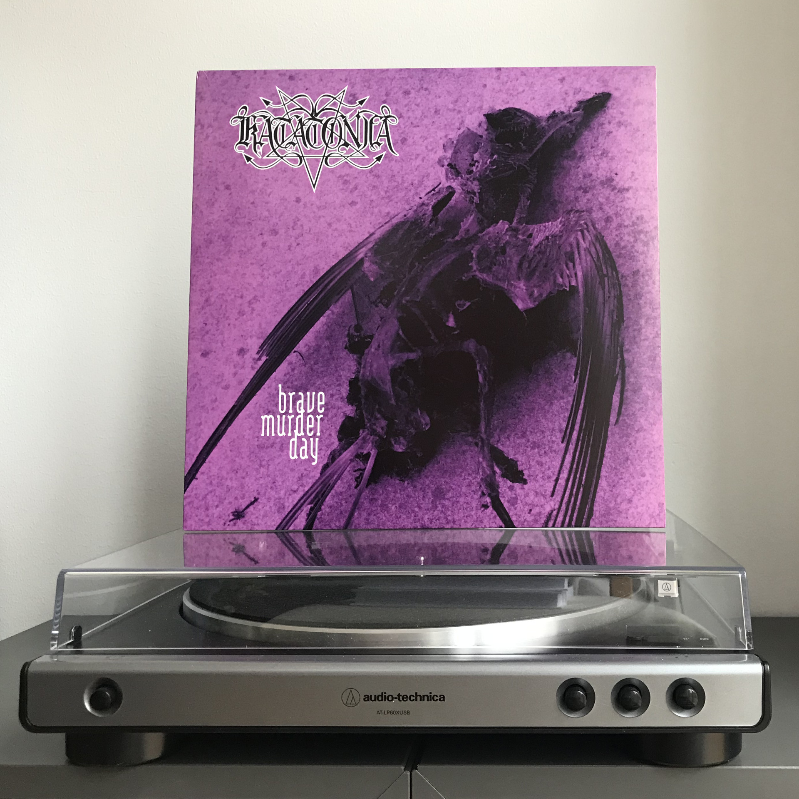
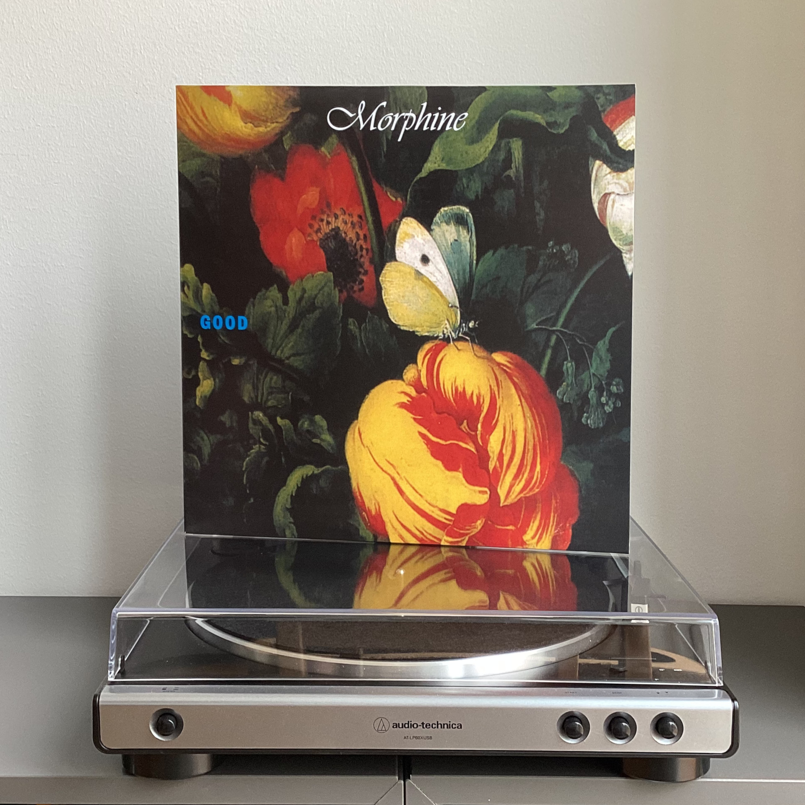

# Чего там по винилу? Отчет за февраль 2024

***

***

## Молчат дома — С крыш наших домов

«Молчат дома» были если не последней, то уж точно не первой группой, которую я ожидал найти в продаже в местных магазинах с пластинками.

Из плюсов: в комплекте с пластинкой оказался купон на скачку его же во FLAC.
Из минусов: пластинка то ли отпечатана очень дешево, то ли производили ее в самом пыльном помещении на свете, потому только после нескольких прослушиваний с регулярной очисткой щеткой она перестала скипать и заедать.
Первую купленную пластинку я даже вернул в магазин, думая, что это брак, но точно такие же проблемы всплыли и у копии, которую я взял на замену.

## Katatonia — Brave Murder Day

Когда-нибудь настанет день, когда из этой рубрики пропадут пластинки Katatonia...
Но этот день не сегодня!

«Опять птицы эти дохлые, что у них за фиксация на них», — ворчит Машуля, а я заряжаю в проигрыватель альбом, названный по трем первым трекам с него: Brave, Murder и Day.

**Фан-факт**: это единственный полноформатник Katatonia, где на вокале выступает Микаэль Окерфельдт из легендарной группы Opeth, потому что у Йонаса Ренксе были проблемы со связками и орать в микрофон как дикая свинья он не мог.
Вообще у групп Opeth, Katatonia, October Tide и Bloodbath давнее и плотное сотрудничество, музыканты из этих групп умудрились переиграть и переездить в туры с другими коллективами.
Такая вот шведская музыкальная коммуналка.

## Morphine — Good

С группой Morphine я знаком примерно с того момента, как впервые взял в руки бас, то есть уже около 15 лет.
Поэтому неудивительно, что я планирую рано или поздно собрать все их записи.

Марк Сэндман долгое время был главным музыкантом, на которого я равнялся, именно его опыт вдохновлял меня на самые дикие эксперименты с инструментом, техниками игры и записи.
Очевидно, я не достиг и малой части того, что он успел сделать за свою короткую жизнь, но это и не важно, главное — мне было весело.
Я верю, что Morphine — это музыка, доступная всем и способная привлечь любого, поэтому рекомендую вам это замечательное видео от Александра Тобольского с канала «Лонгплей»:

<iframe src="https://www.youtube-nocookie.com/embed/CN6Rwvp7q7U?si=T8_sC46rNqfNKml0"></iframe>
