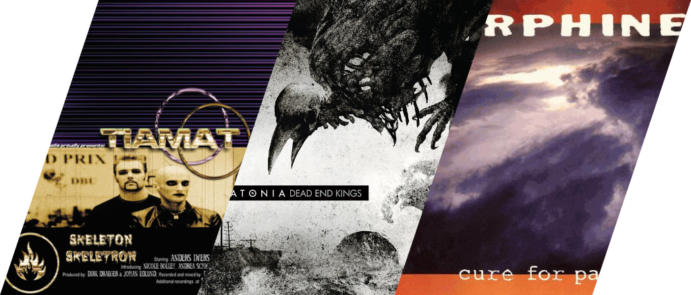
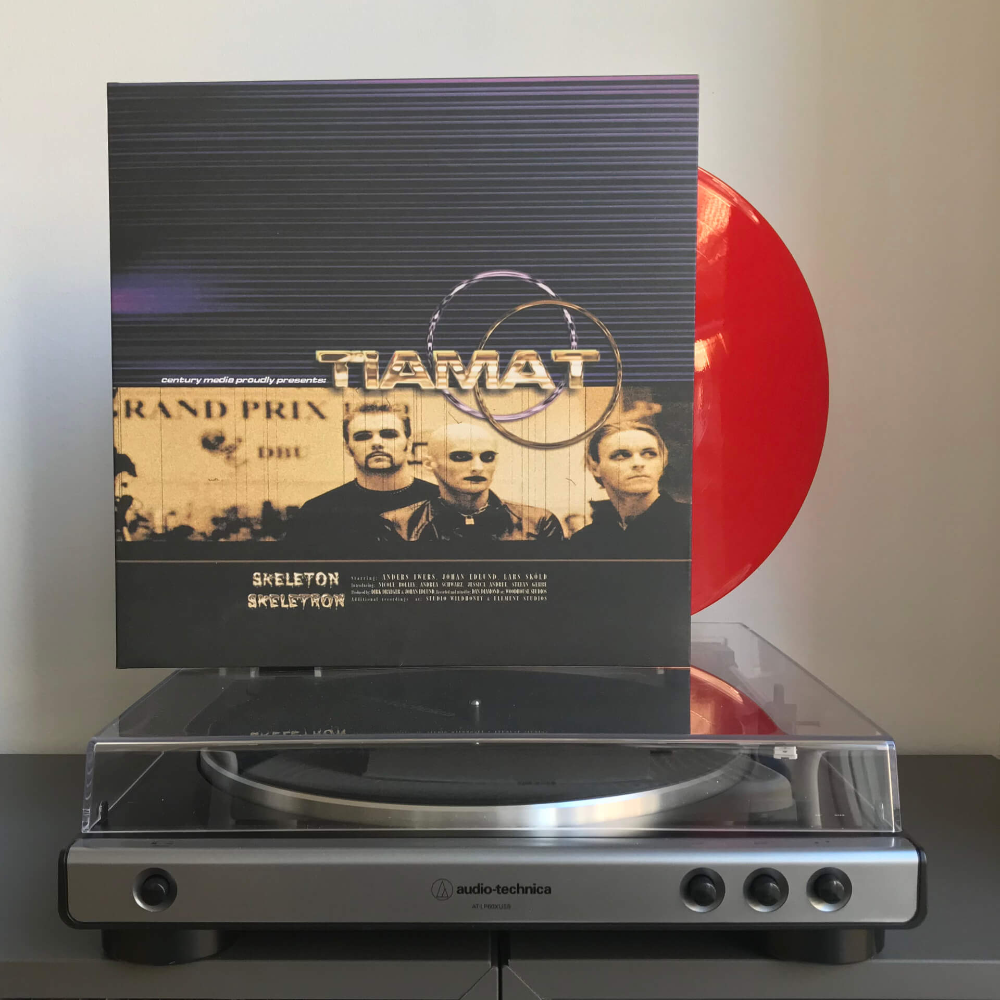
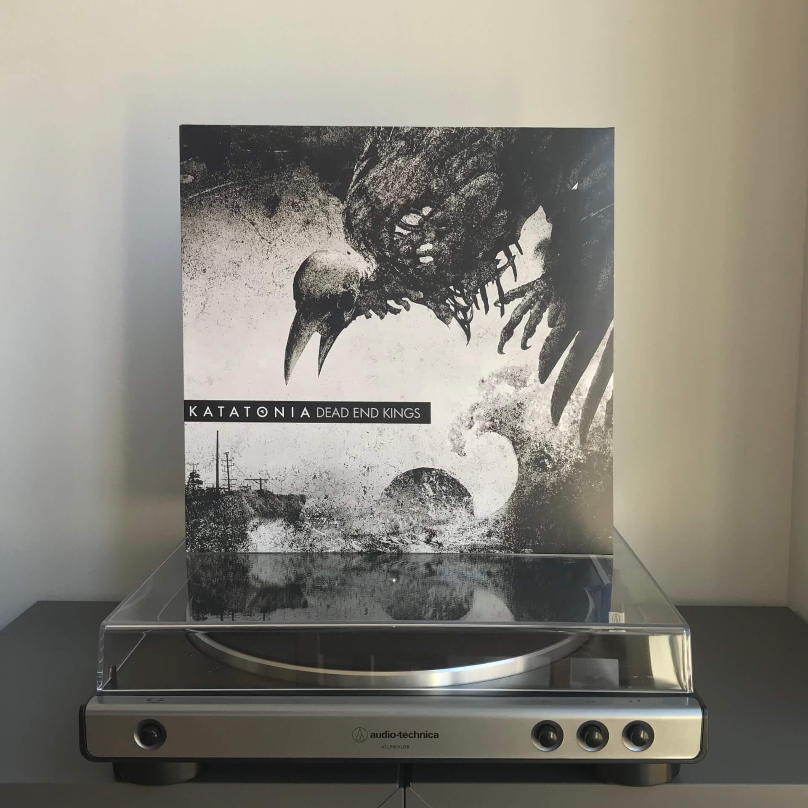
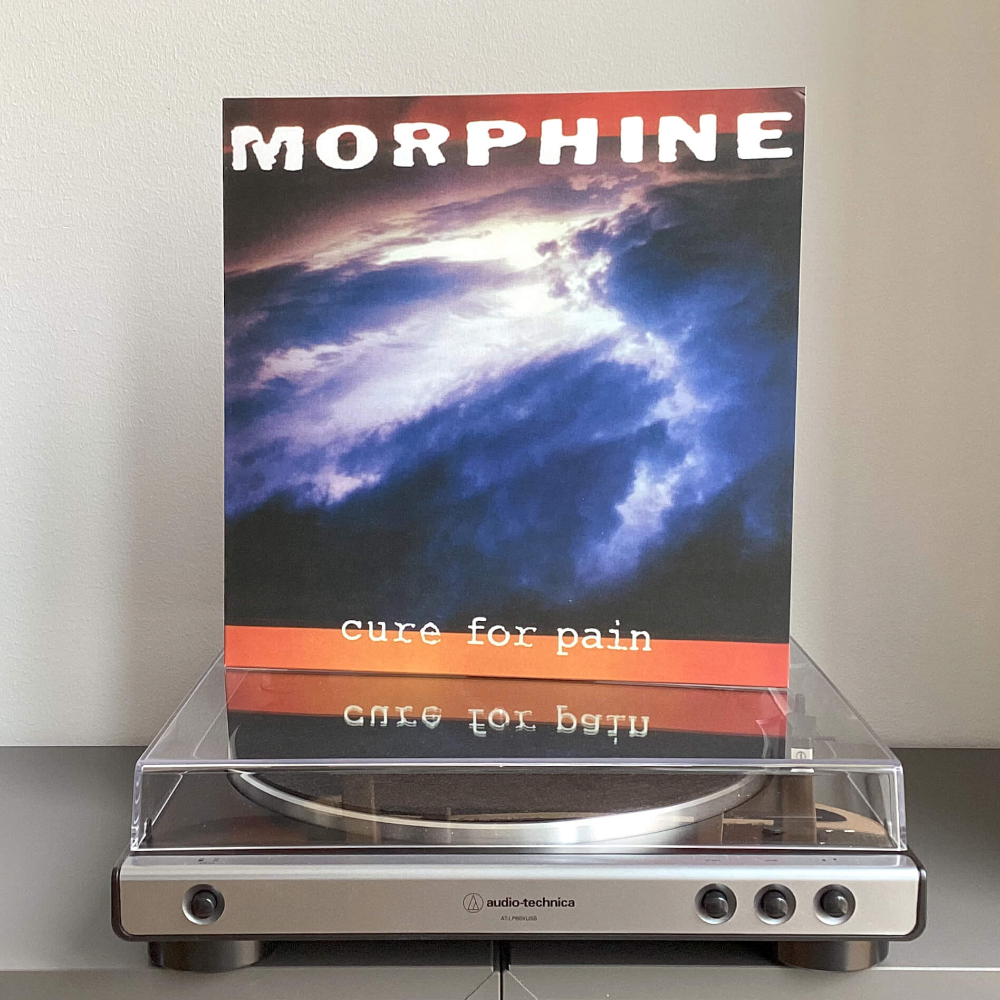

# Чего там по винилу? Отчет за март 2024

***

***

## Tiamat — Skeleton Skeletron

Группа Tiamat полна парадоксов:

* По словам Юхана Эдлунда, вокалиста и фронтмена, в Tiamat только один участник — он сам, но тем не менее проект называется группой.
* Эдлунд с 90-х живет в Германии и пишет всю музыку там, но группа Tiamat все равно считается шведской.
* В дополнение к прошлому пункту: группа хоть и шведская, но их записи в Швеции найти _сложновато_, приходится заказывать из других стран.
* Tiamat никогда не писали специально саундтреков для игр, но именно через игру Vampire the Masquerade: Bloodlines я о них узнал.
* Группа всегда играла дэт-метал и готик-рок, но обложка Skeleton Skeletron выглядит так, будто внутри ждет забористое техно или евродэнс.

Так и живем!

Издание на красном виниле выглядит стильно, весит солидно, но звучит шакально: даже при регулярной чистке вечно что-то подщелкивает и подскрипывает, надо его с мылом помыть будет что ли.

## Katatonia — Dead End Kings

Лично для меня этот альбом закрепил окончательный переход группы к более прогрессивному и артовому звучанию.

Он отлично подойдет, чтобы вкатиться в их творчество: очень мелодичный, легкий для прослушивания, ему можно душевно подпевать на концертах, а если слушать его дома на большой громкости — соседи жаловаться не будут.
В прошлом году на концерте в Дании я видел мужичков за 40 в офисном прикиде, распивающих под треки с Dead End Kings белое вино из фужеров, — и это идеально передает вайб всего альбома.

_Если верить Википедии, альбомов в дискографии Katatonia мне должно хватить суммарно на год._
_Буду надеяться, что к тому времени они выпустят что-то новое, потому что шутка слишком хороша, чтобы бросать ее на полпути._

## Morhpine — Cure for Pain

Если до конца света остается всего 38 минут (мы все ближе к этому сценарию), а вы до сих пор не слышали ни одного трека Morphine — начинайте с этого альбома, потому что плохих или скучных треков тут нет.
Если же до конца остается всего три с половиной минуты — врубайте сразу Buena, лучше уже не будет.

Хоть Cure for Pain и не поднимался особо высоко в чартах, композиции с него разошлись на саундтреки к «Дарье», «Бивису и Баттхеду», «Клану Сопрано» и нескольким фильмам, а саксофонный проигрыш Дэны Колли из Head with Wings <del>подрезал</del> сэмплировал «Дельфин» в своем «Дилере»:

<iframe src="https://www.youtube-nocookie.com/embed/QvjvqHTHLMg?si=FPZpYSj1Bxy-a5dI&amp;controls=0"></iframe>

_P.S.: Ставь лайк, если оставлял на басу всего две струны, чтобы играть Thursday слайдом как Марк Сэндман._
