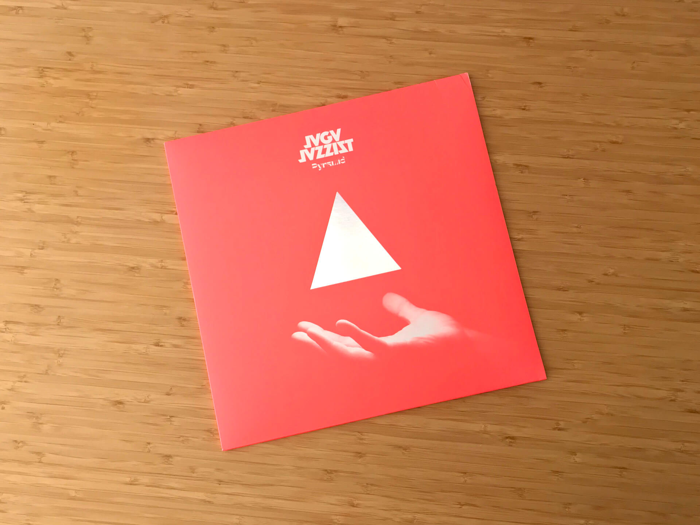

# Чего там по винилу? Отчет за май 2024

***

***

## Jaga Jazzist — Pyramid

Рано или поздно в жизни человека наступает момент, когда его начинает тянуть к великому и вечному, например, к пирамидам.
Но поскольку отправиться к египетским пирамидам сейчас нет ни желания, ни возможности, приходится обходиться музыкальными аналогами — одним из них стал одноименный релиз норвежского октета Jaga Jazzist.

На пластинке всего четыре трека, но по продолжительности набирается почти 40 минут экспериментального джаза. 
Запись идеально подходит и для фона в потоке во время работы, и для увлеченного разглядывания узоров на ковре при прослушивании дома в кресле.

В комплекте с пластинкой лежит самый необычный артефакт, что я когда либо встречал, — кусок фольгированного картона, из которого предлагается сложить уже означенную пирамиду.
Так каждый желающий может не только услышать, но и прикоснуться к великому.

## Katatonia — Tonight's Decision

Второй после Discouraged Ones альбом Katatonia из переходного периода.
В музыке начинает появляться то самое тревожное мироощущение, которое потом закрепится на Last Fair Deal Gone Down и [Viva Emptiness](/2024/01/29/vinyl-report/) и придет к своему пику на монументальном [The Great Cold Distance](/2023/12/28/vinyl-report/).

Хотя на этом альбоме нет сильных хитов, совсем не интересным его назвать тоже нельзя.
Особенно можно выделить кавер-версию Nightmares by the Sea, в оригинале исполненную Джеффом Бакли.
Если зайти в комментарии к этому треку на Ютубе, то вы встретите там чересчур фанатичных поклонников Бакли, заявляющих, что оригинал лучше во всем, а такие каверы только порочат его светлую память:

Но как говорится, если блядей корёжит, вы все делаете правильно.

Трек A Darkness Coming — вывернутая наизнанку история про мальчика, который кричал «Волки!», приправленная лавкрафтовским неописуемым ужасом.
Вас предупреждали, что тьма придет и принесет с собой непонятно какие ужасы, но вы не слушали, и вот она уже здесь — но никто все еще понятия не имеет, чем это грозит.

Тревожно? Не особо.  
Круто? Очень.

## Maserati — Pyramid of the Sun

Рано или поздно в жизни человека наступает момент, когда после прослушивания тревожной музыки его снова тянет к великому и вечному, например, к пирамидам.
И когда Jaga Jazzist уже прослушан, в дело вступают Maserati из Афин в <del>Грузии</del> Джорджии, США.

На сегодняшний день это самое дорогое-богатое издание из всего, что я брал: юбилейный тираж, фиолетовый и пурпурный винилы, конверты с полиграфией, обложка из плотного картона, артбук с психоделическими фото и абстрактными картинками, чтобы залипать в них за прослушиванием инструментального космического рока.
Выглядит офигенно, звучит классно, одна беда — в полку для пластинок по высоте не входит, пришлось поставить ее отдельно.

Надеюсь, этими двумя альбомами получится закрыть странную тягу к пирамидам на ближайшее время и брать еще и Pyramid Of The Necropolis группы War Master не придется.
