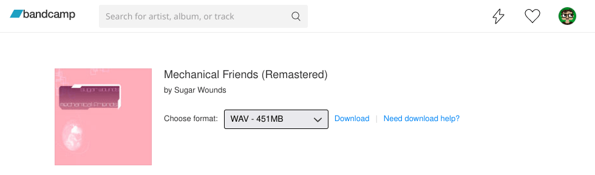
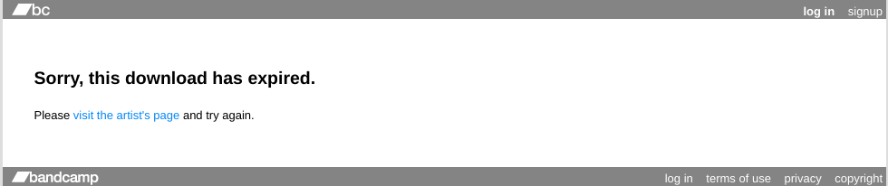
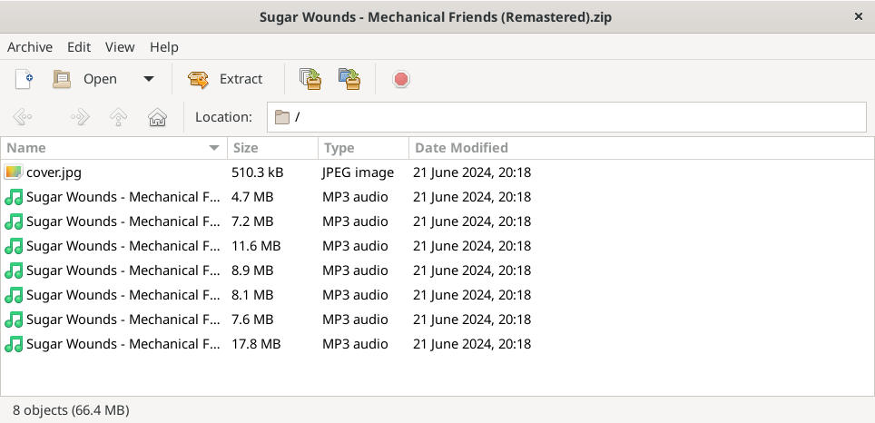

# Reverse engineering Bandcamp downloads for love and piece

***

***

_This post was originally published in English, but is also accessible in [Russian](/2024/06/24/bandcamp-downloads/)._

_**Disclaimer**: It turned out to be much longer and personal than I originally expected._
_I decided to keep it this way, but if you came here only for programming stuff, you are more than welcome to [skip to technical details](#technical)._

Man, I love Bandcamp.
For me it's the only platform that sparkles joy of discovering, listening and buying music.
Compared to Spotify, Apple Music or YouTube, Bandcamp doesn't seem to have The Algorithm™.
You can subscribe to genres  and it will simply show random new releases mixed with not-so-new releases in your feed: some of the albums will be pure gold, others will be utter garbage.
You can follow artists for new hot stuff, but it will not affect your recommendation feed anyhow.
Call me old fashioned, but I love the vibes it gives: even though new music is delivered straight to your browser, you still need to put in extra effort to find something that you really like and you can't predict where the journey takes you.

It brings back memories of being a teenager during the mid-2000s in my hometown.
If you were an emo, a goth or a metal head, there was one place for you to go — a local store selling all kinds of band merchandise (predominantly cheap knock-offs) and [wolf t-shirts](https://knowyourmeme.com/memes/three-wolf-moon).
I've spent countless hours there just window shopping, staring at clothing I couldn't afford and going through tapes and CDs they had in stock.
Luckily, the staff didn't care about gloomy teenagers hanging around, they knew that one day you'll save enough lunch money to buy something from them.

Buying music was a game of guess: I didn't have proper Internet access during that time, so the best source of recommendations I could count on were occasional Wikipedia articles and bands that my classmates mentioned.
So my strategy was simply looking at album covers and maybe asking a thing or two from a bored to death sales guy.
One day you could bring home a Lacrimosa CD just to find out that they are great, another day you get mixed feelings about a Children of Bodom cassette.
It was a gamble, and I enjoyed every single minute of it.

I don't get the same feeling from Spotify where recommendations look like "You liked sugar, so you'll probably like maltitol and aspartame" and I hate Apple way too much to even consider the idea of buying their music service subscription.
Subscriptions in general don't cut it for me: if I paid for music, I want it safely stored on my computer so I can copy it to my audio player (with hardware buttons) and listen it through wired headphones:

And it's not just music: I feel deeply betrayed by Sony who banned one of my PlayStation accounts and won't allow me to buy games from one of the remaining two;
the possibility of losing access to Steam games I (don't) own also looks quite grim.
This is the reason why I prefer GOG.com nowadays: I can download DRM-free installers to my computer and will be able to play Heroes of Might and Magic III even when society crumbles and the Internet goes dark.

Considering my love for Bandcamp, it should not come as a surprise that I also enjoy fiddling with it programmatically.
I call it fiddling for a simple reason: they don't provide official APIs for most of the things you can do on the site, but the site itself is built smart enough to allow me to craft these tools:

**[BC Player](https://github.com/torunar/bc-player)**:
an alternative Bandcamp music player that supports queuing (it also has a [browser extension](https://github.com/torunar/bc-player-helper) to directly integrate with Bandcamp feed).

**[Liked albums widget](https://github.com/torunar/bandcamp-liked-albums-widget)**:
Bandcamp doesn't have "likes" per se, but you can wishlist stuff — and hey, they use a heart icon for it, close enough.
List of wishlisted albums is accessible through (non-documented, of course) search API, which allowed me to build a site where everyone can showcase a collection of releases they like.
Here is mine, for example:

<iframe src="https://torunar.github.io/bandcamp-liked-albums-widget/?fan_id=3382834" style="min-height: 270px; margin-bottom: var(--uiGap);"></iframe>

**[Liked albums RSS](https://github.com/torunar/rss-feeds)**:
it's basically the same thing in the form of an RSS feed.
I mostly follow blackgaze, math rock, synthwave and breakcore, so if you want to stay tuned with what catches my attention on Bandcamp, just add this URL in your RSS reader of choice: [https://torunar.github.io/rss-feeds/build/bandcamp-liked-albums.xml](https://torunar.github.io/rss-feeds/build/bandcamp-liked-albums.xml).

I mentioned buying stuff from Bandcamp, but a lot of music there is available for free, you just go and download it.
Legally.
No strings attached.
They even let you choose the format and quality, isn't it nice?

And even if something is not available freely, there's of course a way to download it with, say, [youtube-dl](https://github.com/ytdl-org/youtube-dl).
Bandcamp understand it and openly admit that they're not going to spend development time and money to fix something that is not broken: ["I heard you can steal music on Bandcamp. What are you doing about this?"](https://bandcamp.com/help/audio_basics#steal).
If you want to support a performer, just name your price (some albums have minimal price set, you can add extra on top) — the artist will get most of the money you paid, and you'll get a copy of the album to listen on your audio player (with hardware buttons!).

Which brings me to the topic of this post: how does downloading free (i.e., distributed without a lower price limit set) music work on Bandcamp?
What if I want to have a local backup of all the free releases from my wishlist?
Bandcamp don't seriously expect me to go through the manual download process for every single album, do they?
Even if they do, I'm pretty sure there is a way to work it around.
Let's go to a [free album page](https://sugarwounds.bandcamp.com/album/mechanical-friends-remastered), ask for a download and see where Bandcamp redirect me:

    https://bandcamp.com/download?id=472457604&ts=1719170366.294537336&tsig=5e1411c3cc4ffe2b0c02b31ffb0e60de&type=album

Okay, the URL has something that looks like an album ID, some token and signature.
Downloading different albums gives different IDs, token and signature change every time, so I can't hardcode them.
From my previous encounters with Bandcamp, I know that it stores album information in a `script` element with the `data-tralbum` attribute, which contains JSON-encoded album data, so let's see if there is a free download link there somewhere:

    {
      "for the curious": "https://bandcamp.com/help/audio_basics#steal https://bandcamp.com/terms_of_use",
      "current": "/** skipped **/",
      "preorder_count": null,
      "hasAudio": true,
      "art_id": 3553041759,
      "packages": null,
      "defaultPrice": 7.0,
      "freeDownloadPage": "https://bandcamp.com/download?id=472457604&ts=1719170366.294537336&tsig=5e1411c3cc4ffe2b0c02b31ffb0e60de&type=album",
      "FREE": 1,
      "PAID": 2,
      "artist": "Sugar Wounds",
      "item_type": "album",
      "id": 472457604,
      "last_subscription_item": null,
      "has_discounts": false,
      "is_bonus": null,
      "play_cap_data": null,
      "client_id_sig": null,
      "is_purchased": false,
      "items_purchased": {
        "packages": {},
        "bundles": {},
        "crowdfunding_campaign": {}
      },
      "is_private_stream": null,
      "is_band_member": null,
      "licensed_version_ids": null,
      "package_associated_license_id": null,
      "has_video": null,
      "tralbum_subscriber_only": false,
      "featured_track_id": 4234552772,
      "initial_track_num": null,
      "is_preorder": false,
      "album_is_preorder": false,
      "album_release_date": "24 May 2024 08:11:31 GMT",
      "trackinfo": "/** skipped **/",
      "playing_from": "album page",
      "url": "https://sugarwounds.bandcamp.com/album/mechanical-friends-remastered",
      "use_expando_lyrics": false
    }

And surely there is the `freeDownloadPage` property.
Now I know how to get to an album download page, but how do I get the actual ZIP archive URL from it?
Let's open source code and start digging.
Again, there is a `script` element on the page, called `pagedata` with something JSON-encoded in its `data-blob` attribute.
The content of this attribute is quite long, so let's focus only on this part:

    {
      "digital_items": [
        {
          "downloads": {
            "mp3-320": {
              "size_mb": "63.3MB",
              "description": "MP3 320",
              "encoding_name": "mp3-320",
              "url": "https://popplers5.bandcamp.com/download/album?enc=mp3-320&fsig=00b08a0ef60ff8f0a9b9e4970c0ba43b&id=472457604&ts=1719170609.0"
            }
          }
        }
      ]
    }

It looks like a list of formats and URLs.
Let's take one of them and try shoving it in the address bar:

Bummer.
Is it time to use the network monitor to debug stuff?
Apparently, the URLs I found before are **not** download URLs, but stat URLs.
When I change format on the free download page to MP3-320, I can see the request to a slightly different URL:

    https://popplers5.bandcamp.com/statdownload/album?enc=mp3-320&fsig=d0b8d24621d44e47db70e80af71eb6b7&id=472457604&ts=1719170610.3045844466&.rand=1118817395515&.vrs=1

* `download` is replaced with `statdownload`.
* `ts` no longer ends with `.0`, but with some seemingly random value.
* Additional `&.rand` parameter added with, again, some random value.
* `&.vrs=1` appended at the end of the URL.

Response to the request looks like this:

    {
      "result": "ok",
      "url": "popplers5.bandcamp.com/statdownload/album?enc=mp3-320&fsig=d0b8d24621d44e47db70e80af71eb6b7&id=472457604&ts=1719170610.3045844466&.rand=1118817395515&.vrs=1",
      "host": "scruffycentral-b4gx-2",
      "download_url": "https://p4.bcbits.com/download/album/1be668409c340ce30382a4b172b1ba553/mp3-320/472457604?fsig=67b47364b6ff165b09c0df8d994c7384&id=472457604&ts=1719171791.1334808993&token=1719776591_abb599a8c126fc1a86667adcab20b1649975e991"
    }

Will it work if I use the `download_url` from the response?
It surely does, I get my sweet ZIP archive and there is free music inside:

The problem is I have no idea how the trailing part of `ts` and the `.rand` parameter are calculated.
What response will I get if I put random values there?
Interestingly enough, it's no longer JSON, but some Javascript code:

    if (window.Downloads) {
        Downloads.statResult({
            "result": "err",
            "retry_url": "https://popplers5.bandcamp.com/download/album?enc=mp3-320&fsig=68a6ccd613ace8850db6e42258de8625&id=472457604&ts=1719217640.3278671238",
            "errortype": "ExpiredFreeDownloadError",
            "date": "2024-06-24 08:27:20 UTC",
            "url": "popplers5.bandcamp.com/statdownload/album?enc=mp3-320&fsig=23be1fba7f0f83c6f725ed9cbcae4275&id=472457604&ts=1719217626.0&.rand=1719217626000&.vrs=1",
            "host": "scruffycentral-b4gx-1"
        })
    };

`retry_url` looks promising, though — and of course when I use it download starts.

Bandcamp, you're truly amazing.
What's next?
Should I build a tool that makes local backup of free albums from my wishlist?
Maybe I will, the whole download process seems to be easy enough to handle in a single bash script (if you speak `sed`):

    #!/usr/bin/env bash
    
    ITEM_URL="${1}"
    
    FREE_DL_PAGE_URL=$(curl -sq "${ITEM_URL}" \
        | sed -nE -e 's/^.+(https:\/\/bandcamp.com\/download\?id=[0-9]+&amp;ts=[0-9]+.[0-9]+&amp;tsig=[a-z0-9]+&amp;type=album).+/\1/p' \
        | sed 's/&amp;/\&/g' \
    )
    
    DL_STAT_URL="$(curl -sq "${FREE_DL_PAGE_URL}" \
        | sed -nE -e 's/^.+(https:\/\/popplers5.bandcamp.com\/download\/album\?enc=mp3-320&amp;fsig=[a-z0-9]+&amp;id=[0-9]+&amp;ts=[0-9]+.0).+/\1/p' \
        | sed 's/&amp;/\&/g' \
        | sed 's/\/download\//\/statdownload\//' \
    )&.rand=$(date +%s)000&.vrs=1"
    
    DL_URL=$(curl -sq "${DL_STAT_URL}" \
        | sed -nE -e 's/.+(https:\/\/popplers5.bandcamp.com\/download\/album\?enc=mp3-320&fsig=[a-z0-9]+&id=[0-9]+&ts=[0-9]+.[0-9]+).+/\1/p'\
    )
    curl -o music.zip "${DL_URL}"

And I guess it's time for me to stop and say thank you for reading all the way to the end.
I'll be back with other technical shenanigans any time soon, stay tuned!
