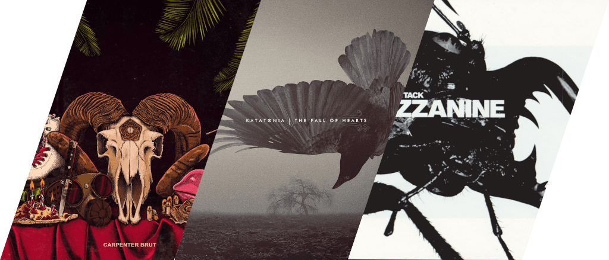
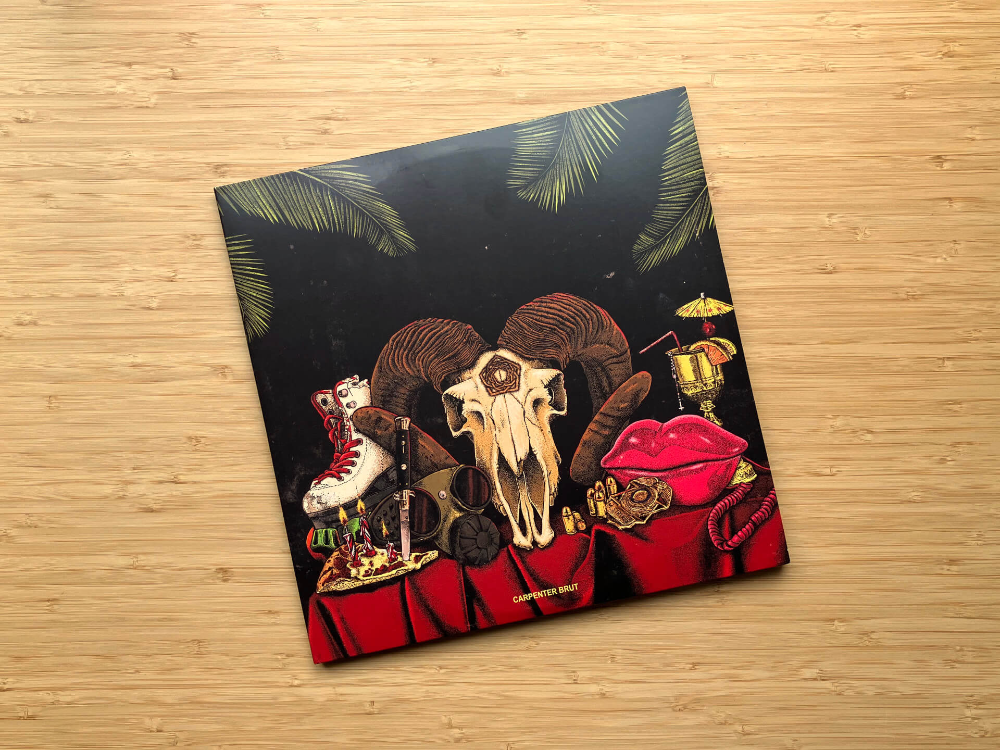
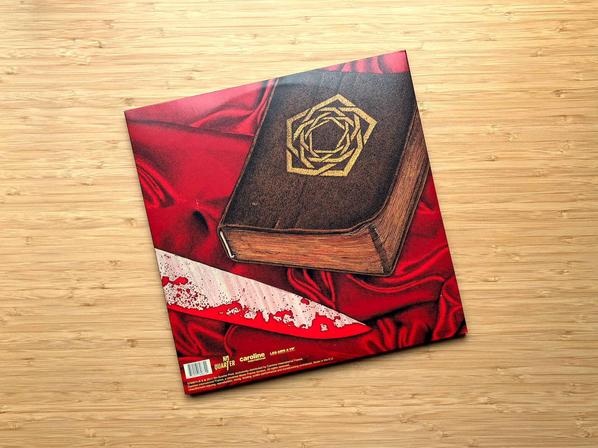
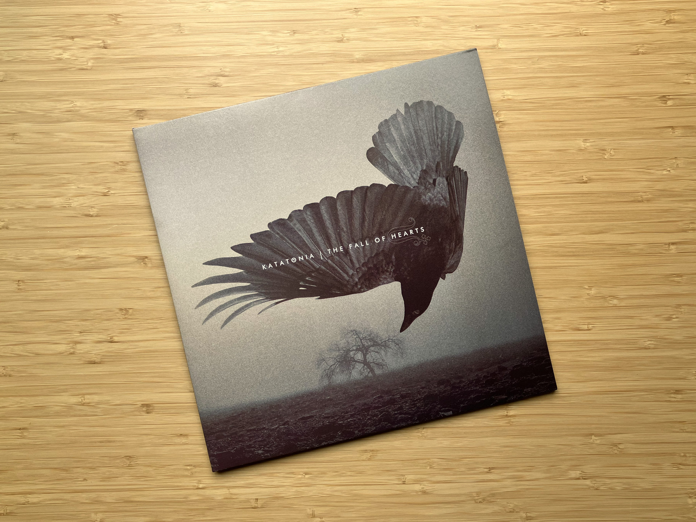
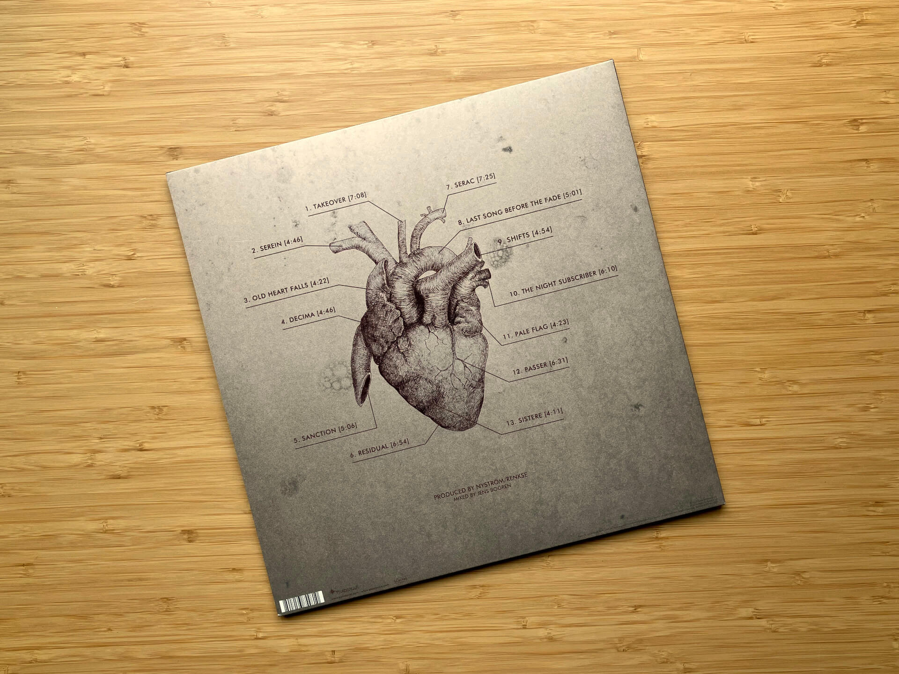
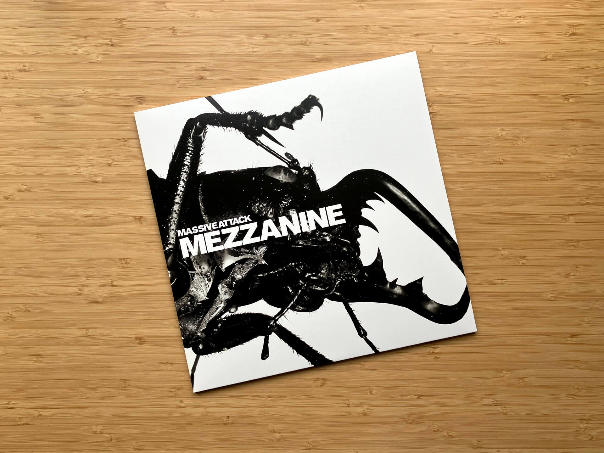

# Чего там по винилу? Отчет за июнь 2024

***

***

## Carpenter Brut — Trilogy

Танцевальный, стильный, пугающий — три эпитета про тройной альбом.
Trilogy — это компиляция из предыдущих EP Карпатыча, крайне логично названных EP I, EP II и EP III.
Внутреннее оформление конверта, соответственно, — это компиляция-переосмысление обложек предыдущих релизов:

В целом альбом можно охарактеризовать одной фразой: «ни прибавить, ни убавить»: это идеальный экземпляр в коллекции любителей дарксинта от одного из главных представителей этого жанра.
Треки с «Трилогии» регулярно ремейкают другие исполнители, сам Carpenter Brut постоянно исполняет их на живых выступлениях, где они звучат намного жестче и реально сотрясают стены. 
А еще это прекрасная музыка для кодинга! 
Сцена из финала игры Hacknet это только подтверждает:

<iframe src="https://www.youtube-nocookie.com/embed/-c_jGVx6vxE"></iframe>

## Katatonia — The Fall of Hearts

Когда в 2009-м Katatonia выпустили Night is the New Day, я был настолько им разочарован, что перестал следить за новыми релизами группы на долгие годы и в итоге пропустил [Dead End Kings](/2024/03/26/vinyl-report/) на релизе.
Мою веру в новый стиль смог закрепить только следующий их альбом The Fall of Hearts, и если бы я мог послать сообщение самому себе обратно в 2012-й, это была бы одна фраза: [«Блять, какой ты дурак, ёб твою мать…»](https://on.soundcloud.com/G1Vxoo8pyC3f5h127). 

The Fall of Hearts не то, чтобы эпохальный, но крайне качественный.
Всегда ношу его с собой на плеере (с кнопочками!), но для меланхоличного прослушивания дома под дождик на улице он подходит все-таки лучше.

## Massive Attack — Mezzanine

Я человек бескультурный. 
Трип-хоп не люблю, за Portishead не шарю, в Бристоле не был.
Но даже при этом Massive Attack знаю и уважаю лет этак с 15.
Первым их треком для меня стала Angel, игравшая в главном меню пройденной мною раз десять Vampire: the Masquerade — Bloodlines, а вторым была Teardrop из опенинга «Доктора Хауса».
Вот такую великую силу имеет группа, раз уж даже в моем болоте их музыка до меня добралась.

Жена у меня тоже Massive Attack котирует и взять Mezzanine было ее идеей, за что ей +100500 очков респекта.
Так уж совпало, что на этом альбоме есть и Angel, и Teardrop — гештальт закрыт, а в физическом издании можно еще и на красивого жирного жука на конверте смотреть.

И на этом все на сегодня!
Пишите [в комментах](https://t.me/misha_talks/165), кстати, что вы думаете про слухи, что основатель Massive Attack Роберт Дель Ная — это и есть Banksy.
