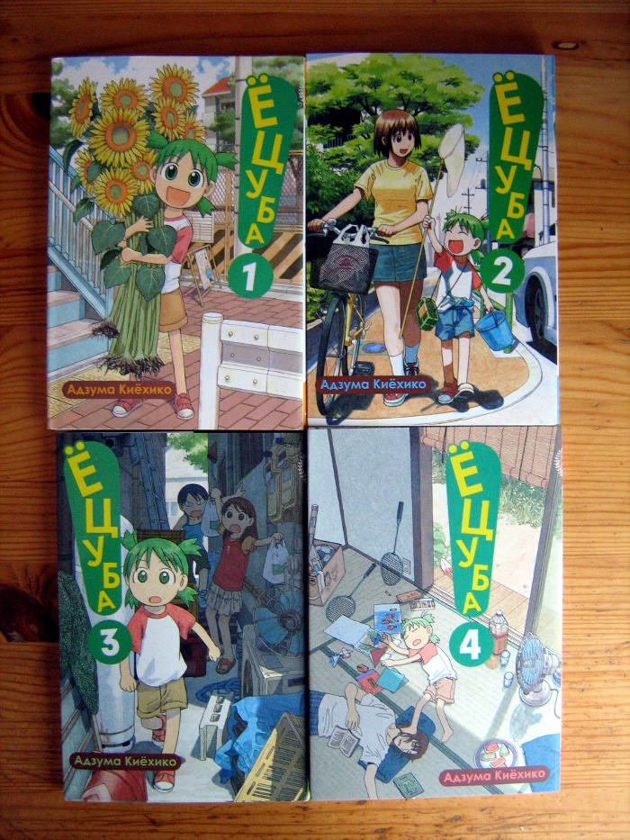

# Праздник к нам приходит

* * *
Сегодня произошло поистине событие века: посылка с мангой от «Фабрики Комиксов» все-таки пришла ко мне.
* * *

Изначально изданием Azumanga Daioh и Yotsuba-to! в России занималось издательство «Пальма-Пресс», которое ныне, разругавшись со всеми печатными домами, находится в состоянии стагнации, доживая свои последние деньки и отдав все лицензии в другие издательства.

И так уж вышло, что «Азумангой» и «Ёцубой» стала заниматься «Фабрика Комиксов» (дочернее издательство «АСТ»), у которой сейчас тоже не лучшее время. Издательство вынуждено работать исключительно по предзаказу с полной предоплатой, чтобы не прогореть на издании большего числа продукции, чем сможет продать. Казалось бы, беспроигрышная модель как для издателя, так и для покупателя, но…

Предзаказ на четвертые тома вышеупомянутых произведений был оформлен еще первого сентября. Сроки печати и доставки были означены в середине ноября. Черт! — подумал я тогда. — Это же целых два месяца ожидания! Вероятно, мне стоило умерить аппетиты и ждать худшего.

Релиз переносили всего два раза: сначала — на середину декабря, а потом — на его конец. 24-го числа манга была-таки выпущена. Казалось бы — что может помешать ей оказаться у меня буквально в новогоднюю ночь? Суровая реальность в лице почты России, для которых, как известно, Новый год — не праздник:

Бандероль просто отказались принять в связи новогодней загруженностью. Но не прошло и 20 дней — как я забирал ее на местном почтовом отделении.

Итог? В целом все прошло вполне мирно. Конечно, манга добиралась до меня четыре с половиной месяца, но все-таки пришла. Ура-ура. Теперь я — счастливый обладатель полного издания «Адзуманги»:  

… и не столь полного издания «Ёцубы», которая по-прежнему публикуется в Японии:  

Буду ли я что-нибудь еще заказывать из «Фабрики Комиксов»? Скорее всего, нет.