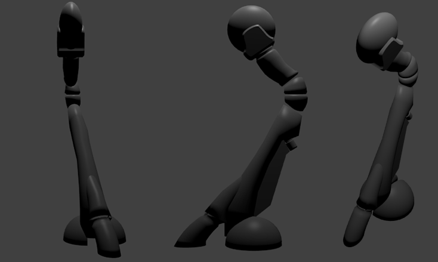
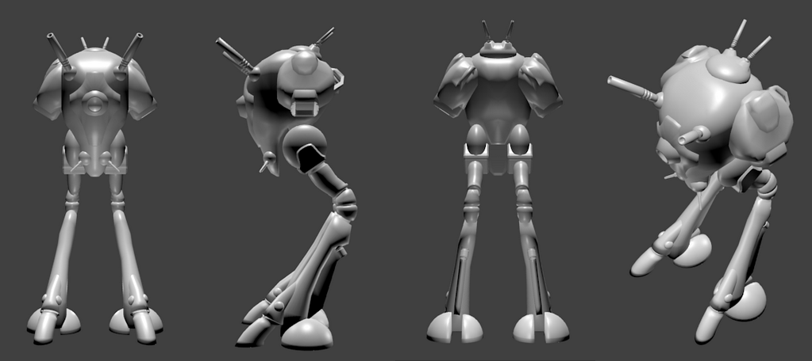

# Reguld в Blender 3D

* * *
В качестве индивидуального проекта по предмету «Видео-компьютерная анимация и системы виртуальной реальности» решил сделать один из механизмов из вселенной Super Dimension Fortress Macross — штурмовой планетарный бот Reguld.
* * *

Работать над моделью начал 3 марта, завершил работу полностью 14 мая. Столь долгое время выполнения объясняется, в первую очередь, неимоверным количеством отчетности по другим учебным дисциплинам.

В процессе работы, по сути, с нуля пришлось осваивать Blender — и, должен признать, к версии 2.6 он стал весьма удобным инструментом. Переработка интерфейса пошла программе на пользу — вспоминаю все те мучения, что пришлось испытать почти 3 года назад при выполнении лабораторной работы в Blender 2.4.

Больше всего времени ушло на создание непосредственно меша, совсем немного — на расстановку материалов и текстур. Здесь немалую роль сыграл Toon Shader ­— именно он позволил обойтись малой кровью. Раз семь пришлось с нуля переделывать освещение, пару раз — крупно править меш (полностью изменять нижние части ног) и текстуры.

Последние 4 дня упорно точил по 3-4 часа в день скелет модели и анимацию. Результат получился таким, каким и планировался:

<iframe width="100%" height="500" src="https://www.youtube-nocookie.com/embed/xYtX69y-MLM" frameborder="0" allow="autoplay; encrypted-media" allowfullscreen></iframe>

Пока ковырялся с Регульдом, понял, что моделирование — это, черт побери, интересно! К завершающей стадии осознал, как много глупостей в процессе работы понаделал, и в следующий раз смогу обезопасить себя от выстрелов в ногу.
