# Ghost Stories

* * *

* * *

В моей небольшой коллекции настолок пополнение — Ghost Stories.

Причиной покупки этой игры стало огромное количество положительных отзывов о ней от абсолютно разных людей. Решив, что терять нечего, неделю назад я оформил на [Hobby Games](http://hobbygames.ru/) очередной заказ — и сегодня, точно в срок, забрал на местном почтовом отделении посылку с игрой.

Итак, что же такое «Ghost Stories?

>Ghost Stories — кооперативная игра, в которой участники берут на себя роль даосских монахов и защищают деревню от нашествия злых духов. Она рассчитана на 1-4 человек, а время партии заявлено в пределах часа.

<cite>[Boardgamegeek](http://boardgamegeek.com/thread/501342/ghost-stories-russian-review-obzor-na-russkom)</cite>

  
> Много воды утекло со времен ужасного царствования Ву-Фенга, Властелина Девяти Кругов Ада. Похоронная урна с его пеплом была захоронена на кладбище маленькой деревушки в Срединной Империи. Прошли годы, и ее жители забыли о своем проклятом наследии.
> 
> Но скрытый глубоко в Преисподней, Ву-Фенг не забыл ни о чем. Беспрестанные поиски привели его к урне. Тень его новой инкарнации встала над жителями деревни, не подозревающими об угрозе.
> 
> К счастью, Фат-Си (даосские монахи) на страже, охраняя границы между живыми и мертвыми. Вооруженные своими мужеством, верой и силой, они призваны отправить инкарнацию Ву-Фенга назад в Ад.

<cite>Книга правил Ghost Stories</cite>

Прежде, чем говорить о геймплее, хотелось бы рассказать о технической 
 составляющей. В коробке с игрой нас ждут:

- Правила, справочные листы и таблица рекордов на четырех языках: английском, немецком, французском и, как я понял, польском

    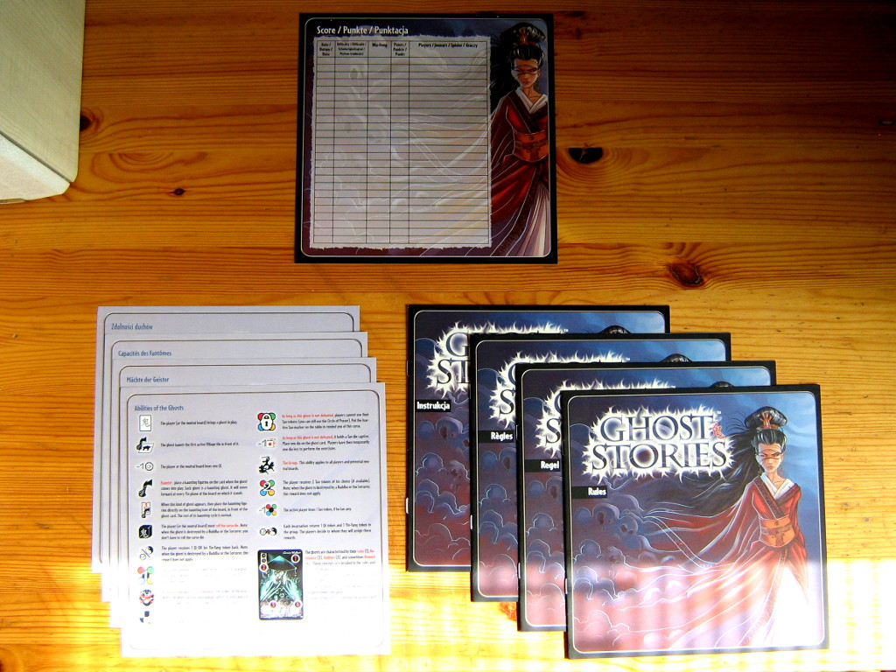

- Карточки игроков

    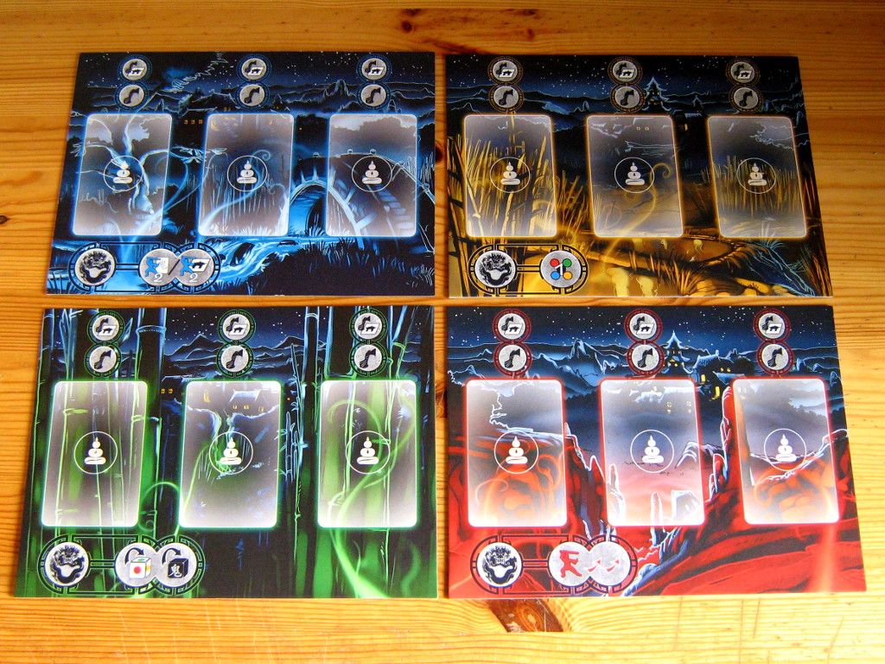

- Картонные формовки-хрустяшки с жетонами и плитками

    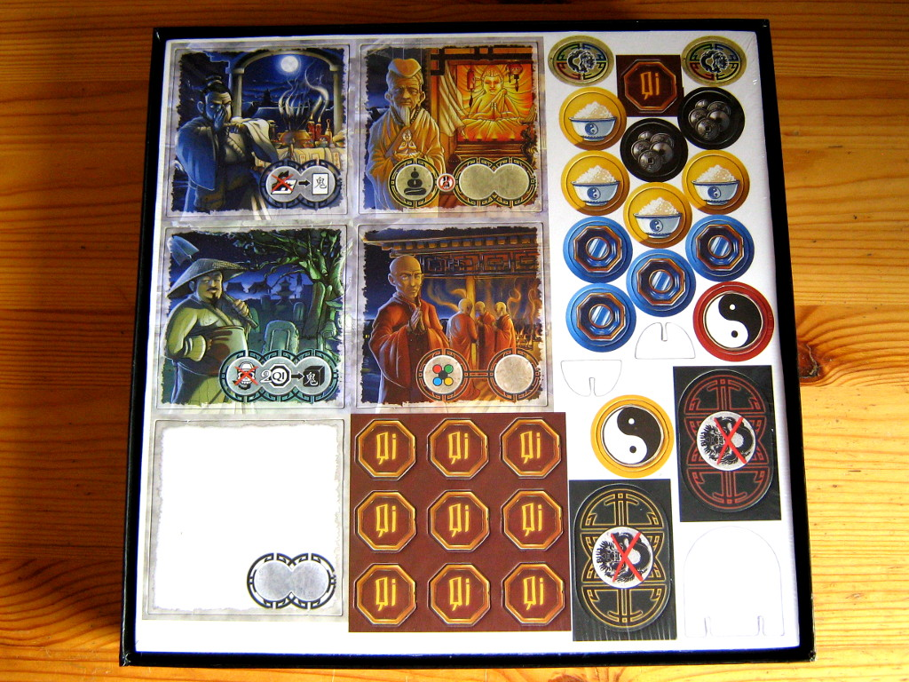

- Игральные кости: 4 кости изгнания (белые и серая), 1 кость проклятия (черная)

    , 1 кость проклятия (черная)")

- Карточки противников

    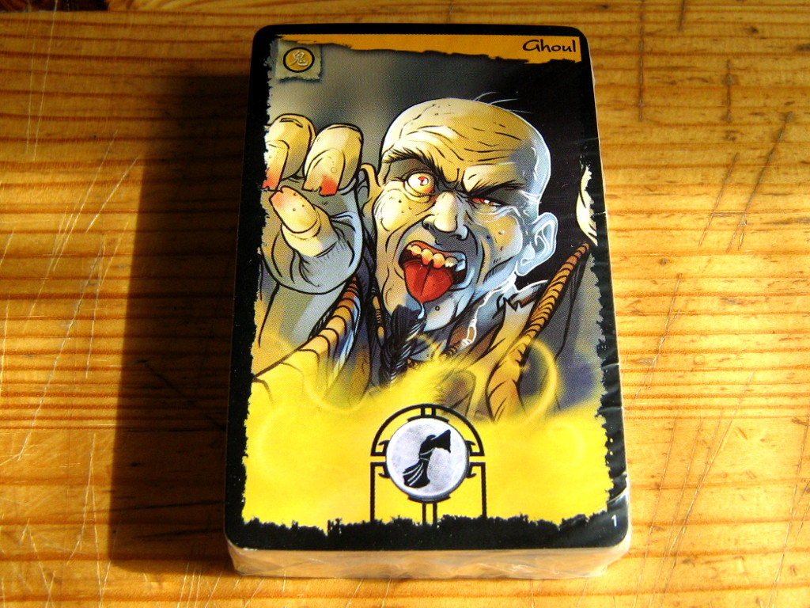

- Миниатюры: 4 миниатюры монахов, 8 миниатюр призраков, 2 статуи Будды

    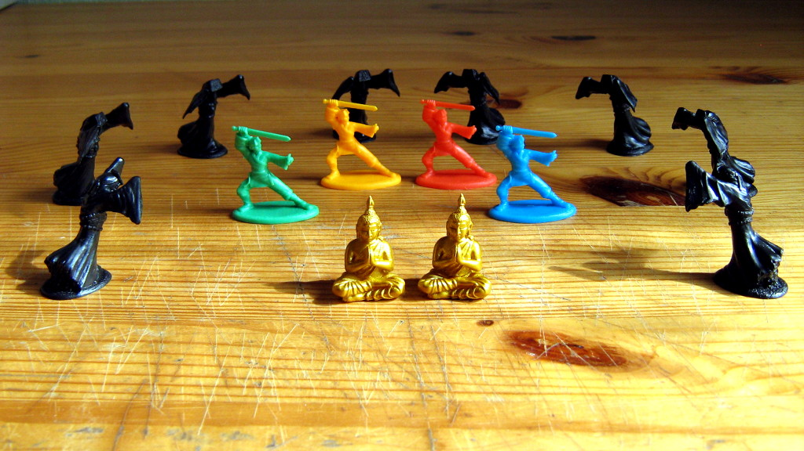

После распаковки и выхрустывания хрустяшек из формовок получаем следующие компоненты:

- Жетоны всевозможные

    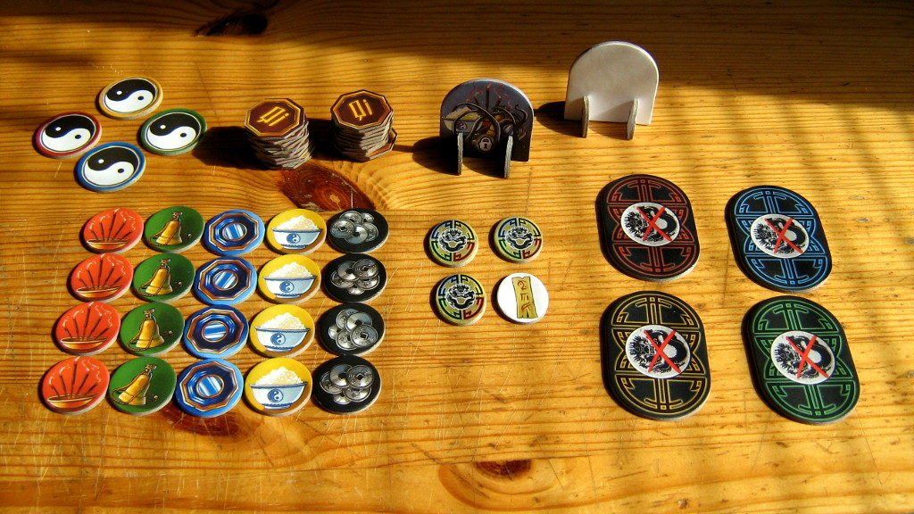

- Деревня — плитки, обозначающие NPC

    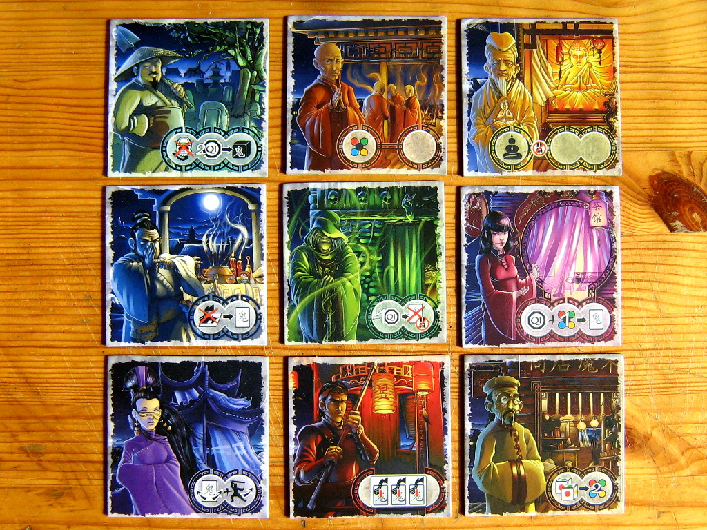

Отдельно о картах. В комплекте с игрой идут 55 карточек с изображением разностной нежити, замечательно выполненных и, что примечательно, не повторяющихся.

Например, так выглядят все 10 карт Инкарнаций Ву-Фенга — босса данной игры:

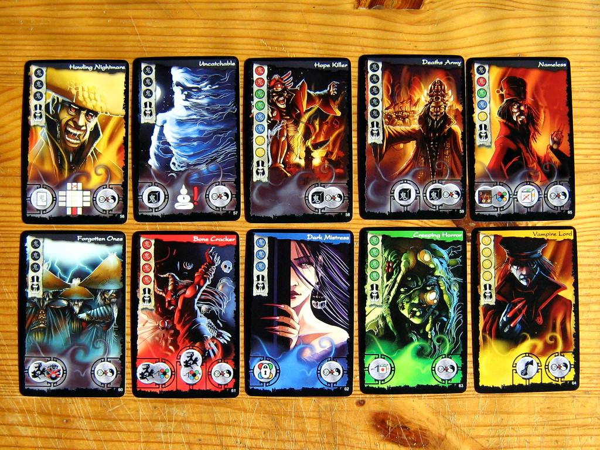

Рядовая нежить тоже не отстает в плане красочности и выразительности. Вот лишь несколько случайно выбранных образчиков:

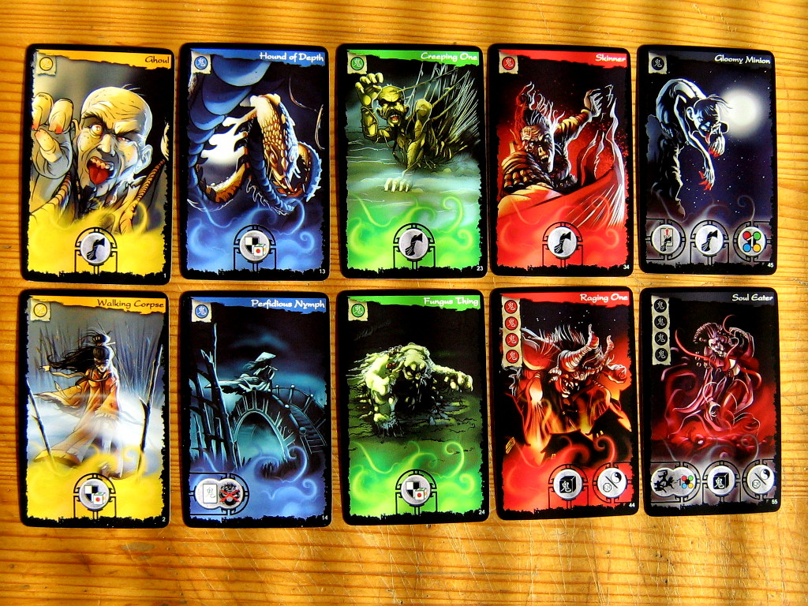

Как видно, игра выдержана в азиатской стилистике: тут и шаолиньцы-защитники, и буддистские монахи в шафрановых накидках, и самураи, и гейши, и скорченные ведьмы, и чудовища, будто прямиком прибывшие из японского фольклора, и монетки с квадратными отверстиями, и даже плошки риса.

Однако, самое время начать игру! Готовое поле для партии из четырех игроков имеет следующий вид:

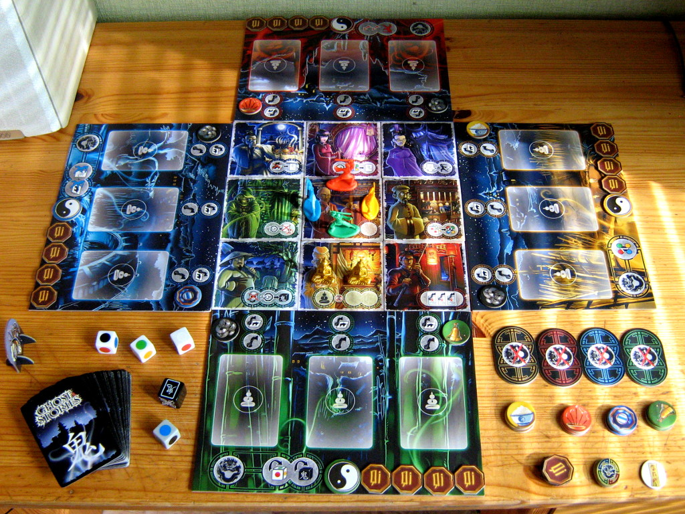

Чтобы прочувствовать механику, решил пробежаться в одиночку. Несмотря на предусмотренную разработчиками возможность игры одним игроком, взял на себя всех четырех воинов.

С каждым ходом на окраину деревни прибывают призраки. Монахи-даоситы, защищая деревню, должны этих призраков изгонять. Монахи отличаются друг от друга не только цветом: все они обладают разными способностями. Так, например, желтый монах может ставить священные печати и имеет бездонные карманы, красный способен летать, перемещаясь по всей карте, синий двигается с огромной скоростью, совершая два действия за ход, ну а зеленый и вовсе является любимчиком богов, имея возможность один раз за ход перебрасывать кубики, если его не устроил предыдущий бросок.

Каждый призрак, приходящий в игру, может оказывать определенное воздействие, ослабляя монахов и увеличивая мощь армии Ву-Фенга. Для изгнания духов Дао-игроки могут пользоваться священными Дао-предметами или же надеяться на Дао-удачу, закидывая противников Дао-кубами.

Особую опасность представляют неспокойные призраки — они, вступив в игру, сначала приближаются к деревне, а потом и вовсе начинают свое движение по ней, убивая жителей. Как только 4 жителя будут убиты, игра заканчивается победой Сил Тьмы.

Собственно, забыв об ограничении на 4-х убитых, тыкался до упора, однако, потерпел сокрушительное поражение. Такие концовки игрокам придется видеть часто: даже на минимальном уровне сложности игра — настоящий хардкор, требующий под угрозой смерти работы в команде.

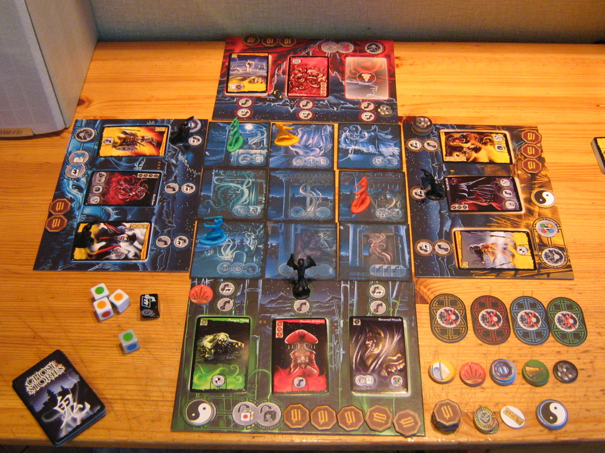

**YOU AND ALL YOUR FRIENDS ARE DEAD**

Не могу дождаться возможности попробовать игру в компании.