# Dungeons and Dragons: Castle Ravenloft

* * *

* * *

> The master of Ravenloft is having guests for dinner – and you are invited!
> 
> Evil lurks in the towers and dungeons of Castle Ravenloft, and only heroes of exceptional bravery can survive the horrors within. Designed for 1-5 players, this boardgame features multiple scenarios, challenging quests, and cooperative gameplay.
> 
> Each player selects a hero; a ranger, rogue, warrior, cleric, or wizard. On their turn, each player can explore further into the dungeon (turn over new tiles), move through the already explored parts of the dungeon, and fight monsters. When a new dungeon tile is revealed, there is typically an encounter of some sort, and new monsters to fight are added. Slain monsters reward the players with treasure, and experience points, allowing them to level up and increase their skills during play. Players must cooperate to stay alive, slay the monsters, and achieve the goal of their quest. Each scenario has a different goal - from retrieving a relic, to slaying a vampire lord.

<cite>[BoardGameGeek](https://boardgamegeek.com/boardgame/59946/dungeons-dragons-castle-ravenloft-board-game)</cite>

Спустя пару месяцев, появились время и компания для прохождения подаренного Мари “Dungeons and Dragons: Castle Ravenloft”. Спустя 4 часа, когда сценарий был завершен, от стола отклеились 3 абсолютно довольных игрока. Такого бешеного удовольствия я не испытывал с момента освоения “Ужаса Аркхэма” и его дополнений.

С настолками в жанре “dungeon crawl” до этого мы почти не сталкивались, а потому на общее восприятие оказала влияние и новизна жанра.

Итак, чем же игра так хороша?

В первую очередь, “Castle Ravenloft” предлагает игрокам настоящее приключение, начало и окончание которого определяются одним из 12 заранее написанных сценариев, а течение — действиями игроков и случайными событиями. Случайный фактор добавляет реиграбельности даже в рамках одного сценария, а когда сценарии из “Adventure book”, идущего в комплекте с игрой, закончатся, ничто не помешает загрузить новые из Сети или же просто придумать самим.

Во-вторых, подкупает простота механики.

Собственно, “Dungeons and Dragons” в “Castle Ravenloft” представлены по-минимуму: игра очень проста с точки зрения боевой и приключенческой систем, не скатываясь при этом в примитивизм и сохраняя некоторые принципы изначальной ролевой игры. Полностью отсутствуют сложные броски, задействующие разные виды костей — для всех проверок используется только <abbr title="20-гранная игровая кость">d20</abbr>.

При всей простоте, в игре представлены многие виды действий: сражения, включающие рукопашные схватки и магические действия, обезвреживание ловушек, случайные события и эффекты. Игроки могут использовать различные виды снаряжения: оружие, зелья, кольца и амулеты, дающие преимущества в исследовании и бою.

[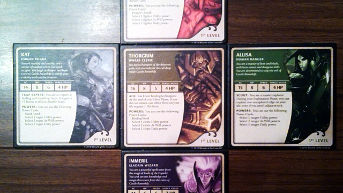](./img/22.jpg)
[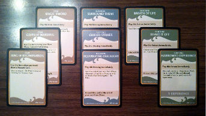](./img/23.jpg)

Немалую роль играет общее художественное оформление: разработчики решили, что щедро всыпать в коробку с игрой различных миниатюр — это отличная идея, и они оказались правы. Каждый игровой персонаж (всего их 5) и противник в игре (включая боссов) представлен очень качественно сделанной фигуркой. Остальные компоненты: предметы, ловушки, описания монстров, событий и эффектов сделаны в формате карточек.

[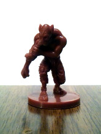](./img/10.jpg)
[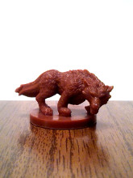](./img/12.jpg)
[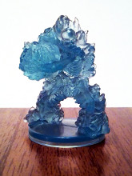](./img/13.jpg)
[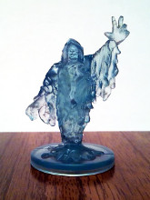](./img/14.jpg)
[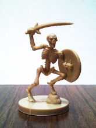](./img/15.jpg)
[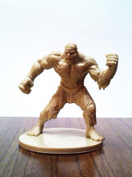](./img/16.jpg)
[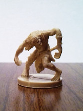](./img/17.jpg)
[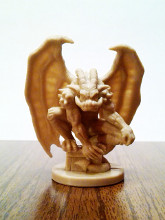](./img/18.jpg)

[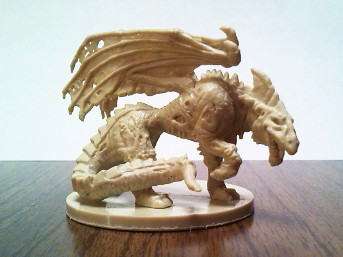](./img/20.jpg)
[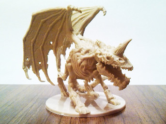](./img/21.jpg)

Компоненты игры не занимают много места — но это не значит, что для игры подойдет маленький стол; выстраиваемые подземелья будут огромны. Игроки зачаствую начинают с подземелья размером в 4 плитки, где каждая плитка аналогична квадрату 6 × 6 метров. Практически каждый ход игроков сопровождается продвижением по подземелью — “достраиванием” его новыми плитками со стороны неисследованных участков.

[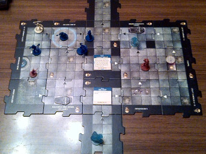](./img/02.jpg)
[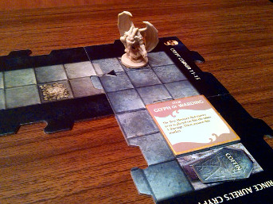](./img/05.jpg)
[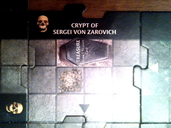](./img/06.jpg)
[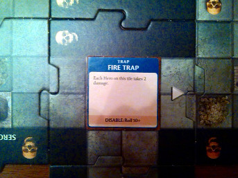](./img/07.jpg)

Сражения с монстрами происходят часто — по мере прохождения подземелья противники будут появляться почти каждый ход. Скучать не придется, объединять усилия в борьбе с нежитью нужно будет постоянно.

[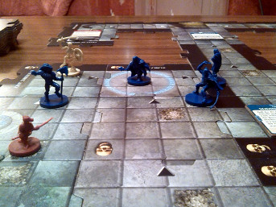](./img/03.jpg)
[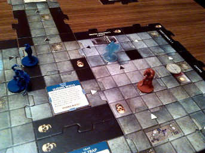](./img/04.jpg)

[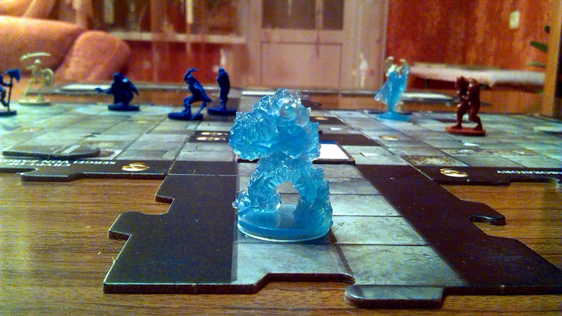](./img/08.jpg)

Пройдя первый — по сути, обучающий — сценарий, с нетерпением ждем возможности собраться снова и перейти к настоящей игре, с боссами и артефактами, дополнительными факторами и заданиями, усложняющими игру и делающими ее более захватывающей.

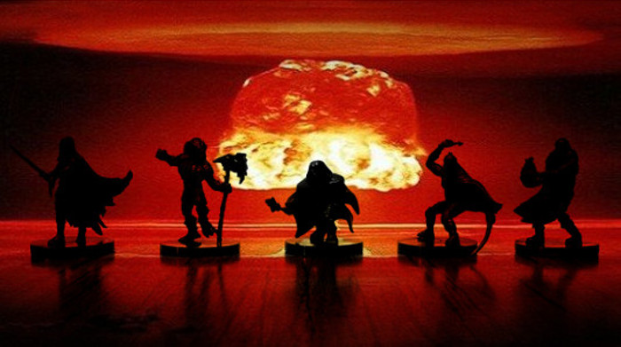
