# Держатель для книг своими руками

* * *
Что делать, когда нужно поздравить друга-книголюба с днем рождения, готовые подарки скучны и безблагодатны, а в доме водится столярный инструмент? Конечно же, сотворить подарок своими руками.
* * *

Компоненты и инструменты:

1. Сосновая доска толщиной 30 мм
2. Бревно с Y-образным разветвлением
3. Ножовка по дереву
4. Дрель
5. Сверла разной толщины
6. Шкурка
7. Саморезы
8. Отвертка
9. Лак паркетный матовый
10. Стакан
11. Тонкие ветки
12. Шпагат
13. Клей «Момент»

Отпиливаем от доски заготовки по размеру подставки. Я делал плашки 140×140. Чем толще и тяжелее доска, тем выше вероятность, что подставка не будет уползать под весом книг.

Отпиливаем от бревна Y-образное разветвление и распиливаем его вдоль по высоте.

[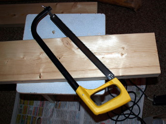](./img/01.jpg)
[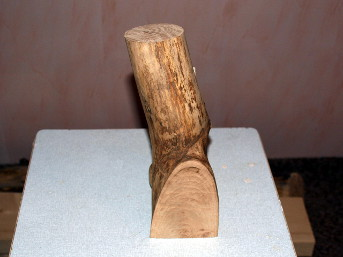](./img/02.jpg)

Просверливаем в основаниях сквозные отверстия. С тыльной (нижней) стороны подставки более толстым сверлом рассверливаем углубления, чтобы заглубить саморезы в потай.

[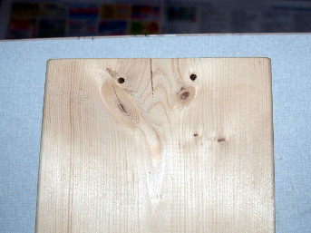](./img/03.jpg)
[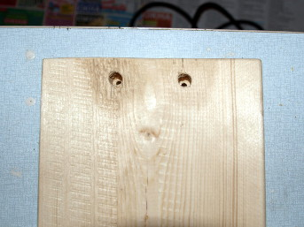](./img/04.jpg)

Просверливаем отверстия в бревнах. Скрепляем основания с бревнами.

[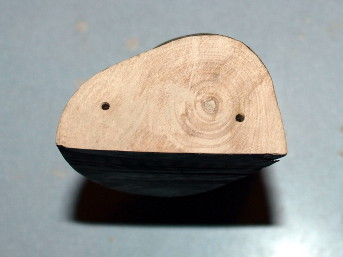](./img/05.jpg)
[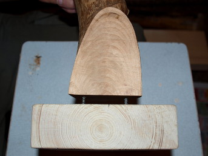](./img/06.jpg)

Шкурим полученную конструкцию. Покрываем ее лаком и даем просохнуть сутки.

[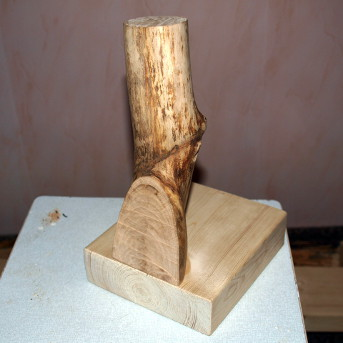](./img/07.jpg)
[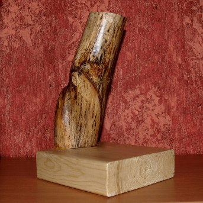](./img/08.jpg)

На этом уже можно остановиться, ибо полученная конструкция вполне справляется с ролью упора для книг. Однако, Мари предложила украсить еще и сами подставки.

Она сделала органайзер для карандашей и ручек, примотав тонкие ветки к стакану шпагатом.

[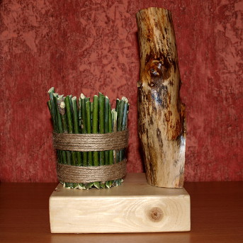](./img/09.jpg)
[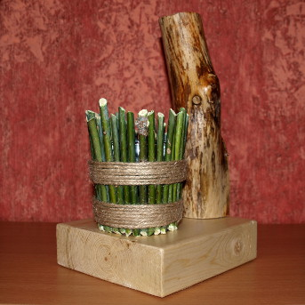](./img/10.jpg)

Я скрутил из остатков веток пирамидку, подобную [тем, что были показаны в сериале «True Detective»](http://img1.nymag.com/imgs/daily/vulture/2014/03/04/true-detective-sets/9-devils-nests.w529.h352.2x.jpg).

[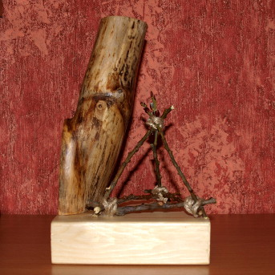](./img/11.jpg)
[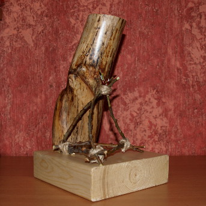](./img/12.jpg)

Стакан и пирамидку крепили на клей. Изделие в сборе успешно прошло полевые испытания.

