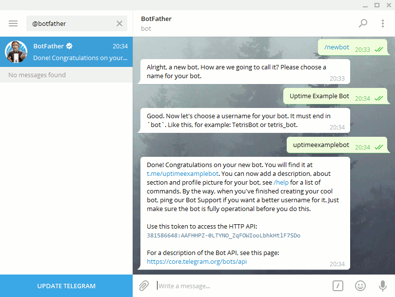
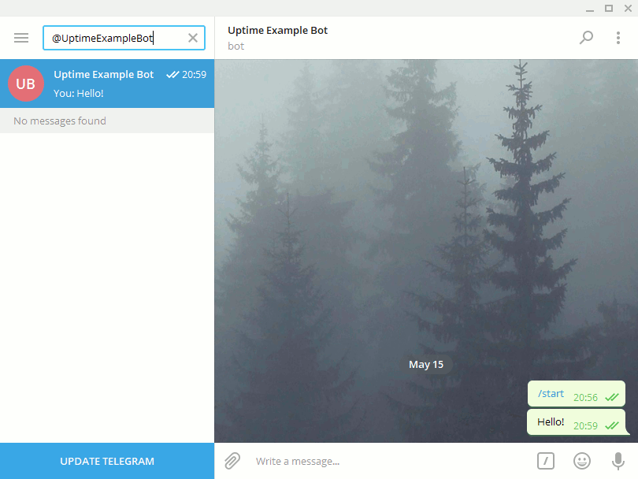
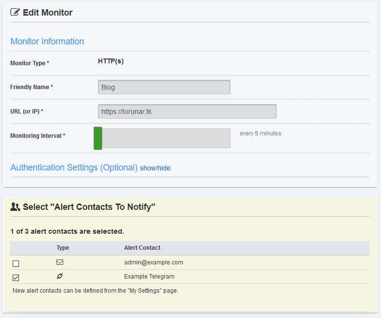
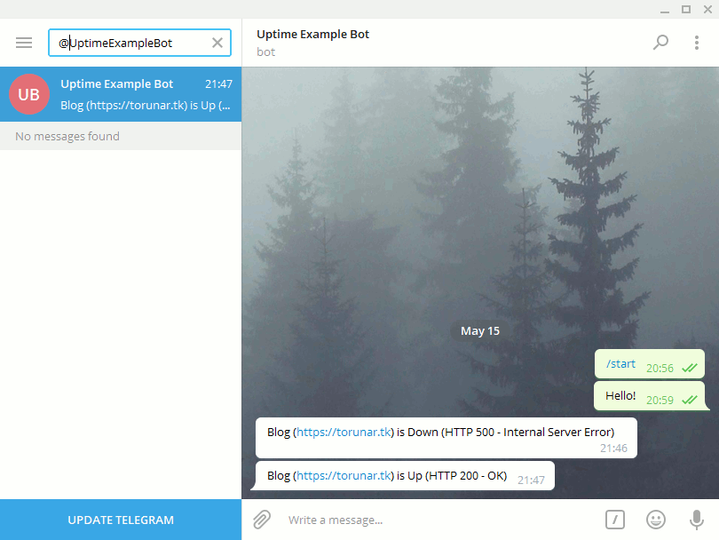

# Оповещения о состоянии сервера с UptimeRobot и Telegram

***
Балуемся API Telegram и делаем маленький бот-оповещалку о падениях сервера.
***

Для легкого мониторинга доступности сайтов я уже более года использую сервис [UptimeRobot](https://uptimerobot.com). Он предоставляет инструменты для проверки состояния на основании нескольких критериев:

* Код ответа HTTP.
* Наличие или отсутствие ключевого слова в теле страницы.
* ping.
* Доступность порта.

Для оповещений о падениях UptimeRobot предлагает использовать веб-хуки, SMS, публикации в Twitter, сообщения в Slack, пуш-нотификации для iOS и Android и, разумеется, старые добрые электронные письма. Последними я и пользовался до недавнего времени, пока не захотелось странного — интеграции с Telegram.

## Регистрация бота в Telegram

Все начинается с регистрации бота. Для этого используется официальный бот [BotFather](https://t.me/botfather) — команда `/newbot` позволит в интерактивном режиме создать бота и получить необходимый **токен** для работы с HTTP API:

После создания бота нужно выйти с ним на связь — отправьте ему сообщение с произвольным текстом. В ответ... ничего. Так и должно быть: бот маленький и тупой, начинки у него нет. Это сообщение необходимо в дальнейшем для определения получателя.

Откройте в браузере следующий URL: `https://api.telegram.org/bot<token>/getUpdates`, где `<token>` — полученный от BotFather токен. В результате будет выполнен запрос к API для получения последних обращений к боту, ответ должен иметь следующий вид:

    {
        "ok": true,
        "result": [
            {
                "update_id": 282483725,
                "message": {
                    "message_id": 2,
                    "from": {
                        "id": <chat_id>,
                        "first_name": "Mike",
                        "last_name": "Schekotov",
                        "username": "torunar"
                    },
                    "chat": {
                        "id": <chat_id>,
                        "first_name": "Mike",
                        "last_name": "Schekotov",
                        "username": "torunar",
                        "type": "private"
                    },
                    "date": 1494867575,
                    "text": "Hello!"
                }
            }
        ]
    }
    
Здесь `<chat_id>` — искомый **идентификатор получателя**.

## Настройка оповещений в UptimeRobot

Для уведомления о падениях сервера нужно настроить новый способ оповещения в секции **Alert Contacts** на странице настройки профиля **My Settings**.

В поле **Alert Contact Type** нужно выбрать **Web-Hook**, во **Friendly Name** — указать любое понятное описание.

В качестве **URL to Notify** нужно использовать `https://api.telegram.org/bot<token>/sendMessage?` — `?` в конце важен.

Основная магия происходит в **POST Value (JSON Format)**. Здесь нужно указать получателя и непосредственно текст оповещения:

    {
        "chat_id": "<chat_id>",
        "text": "*monitorFriendlyName* (*monitorURL*) is *alertTypeFriendlyName* (*alertDetails*)"
    }
    
`<chat_id>` — это **идентификатор получателя** из запроса `getUpdates`.

В тексте уведомления, которое будет отправлено при смене статуса ресурса, UptimeRobot позволяет использовать определенные подстановочные переменные, заключенные в `*` — полный список с пояснениями доступен на форме создания контакта.

Остается только создать новый ресурс для мониторинга и включить бота в список получателей в секции **Select "Alert Contacts To Notify"**.

Теперь бот будет уведомлять о смене состояния доступности сервера:

