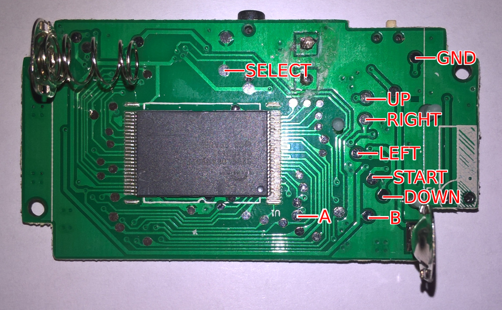
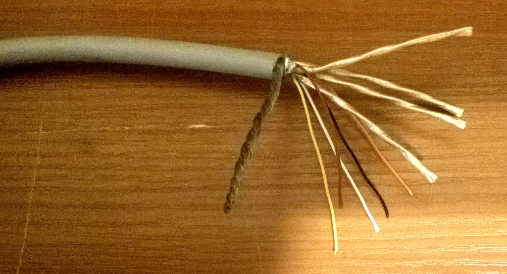
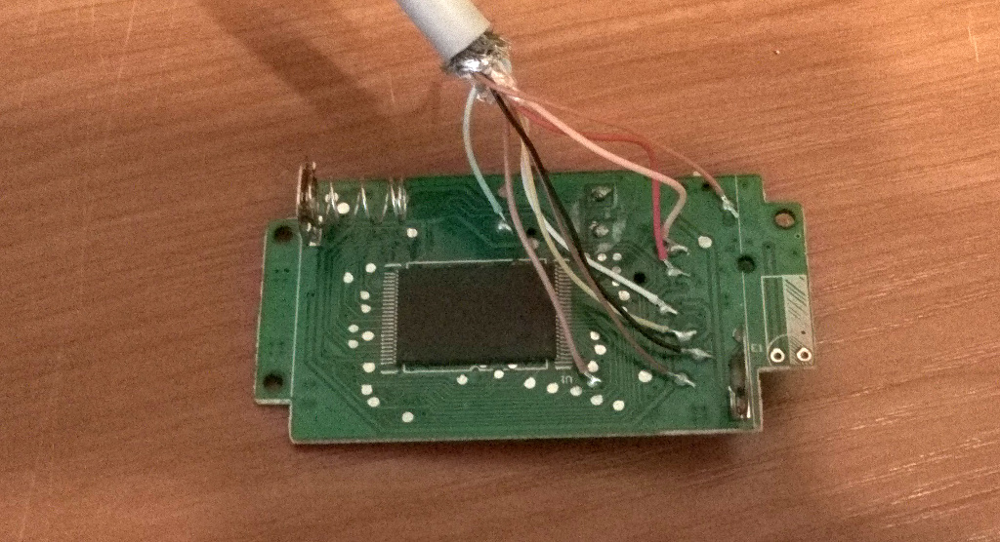
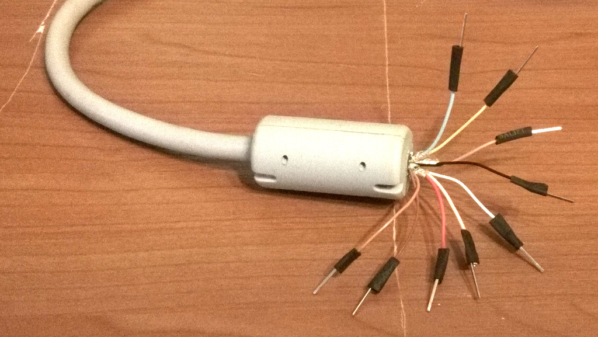
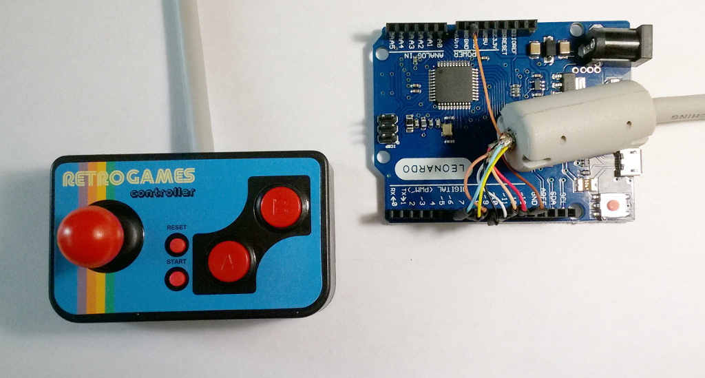

# Arduinopad: геймпад из портативной консоли

***

***

Некоторое время назад досталась мне в подарок консоль Retro Games Controller от китайской компании ThumbsUp.

Девайс был укомплектован двумя сотнями встроенных игр, питался от трех батареек ААА и подключался к телевизору обычными «тюльпанами» — сферическая plug'n'play консоль в вакууме.
Сами игры качеством не отличались — из 200 игр годной можно назвать с натяжкой всего одну.
Общее представление об устройстве можно составить из этого видео:

<iframe width="100%"
        height="415"
        src="https://www.youtube-nocookie.com/embed/lRelpho3Zf8?rel=0"
        frameborder="0"
        allow="autoplay; encrypted-media"
        allowfullscreen
></iframe>

Консоли светила участь пылиться на полке, если бы не одно «но»: на удивление удобный контроллер.
Решив, что такая годнота пропадать не должна, я начал искать способы подключения ее к ПК.

Поиски спецификации консоли и информации о ее перепрошивке ни к чему не привели — очевидно, никто таким еще не занимался, и я был пионером.
Беглый осмотр внутренностей консоли подсказывал, что просто так ее к ПК не подключить — плата представляла из себя кусок текстолита с единственным чипом и контактными площадками под кнопки.
Единственным выходом в такой ситуации было использование конвертера, который преобразовал бы аналоговые сигналы от элементов управления в цифровые.

Почитав, как такую задачу решают взрослые солидные дяди с техническим багажом, я решил использовать плату Arduino Leonardo.
Основным ее преимуществом было то, что она играет роль human interface device при подключении к ПК — то есть ведет себя как мышь или клавиатура.
Вдобавок, этим бы я закрыл давний гештальт сделать что-нибудь на базе Arduino.

## Монтаж

Разобрав консоль, я первым делом прозвонил плату мультиметром и разметил, какие кнопки с каким выводами связаны.

**Итого:** 8 кнопок (A, B, Reset, Select и четырехпозиционная крестовина) + земля = 9 контактов.

Именно тут начались проблемы.
Я просто не мог найти провод, в котором было бы столько жил.

Продавцы во всех радиотехнических магазинах либо предлагали мне плоские шлейфы, либо разводили руками.
Первоначально я планировал использовать витую пару с экраном для подключения ­— в ней как раз было восемь жил, а экран использовался бы для подключения земли.
Однако я решил посовещаться с отцом, радиоинженером со стажем, и он меня от этой мысли отговорил — витая пара с экраном была слишком жесткой и негибкой для геймпадного провода.
Он же и подсказал решение: кабель DVI-I, внутри которого 18 контактных жил + земля + экран.

Дербаним провод на жилы и припаиваем к плате:

Конец провода, который будет вставляться в Arduino, тоже дербаним.
Т.к. коннектора для шлейфа под рукой не оказалось, то пришлось [смакгайверить](https://ru.wikipedia.org/wiki/Секретный_агент_Макгайвер) контакты из скрепок и термоусадки:

Система в сборе:

## Прошивка

Мало собрать консоль — нужно еще и написать прошивку, с которой она будет работать.

Благо, написать для Arduino Leonardo эмулятор нажатий клавиш — дело плевое.
[Arduino IDE](https://www.arduino.cc/en/Main/Software) обладает всей необходимой функиональностью для разработки и заливки прошивки на устройство: это и редактор кода, и компилятор и программатор.

Самый важный момент, который нужно учитывать — [дребезг контактов](https://ru.wikipedia.org/wiki/Дребезг_контактов), то есть промежуточные уровни сигналов при переключении состояний клавиши.
Для решения этой проблемы есть готовая библиотека [Bounce2](https://github.com/thomasfredericks/Bounce2).

За пару часов я набросал максимально простой скетч для платы.
Эмулируется нажатие следующих клавиш:

* Крестовина — стрелки;
* A — Z;
* B — X;
* Reset — Escape;
* Start — Enter.

Исходный код скетча: [https://github.com/torunar/arduinopad](https://github.com/torunar/arduinopad)

## Контроллер в действии

<iframe width="100%"
        height="415"
        src="https://www.youtube-nocookie.com/embed/gu27QGko9sk?rel=0"
        frameborder="0"
        allow="autoplay; encrypted-media" allowfullscreen
></iframe>
