# Как увидеть шведского тюленя

***

В сорока километрах от Мальмё расположен природный заповедник Моклэппен. Весь год туда приплывают тюлени, но открыт для посещения он только с ноября по февраль, когда тюлени не заняты размножением и защитой потомства.

***

К поездке в [Моклэппен](https://en.m.wikipedia.org/wiki/Måkläppen) стоит подготовиться заранее: если не учесть некоторые факторы, можно остаться с мокрыми ногами, замерзшей жопой и так и не увидеть тюленей.

## Выбери день

Моклэппен расположен на полуострове: место, куда тюлени приплывают греть на солнце свои тушки, соединено с большой землей тонкой песчаной косой. Поэтому ехать в заповедник нужно во время отлива — так вы сможете дойти до лежбища, не проваливаясь в мокрый песок по щиколотку. Узнать про приливы и отливы можно на сайте [метеорологической службы]([https://www.smhi.se/vader/prognoser/vattenstand-och-vagor/skanor/](https://www.smhi.se/vader/vader-till-havs/vattenstand-och-vagor/skanor/diagram)).

[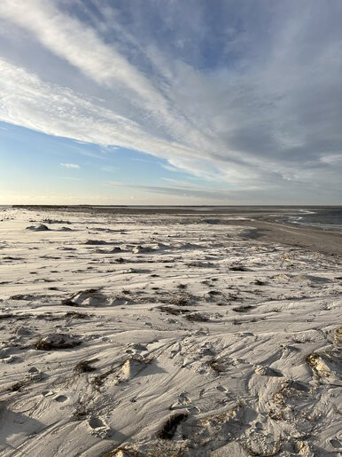](./img/01.jpg)
[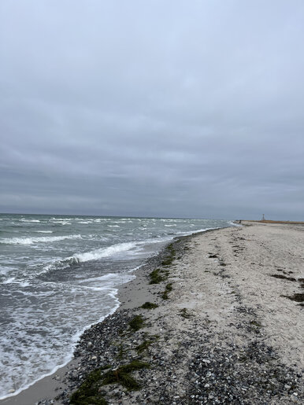](./img/02.jpg)
[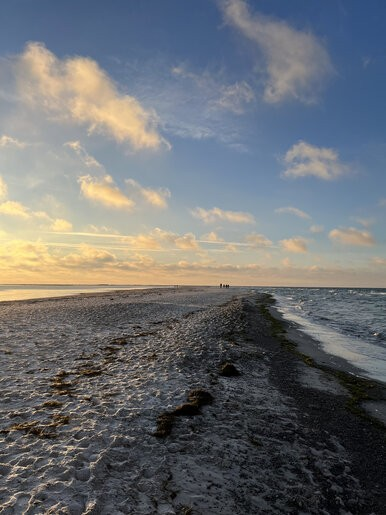](./img/03.jpg)
[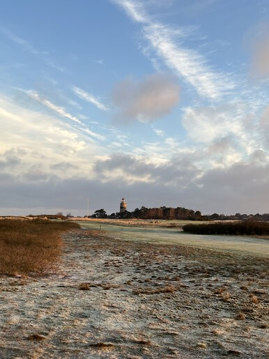](./img/04.jpg)

## Выбери время

Ехать смотреть тюленей лучше очень рано утром — потом на косу подтянутся туристы, есть небольшая вероятность того, что они спугнут животных. Оптимальное время для посещения зимой — часов 8 утра, потому что так вы еще и застанете рассвет над морем и сможете кайфануть от чувства, что вы последние люди на земле.

[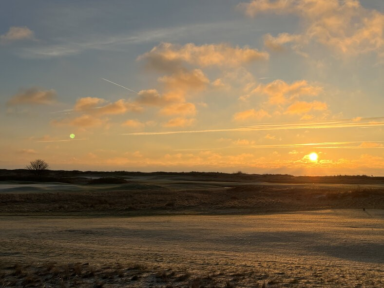](./img/05.jpg)
[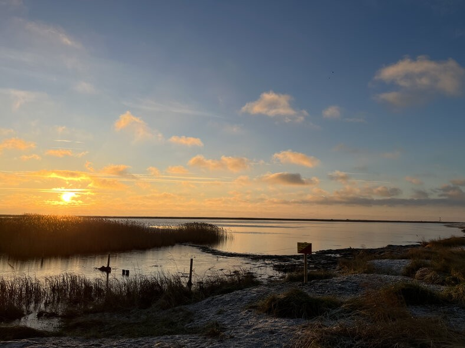](./img/06.jpg)

Это значит, что встать в день поездки придется часов в 6 или даже раньше.

## Выбери одежду

Путь по полуострову до лежбища занимает около часа. Все это время вы будете идти вдоль холодного моря, ветер будет задувать со всех сторон, а под ногами будут мокрый песок и водоросли.

Подштанники, свитер, шарф, перчатки и капюшон — ваши союзники, а многослойность — секрет победы. Если еще не обзавелись курткой с ветрозащитой — это отличное время ее купить. Удобные носки и трекинговые ботинки или теплые кроссовки — отличная идея, а вот резиновые сапоги брать не стоит, по песку в них идти очень сложно.

## Выбери содержимое своего рюкзака

Путь до тюленей долгий, но не сложный, поэтому идти лучше с небольшим рюкзаком, положив в него только необходимое:

* термос с горячим чаем (море холодное!);
* запасные носки и, опционально, обувь (море мокрое!);
* пару сэндвичей и что-нибудь сладкое, чтобы восстановить уровень сахара после пешего перехода;
* оптику.

К тюленям нельзя подходить ближе, чем на 50 метров, чтобы не беспокоить их. Поэтому бинокль или фотоаппарат с большой банкой — единственный вариант рассмотреть их хорошо.

[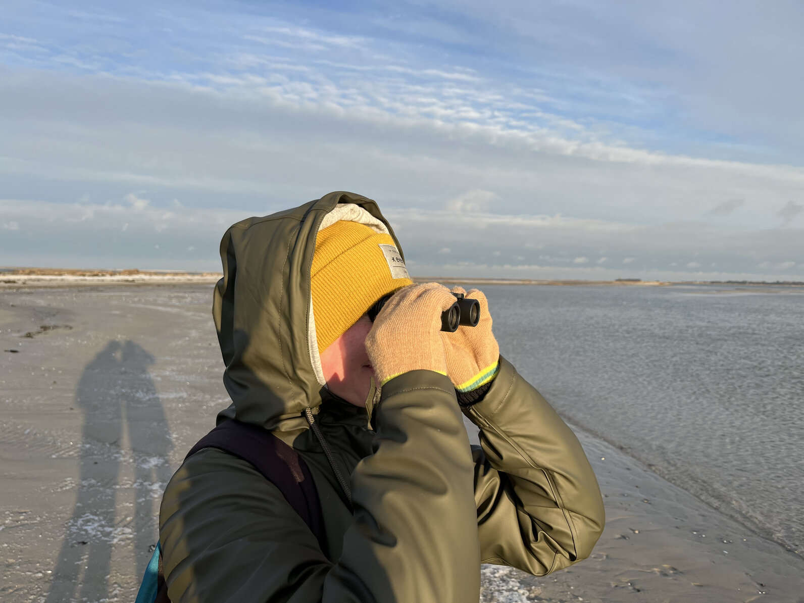](./img/07.jpg)

## Выбери маршрут

Самый простой способ — доехать до города Фальстербо на региональном автобусе или машине, пройти через городской парк, выйти через город к побережью и идти, идти, идти. Дорога в одну сторону займет около 7 километров, примерно час шагом, быстрым настолько, насколько позволяет песок.

Материковая часть пути на Google Maps: [goo.gl/maps/ejcgLtntHZuU4Ygj9](https://goo.gl/maps/ejcgLtntHZuU4Ygj9)

[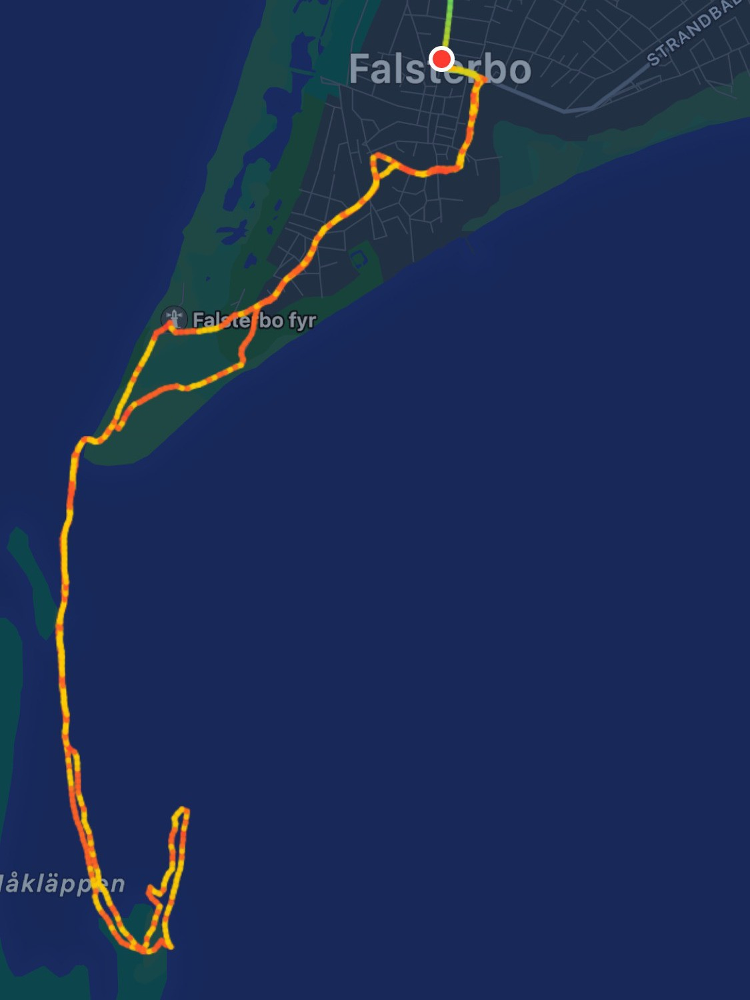](./img/08.jpg)

Фальстербо — маленький тихий город, в котором можно полюбоваться местными домиками, увидеть в утренней тишине пришедших из леса косуль и белок, посмотреть на церковь без креста (рядом с ней расположен туалет, это важно!) и самый старый маяк в Скандинавии (построен в 1795 году и, вроде как, до сих пор используется).

[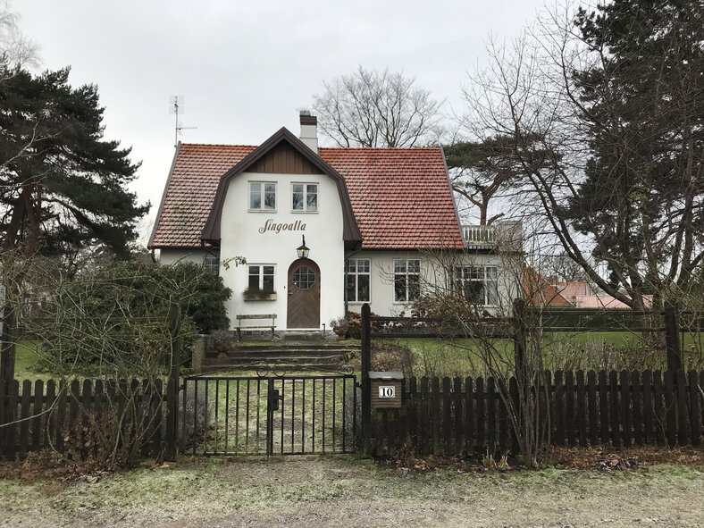](./img/11.jpg)
[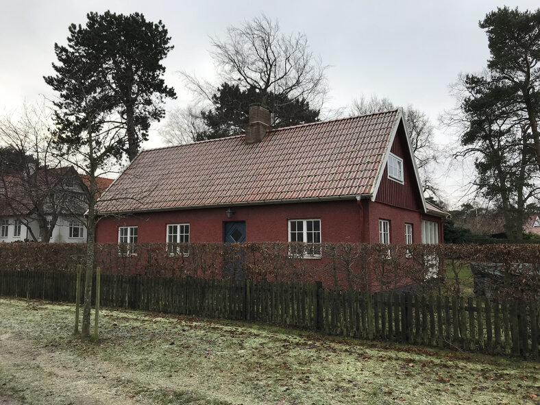](./img/12.jpg)
[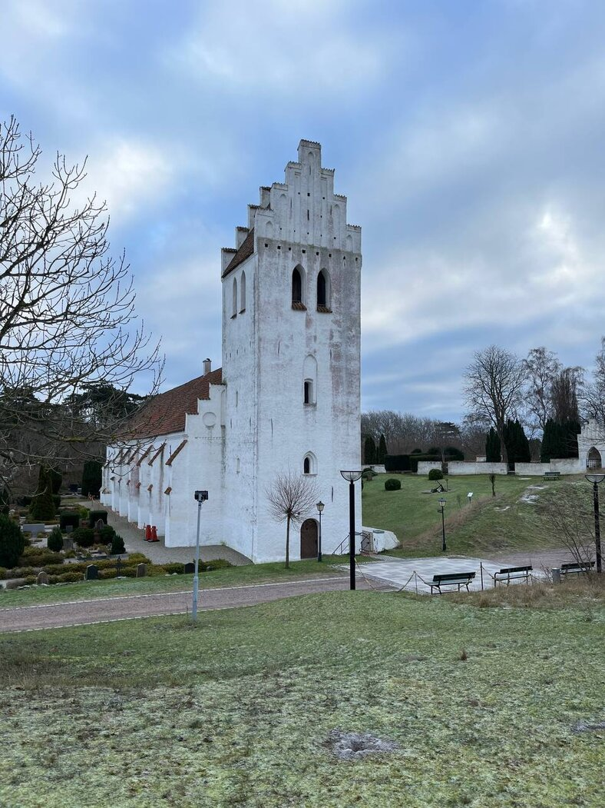](./img/10.jpg)
[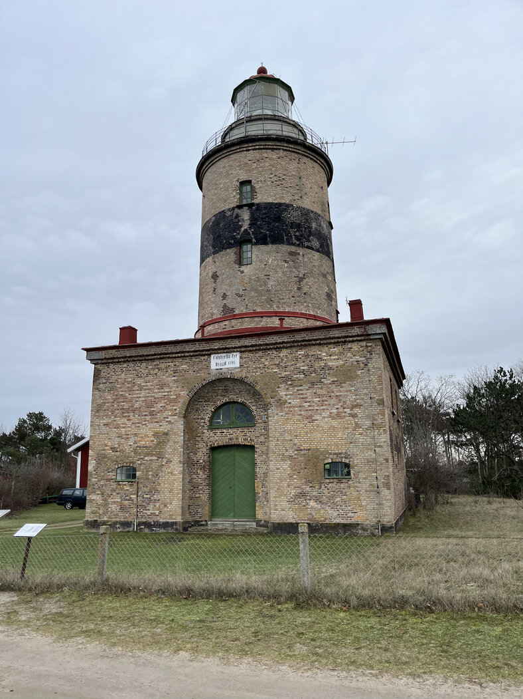](./img/09.jpg)

Даже если не получится добраться до тюленей, поездка в любом случае даст возможность погулять у моря, посмотреть на красивое и подумать в тишине.

