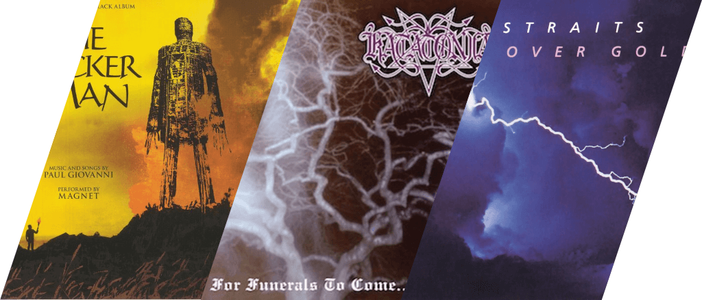
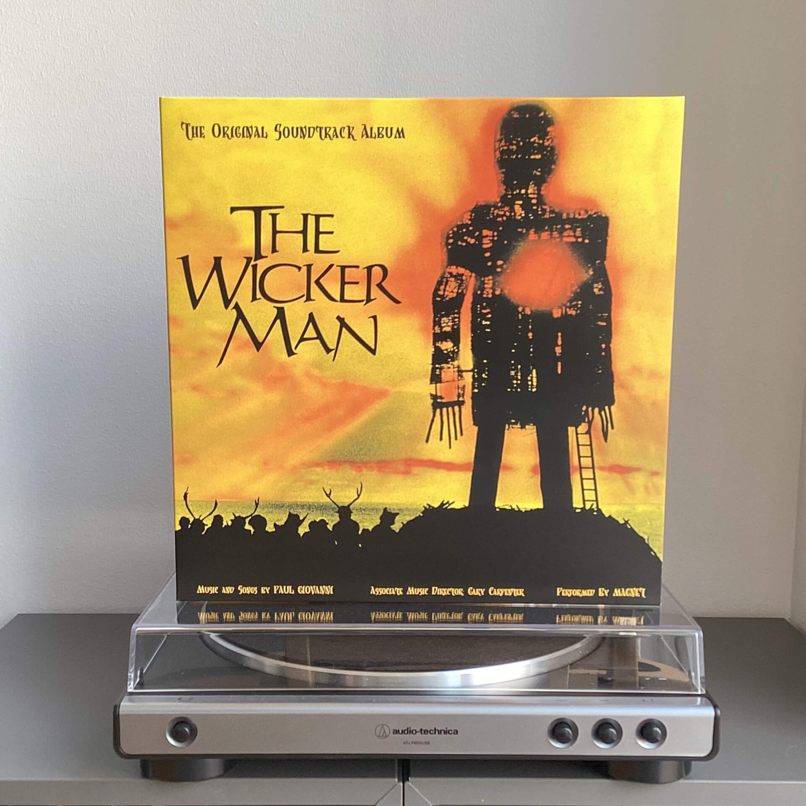
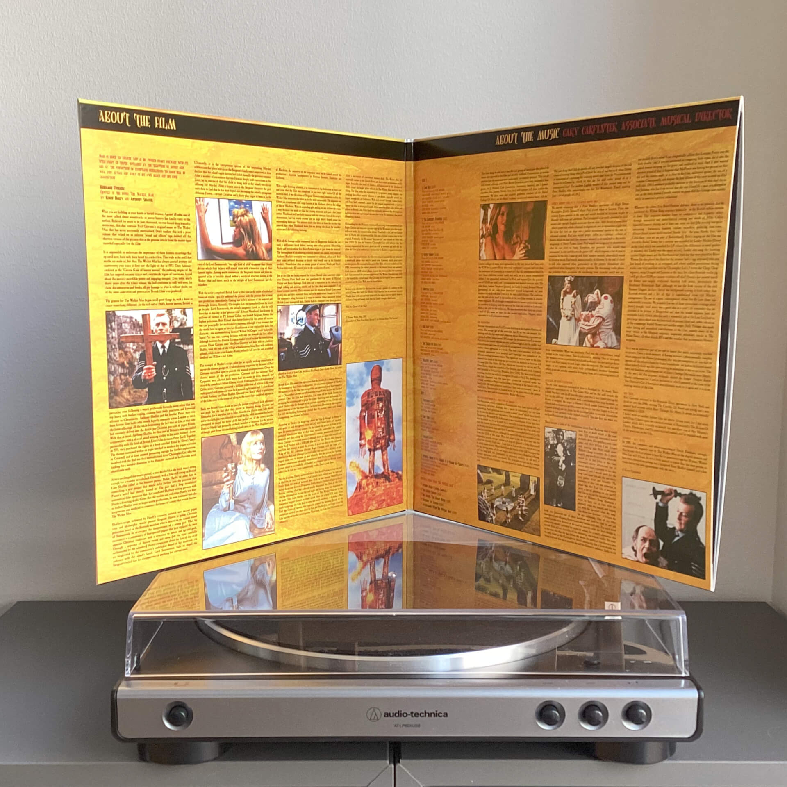
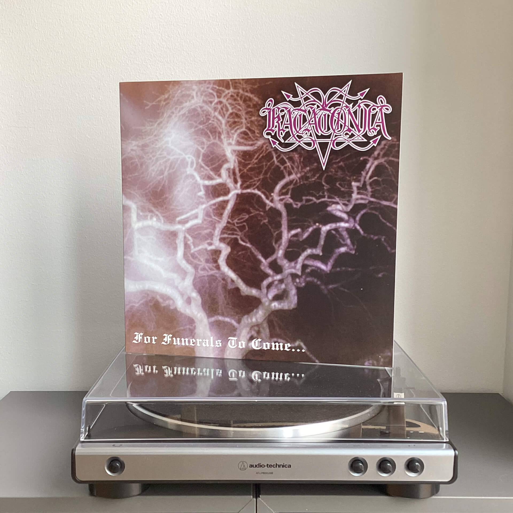
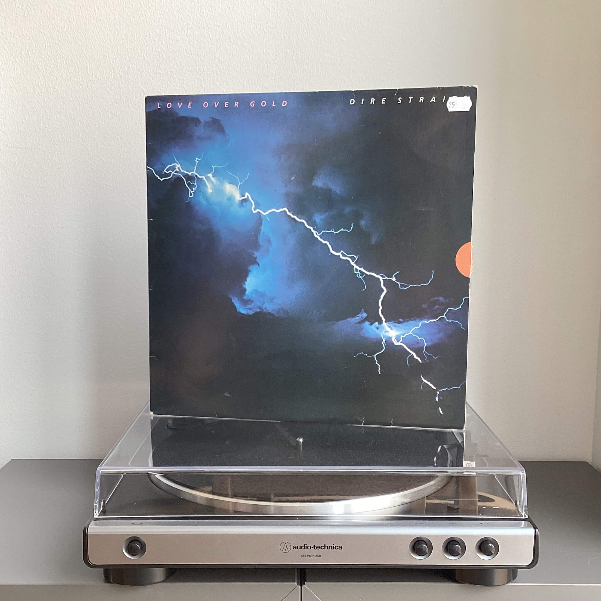

# Чего там по винилу? Отчет за ноябрь 2023

***

***

## Paul Giovanni — Wicker Man

&laquo;Плетеный человек&raquo; 1973-го года — без преувеличения мой любимый хоррор и вряд ли что-то сможет сместить его с этого пьедестала.
Когда я увидел его впервые несколько лет назад, я пересмотрел его три раза с разницей в день.
Густая атмосфера детективной истории, разворачивающейся на удаленном острове, мрачные каменные утесы Шотландии, дикие языческие ритуалы и музыка — сочетание всех этих элементов дарило причудливый и захватывающий опыт.

Поэтому, когда я увидел в продаже пластинку с саундтреком, вопрос брать или не брать даже не стоял.

На внутренней стороне конверта изложена судьба многострадального фильма: проблемы с производством, сумбурный и во многом провальный релиз и, наконец, ренессанс, вызванный повторными прокатами и перевыпусками, заслуженный успех и культовый статус.
Оттуда же можно узнать, что Пол Джованни, композитор саундтрека, не был профессиональным композитором, как и музыканты-исполнители, поэтому очень многое делалось на коленке и придумывалось на месте, возможно именно поэтому саундтрек и вышел таким самобытным.

## Katatonia — For Funerals To Come...

EP, название которого, если верить вкладышу, чуть не стало пророческим для Katatonia: на тот момент у них был всего один полноформатник [Dance of December Souls](/2023/10/07/vinyl-report/), сама группа понятия не имела, куда двигаться дальше, а внутри не было даже согласия о том, в каком жанре делать музыку.

Все шло то ли к распаду, то ли к длительному простою, но в итоге в группе произошли перестановки, на вокал пришел Микаель Окерфельдт из Opeth, и уже в 1996-м году Katatonia выпустила свой следующий альбом Brave Murder Day (уже лежит в вишлисте и ждет своего времени).

Совершенно неожиданно заказанная пластинка оказалась переизданием 2011-го года, где к четырем оригинальным трекам были добавлены записанные в середине девяностых треки Black Erotica и Love of the Swan, в результате EP разросся с изначальных 18 минут до полноценного 35-минутного альбома.

## Dire Straits — Lover Over Gold

Формально именно с этого альбома, а конкретно с трека Telegraph Road два года назад и начался мой канал: [t.me/misha_talks/3](https://t.me/misha_talks/3), поэтому мимо него пройти было нельзя.

Пластинка куплена в местном магазине с б/у записями, причем Lover Over Gold лежала аж в нескольких ящиках, и цены на пластинку в разном состоянии колебались от 20 до 130 крон. Решил взять что-то посередине и не прогадал: конверт почти уничтожен, но пластинка внутри в хорошем состоянии, без повреждений и стариковского песка (хотя казалось бы).