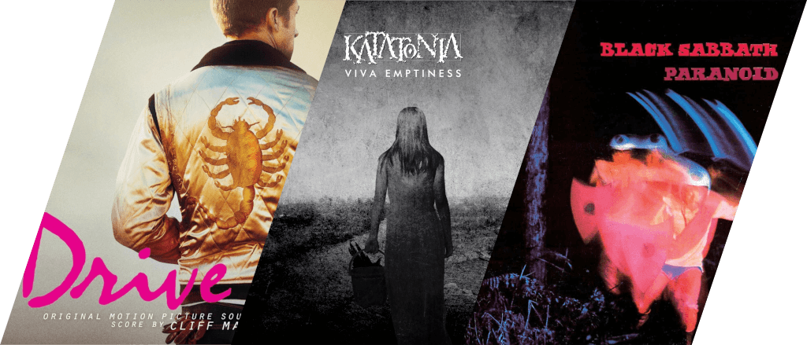
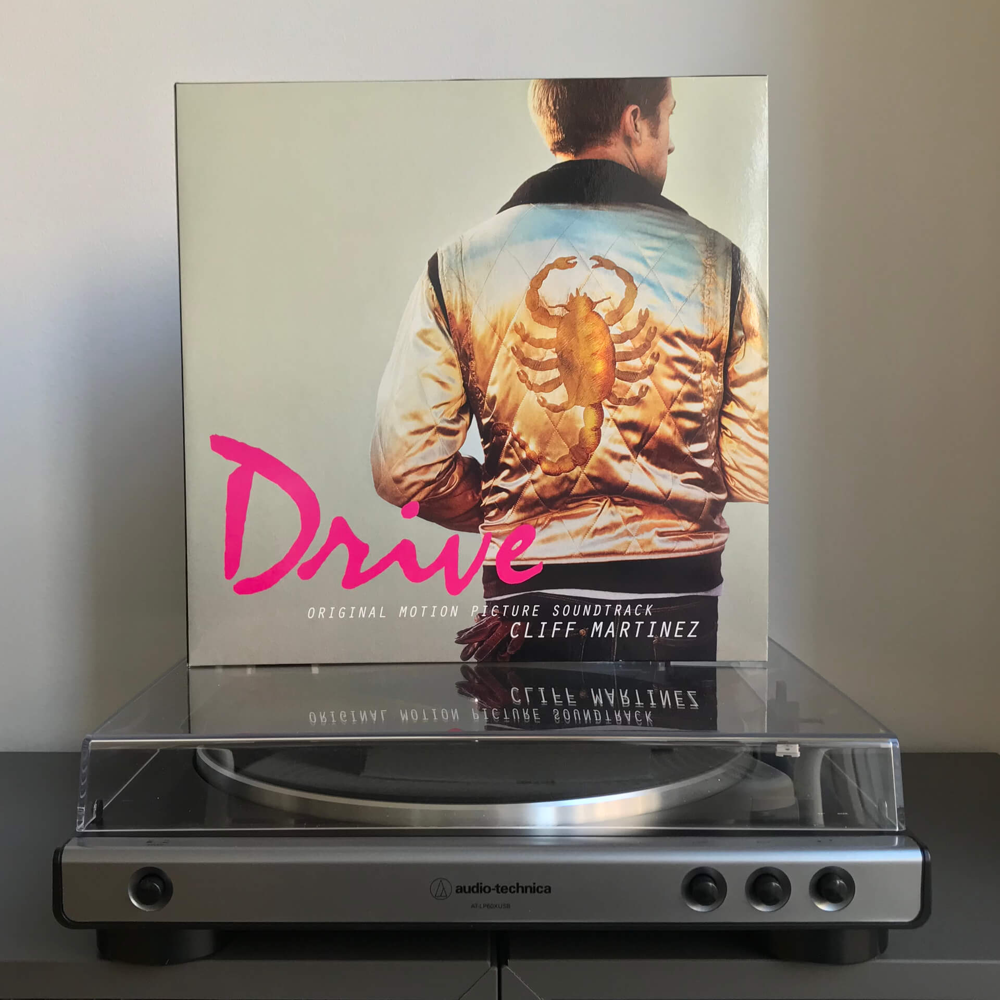
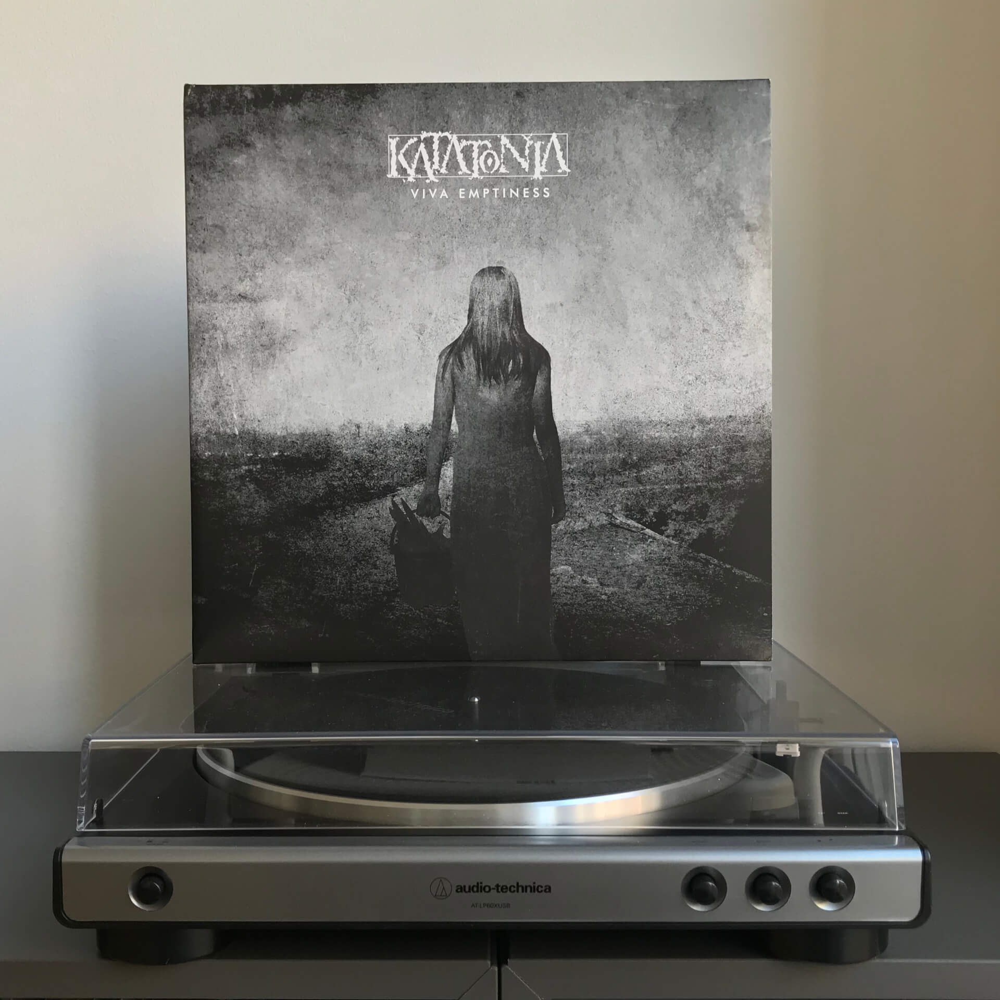
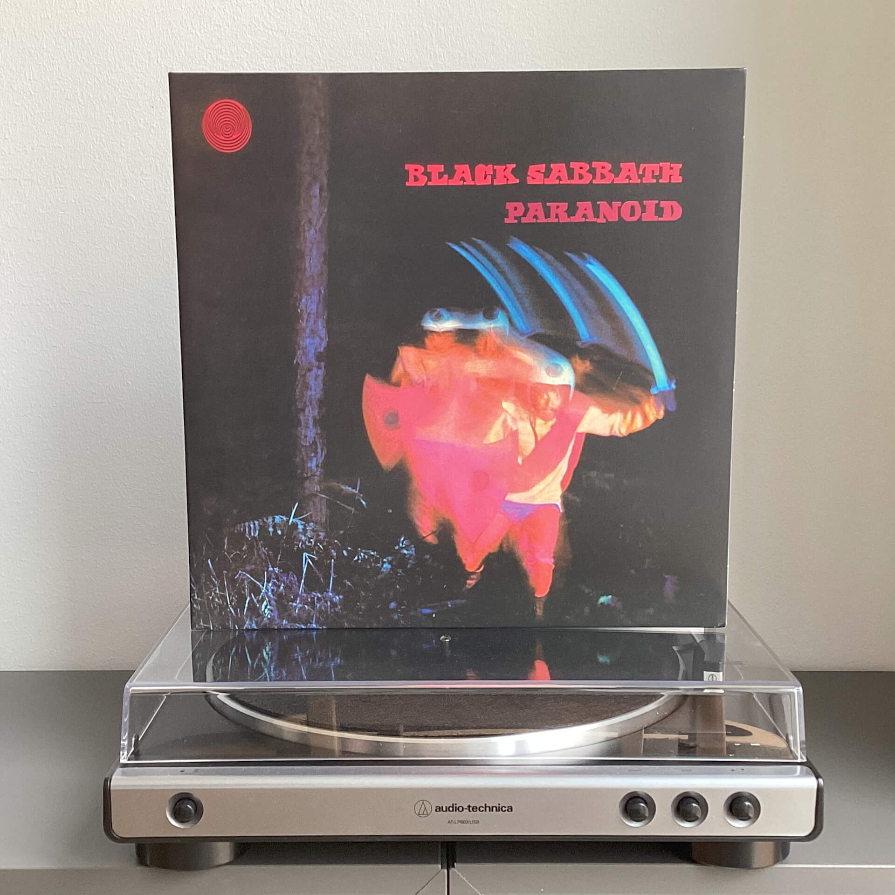

# Чего там по винилу? Отчет за январь 2024

***

***

## Cliff Martinez — Drive

Поиски ответа на вопрос, умер ли персонаж Райна Гослинга в конце «Драйва», привели меня к покупке этого саундтрека.
Отчасти на решение повлияло и то, что это издание на флюоресцентном виниле; в детстве я был без ума от игрушечных динозавров, которых нужно было «заряжать» на солнце ради одной-двух минут света в темном шкафу.

Увы, даже в светящемся состоянии саундтрек не проливает света на загадочную концовку фильма.

## Katatonia — Viva Emptiness

Оригинальный Viva Emptiness я покупал на CD еще в 2007-ом, на виниле же я взял расширенное издание, приуроченное к десятилетию альбома. Несмотря на то, что в переиздании некоторые треки звучат лучше из-за ремастеринга и добавленных клавишных партий, в целом альбом лишился одной фишки. В оригинальном издании, на мой взгляд, был восхитительный трюк с двойной концовкой: сначала Omerta обрывалась буквально на полуслове, создавая ощущение клиффхэнгера:

<iframe src="https://www.youtube-nocookie.com/embed/3mej0gh4SBo?si=GNgSt8FKTUEqfCA3"></iframe>

Следом за ней шла инструментальная Inside the City of Glass. Она создавала потустороннее ощущение, которое отлично резонировало с названием трека и давало альбому второй финал:

<iframe src="https://www.youtube-nocookie.com/embed/7oz9Wvl87MM?si=DykwIs7NQGSv-VxW"></iframe>

В переиздании в Inside the City of Glass был добавлен вокал, что не сильно повлияло на трек само по себе, но вот добавленный перед ним Wait Outside немного размывает ощущение второго финала.  В целом переиздание вышло хорошим, но если появится возможность, я заменю его на оригинал.

## Black Sabbath — Paranoid

Моя любимая работа группы Black Sabbath — это композиция Black Sabbath с альбома Black Sabbath, поэтому вполне очевидно, что я хотел брать ее.

Маша сказала, что ни одного трека с этого альбома не знает и брать нужно что-то, что можно слушать, например Paranoid.

Мы все обсудили, пришли к консенсусу и взяли Paranoid, поскольку я хоть и не люблю его всем сердцем, но все же признаю его большой мемный потенциал:

<iframe src="https://www.youtube-nocookie.com/embed/kyGL8lGJ4cE?si=krnLRdwDbtm49_Rb"></iframe>
