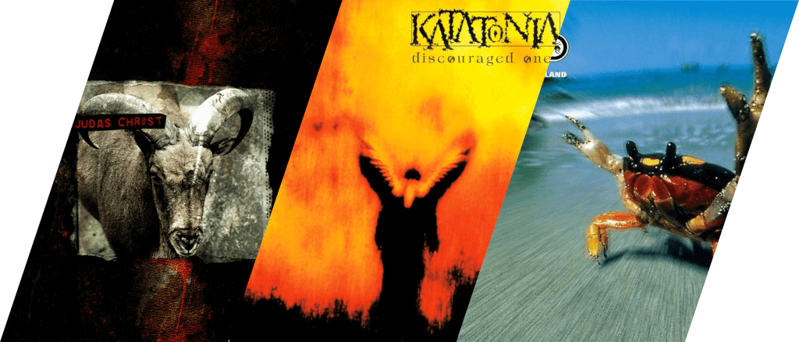
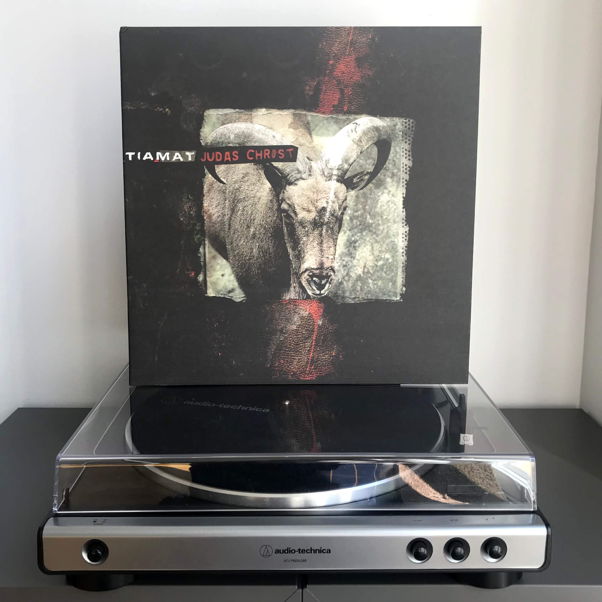
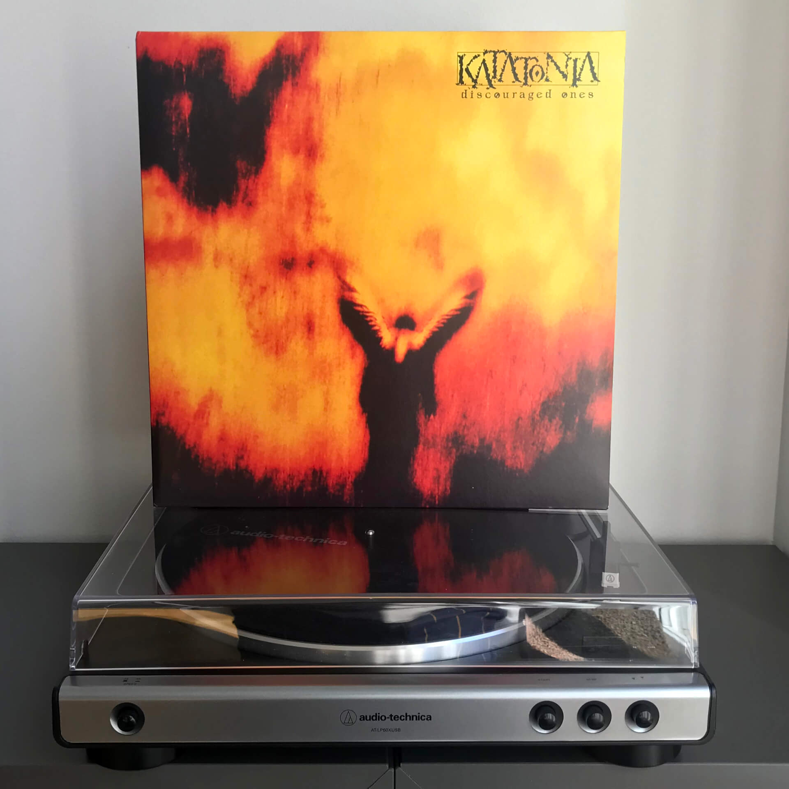
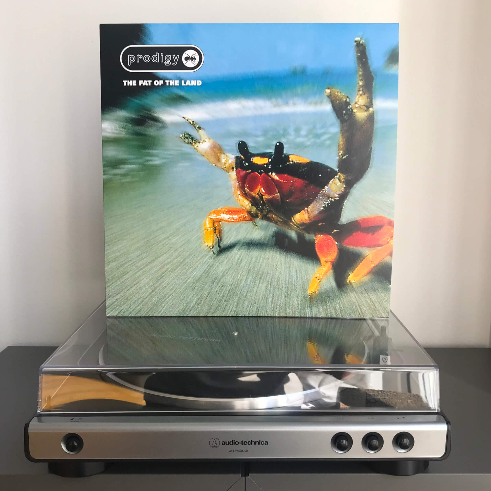
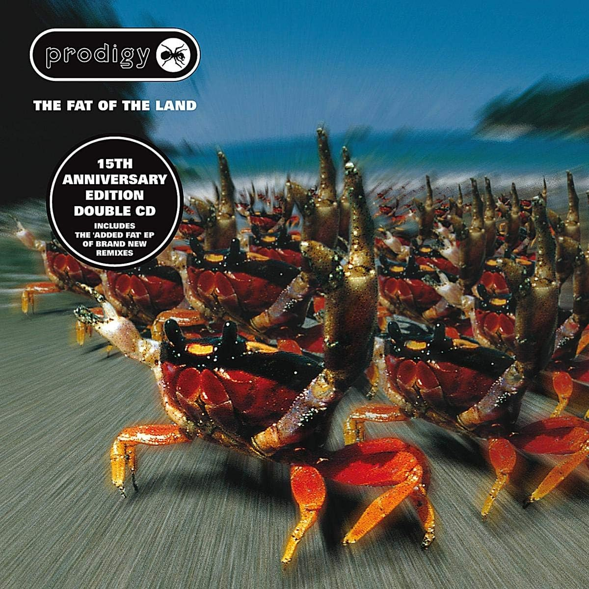

# Чего там по винилу? Отчет за апрель 2024

***

***

## Tiamat — Judas Christ

В [прошлый раз](/2024/03/26/vinyl-report/) я уже рассказывал, что зарекся брать Tiamat на красном виниле из-за его пыльности и в целом так себе качества печати.
И что же вы думаете? 
Я сделал это снова: не доглядел и заказал случайно какое-то там лимитированное издание на красном тяжелом виниле.

Возможно, дело в том, что [iMusic](https://imusic.se), на котором я теперь беру большую часть записей, не всегда пишут, какое именно издание ты покупаешь, и могут иногда положить mega deluxe limited expanded early adopter yoba edition вместо обычного (к сожалению, бывает и наоборот).
А возможно, я просто читаю жопой.

Со звуком на этой пластинке все уже окей, пыли в пакет тоже никто не насыпал. 
Подсудимый оправдан, получается, стоит сменить гнев на милость и взять последний альбом, который я хотел, тоже на красном виниле.

## Katatonia — Discouraged Ones

Как я упоминал [ранее](/2024/02/29/vinyl-report/), предыдущий по хронологии альбом Katatonia — Brave Murder Day, — вышел не без проблем.
Вокалист Йонас Ренксе из-за болезни уже не мог орать дурниной, вокал для альбома делал Микаэль Окерфельдт из Opeth, но это не помешало группе продолжить свое существование.

Discouraged Ones — это первый альбом переходного периода, и на нем все не так: стиль поменялся, музыканты новые, какой делать звук — вообще не понятно, вокалист не освоился с непривычной манерой пения, и все это звучит очень грустно, суматошно и безысходно.
Это сочетание делает альбом просто идеальным для/от мужской депрессии.
Даже само название, «Приунывшие», — отражает состояние, когда все из рук валится, проблемы громоздятся одна на другую, ты понятия не имеешь, что делать дальше и имеет ли вообще смысл делать хоть что-то.

Если вас спрашивают: «Как дела?», а ты отвечаешь: «Вроде нормально все», а потом [чё-то раз и приуныл](https://www.youtube.com/watch?v=siAlDSZrtS0), послушайте Discouraged Ones.
Возможно, станет легче.

Или нет.

## The Prodigy — The Fat of the Land

За очень многие вещи я берусь только потому, что в них есть великий мемный потенциал, и до сих пор это работает великолепно почти со всем: от литературы до видеоигр, от еды до одежды.

Фильмы Дэвида Линча, книги Владимира Сорокина, норвежский блэк-метал, игры серии Yakuza — вокруг всего этого выстроена огромной силы мемная культура.
Я заинтересовался ими из-за мемов, но в итоге начал их любить и ценить. 
Как говорится, I came looking for copper and found gold.

The Prodigy — еще один пример того, как великий мемный потенциал влияет на принимаемые решения: про эту группу и конкретно Кита Флинта я узнал раньше, чем слово «мем» вообще вошло в обиход.
Клипы этой группы мы в школьные годы передавали друг другу на **дисках с приколами**, а 10-секундные зашакаленные рингтоны с Firestarter и Smack My Bitch Up пересылали по <s>ИК-порту</s> Bluetooth с телефона на телефон.

А потом в один день я увидел обложку The Fat of the Land и прифигел: что может быть круче кислотно-оранжевого краба, шпарящего на всех парах?
Только толпа таких же крабов на обложке Expanded Edition:

Лучше уже не будет, можно выключать. 
К сожалению, расширенное издание выходило только на CD, приходится довольствоваться малым, так что пластинка с главными хитами отправляется в коллекцию.
