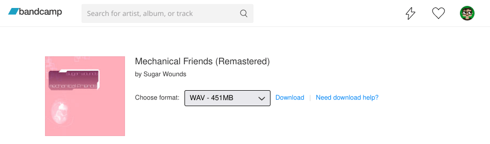
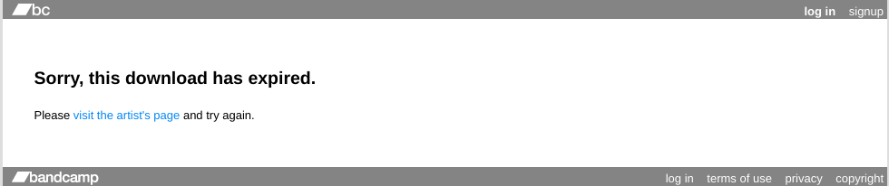
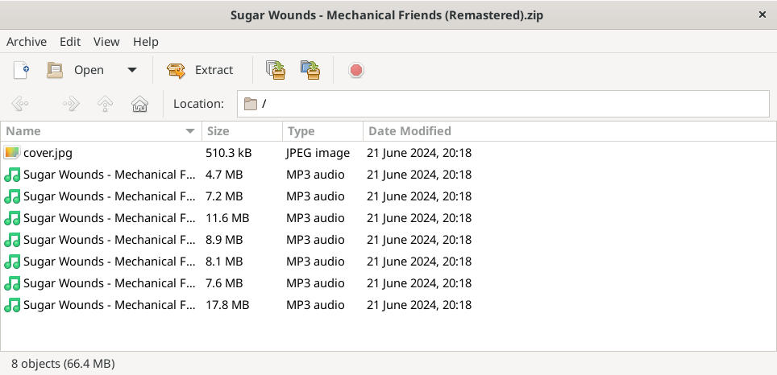

# Реверс-инжиниринг загрузок с Bandcamp во имя любви и мира

***

***

_**Ахтунг**: Этот пост вышел куда длиннее и запутаннее, чем я изначально планировал._
_Поскольку это все-таки мой блог, то я решил оставить все, как есть, но если вам интересны только технические детали, то [до них буквально один клик](#technical)._

Ух, как же я люблю Bandcamp.
Ни одна музыкальная платформа не дарит мне такой радости от поиска, прослушивания и покупки музыки.
На первый взгляд, у Bandcamp нет никакого Алгоритма™, как у Spotify, Apple Music или YouTube.
Хочешь — подписывайся на отдельные жанры, и тебе в ленту будет приносить новые и не очень релизы: будет и годнота, и мусор.
На отдельных музыкантов тоже можно подписываться, но я не заметил, чтобы они хоть как-то влияли на выдачу в ленте.
В современном мире за такое принято закидывать говной, но мне такой подход прям заходит: вроде бы и вся музыка на кончиках пальцев, но чтобы найти что-то топовое, все равно нужно перерыть и переслушать кучу всего.

Bandcamp меня буквально в середину 00-х переносит.
Был у нас в городе один магазинчик для неформалов, который торговал всяким (преимущественно поддельным) мерчем и [футболками с волками](https://knowyourmeme.com/memes/three-wolf-moon).
Я там мог часам зависать, залипая в витрины на футболки, которые все равно не мог себе позволить, и диски с кассетами, многие из которых пылились в продаже годами.
К счастью, продавцы относились ко всяким лодырям нейтрально — наверное, понимали, что рано или поздно лодырь накопит денег с обедов и что-нибудь да купит.

Покупка музыки там каждый раз была лотереей: нормального интернета в ту пору у меня еще не было, совета спросить было не у кого, вот и приходилось ограничиваться инфой из Википедии да отрывочными сведениями от одноклассников.
Так что стратегия была каждый раз одна и та же: пялишься на обложки, пока глаза не пересохнут, спрашиваешь чего-нибудь у скучающей томной девицы за прилавком и выбираешь в итоге почти пальцем в небо.
Иной раз притащишь домой диск Lacrimosa и влюбишься в них на всю жизнь, а порой возьмешь Children of Bodom на кассете да так больше одного раза ее и не послушаешь.
Не стоит недооценивать силу азарта!

Spotify со своими рекомендациями после такого выглядит жалко и пресно: "Ой, вам понравился сахар, возможно, вам понравится стевия", а Apple вообще могут жопу пососать — я ненавижу эту компанию и все, что они делают, слишком сильно, чтобы даже задумываться о покупке чего-либо от них когда-либо.
К подписочным сервисам я отношусь с недоверием и недовольством (и это в 2к24-м-то!): как по мне, если я уже заплатил за музыку, у меня должна быть возможность ее себе на компухтер сохранить, в Winamp'е послушать, а потом закинуть на внешний аудиоплеер (с кнопочками!), воткнуть наушники в него и пойти куда-нибудь по делам:

И не в одной музыке дело: Sony жоско меня предали, забанив мой шведский PSN-аккаунт, а с русского аккаунта сейчас, понятное дело, игры не купить;
вероятность когда-то потерять доступ ко всем играм, которыми я (не) владею в Steam, тоже особой уверенности в завтрашнем дне не приносит.
Поэтому нынче, если я что и покупаю, то делаю это на GOG.com: они дают скачать отдельный установщик, так что без третьих Героев я не останусь даже в случае краха цивилизации (и да, я реально бэкаплю локально инсталлеры из GOG).

С учетом моей любви к Bandcamp, ничего удивительного, что я частенько пилю какие-то хаки и костыли вокруг него.
Увы, Bandcamp никаких публичных API для большей части функциональности не дают, но даже так я смог запилить ряд тулзов, которыми пользуюсь регулярно:

**[BC Player](https://github.com/torunar/bc-player)**:
альтернативный плеер, который умеет очереди (и [расширение для браузера](https://github.com/torunar/bc-player-helper) для прямой интеграции с лентой).

**[Виджет с лайками](https://github.com/torunar/bandcamp-liked-albums-widget)**:
как таковых, лайков на Bandcamp нет, есть только вишлист, но они сами решили использовать иконку с сердечком для него — close enough, как говорится.
Список лайков можно вытащить через (незадокументированное, конечно же) API для поиска, поэтому я смог запилить одностраничник, где можно хвастаться своим ужасным музыкальным вкусом.
Я вот хвастаюсь, например:

<iframe src="https://torunar.github.io/bandcamp-liked-albums-widget/?fan_id=3382834" style="min-height: 270px; margin-bottom: var(--uiGap);"></iframe>

**[RSS с лайками](https://github.com/torunar/rss-feeds)**:
по сути, то же самое, но в форме RSS-ленты.
Я в основном слушаю блэкгейз, матрок, синтвейв и брейккор, так что если есть желание узнавать, чего мне там понравилось, раньше, чем я напишу об этом в своем [Телеграм-канале](https://t.me/misha_talks), то вот ссылка на ленту: [https://torunar.github.io/rss-feeds/build/bandcamp-liked-albums.xml](https://torunar.github.io/rss-feeds/build/bandcamp-liked-albums.xml).

Я уже упоминал, что на Bandcamp можно покупать музыку, но огромное ее количество доступно бесплатно.
Легально.
Без регистрации, без СМС.
Даже формат для скачивания можно выбрать, ну не лапочки ли?

И даже если у чего-то нет бесплатной версии, всегда есть [youtube-dl](https://github.com/ytdl-org/youtube-dl).
Bandcamp понимают, что у кого есть желание пиратить, спиратит обязательно, и поэтому они не чинят то, что не сломано: ["I heard you can steal music on Bandcamp. What are you doing about this?"](https://bandcamp.com/help/audio_basics#steal).
Тут все остается на усмотрение пользователя: хочешь поддержать исполнителя — давай, сколько дашь, музыканты с твоей покупки получат большую часть денег, а ты получишь свой релиз, чтобы слушать его на внешнем аудиоплеере (с кнопочками!).

И тут-то мы и добрались до сути: а как вообще устроено скачивание бесплатных (т.е. без минимальной цены) релизов на Bandcamp?
Что, если я хочу локальную копию **всего** своего списка лайков?
Не думают же они, что я буду каждый альбом отдельно качать?
Даже так, наверняка это можно как-то обойти.
Так что идем на страницу [какого-нибудь бесплатного альбома](https://sugarwounds.bandcamp.com/album/mechanical-friends-remastered), выбираем бесплатную загрузку и смотрим, куда нас редиректит:

    https://bandcamp.com/download?id=472457604&ts=1719170366.294537336&tsig=5e1411c3cc4ffe2b0c02b31ffb0e60de&type=album

Так, в URL'е есть ID альбома, какие-то токен и подпись.
У разных альбомов разные ID, а токен и подпись вообще каждый раз меняются, их захардкодить нигде не получится.
Со времен работы над BC Player я знаю, что информация об альбоме хранится в элементе `script` с атрибутом `data-tralbum`, где в формате JSON куча всего про альбом, может и ссылка на скачивание там найдется?

    {
      "for the curious": "https://bandcamp.com/help/audio_basics#steal https://bandcamp.com/terms_of_use",
      "current": "/** skipped **/",
      "preorder_count": null,
      "hasAudio": true,
      "art_id": 3553041759,
      "packages": null,
      "defaultPrice": 7.0,
      "freeDownloadPage": "https://bandcamp.com/download?id=472457604&ts=1719170366.294537336&tsig=5e1411c3cc4ffe2b0c02b31ffb0e60de&type=album",
      "FREE": 1,
      "PAID": 2,
      "artist": "Sugar Wounds",
      "item_type": "album",
      "id": 472457604,
      "last_subscription_item": null,
      "has_discounts": false,
      "is_bonus": null,
      "play_cap_data": null,
      "client_id_sig": null,
      "is_purchased": false,
      "items_purchased": {
        "packages": {},
        "bundles": {},
        "crowdfunding_campaign": {}
      },
      "is_private_stream": null,
      "is_band_member": null,
      "licensed_version_ids": null,
      "package_associated_license_id": null,
      "has_video": null,
      "tralbum_subscriber_only": false,
      "featured_track_id": 4234552772,
      "initial_track_num": null,
      "is_preorder": false,
      "album_is_preorder": false,
      "album_release_date": "24 May 2024 08:11:31 GMT",
      "trackinfo": "/** skipped **/",
      "playing_from": "album page",
      "url": "https://sugarwounds.bandcamp.com/album/mechanical-friends-remastered",
      "use_expando_lyrics": false
    }

Ну да, вот она, в свойстве `freeDownloadPage`.
Итак, как попасть на страницу загрузки — понятно, но как забрать желанный ZIP архив с файликами?
Открываем исходный код страницы и начинаем копать.
Находим `script` с ID `pagedata`, у которого в `data-blob` очередная JSON-простыня.
Нам оттуда мало, что нужно, кроме вот этой части:

    {
      "digital_items": [
        {
          "downloads": {
            "mp3-320": {
              "size_mb": "63.3MB",
              "description": "MP3 320",
              "encoding_name": "mp3-320",
              "url": "https://popplers5.bandcamp.com/download/album?enc=mp3-320&fsig=00b08a0ef60ff8f0a9b9e4970c0ba43b&id=472457604&ts=1719170609.0"
            }
          }
        }
      ]
    }

Выглядит как список форматов из селектора с URL'ами для скачивания.
Но вот, что будет, если по этому URL перейти:

Блин.
Уже пора через сетевой монитор дебажить, что откуда качается?
Потыкав немного в страницу загрузки, я выяснил, что эти адреса — не для загрузки, а для предоставления информации **о загрузке**.
Например, выбрав формат MP3-320, я вижу, что сайт запрашивает информацию с немного другого адреса, нежели в pagedata:

    https://popplers5.bandcamp.com/statdownload/album?enc=mp3-320&fsig=d0b8d24621d44e47db70e80af71eb6b7&id=472457604&ts=1719170610.3045844466&.rand=1118817395515&.vrs=1

* `download` превратился в `statdownload`.
* `ts` заканчивается не на `.0`, а на какое-то рандомное число.
* Добавился параметр `&.rand` с, опять же, рандомным значением.
* `&.vrs=1` в конце URL.

В ответе же прилетает:

    {
      "result": "ok",
      "url": "popplers5.bandcamp.com/statdownload/album?enc=mp3-320&fsig=d0b8d24621d44e47db70e80af71eb6b7&id=472457604&ts=1719170610.3045844466&.rand=1118817395515&.vrs=1",
      "host": "scruffycentral-b4gx-2",
      "download_url": "https://p4.bcbits.com/download/album/1be668409c340ce30382a4b172b1ba553/mp3-320/472457604?fsig=67b47364b6ff165b09c0df8d994c7384&id=472457604&ts=1719171791.1334808993&token=1719776591_abb599a8c126fc1a86667adcab20b1649975e991"
    }

И куда же ведет `download_url`?
На скачку желанного ZIP архива с бесплатной (легально, без регистрации, без СМС) музыкой:

Проблема лишь в том, что я понятия не имею, как вычисляются "хвост" `ts` и параметр `.rand`.
Что, если туда закинуть реально рандомные значения?
В ответ приходит уже не JSON, а вполне себе Javascript:

    if (window.Downloads) {
        Downloads.statResult({
            "result": "err",
            "retry_url": "https://popplers5.bandcamp.com/download/album?enc=mp3-320&fsig=68a6ccd613ace8850db6e42258de8625&id=472457604&ts=1719217640.3278671238",
            "errortype": "ExpiredFreeDownloadError",
            "date": "2024-06-24 08:27:20 UTC",
            "url": "popplers5.bandcamp.com/statdownload/album?enc=mp3-320&fsig=23be1fba7f0f83c6f725ed9cbcae4275&id=472457604&ts=1719217626.0&.rand=1719217626000&.vrs=1",
            "host": "scruffycentral-b4gx-1"
        })
    };

И `retry_url` (как удобно) как раз ведет на скачивание.

Bandcamp, пожалуйста, не меняйся.
Что дальше?
Пилить тулзу для бэкапа всего вишлиста?
Можно и так, весь описанный выше процесс помещается в один скрипт на bash (если вы понимаете `sed`):

    #!/usr/bin/env bash
    
    ITEM_URL="${1}"
    
    FREE_DL_PAGE_URL=$(curl -sq "${ITEM_URL}" \
        | sed -nE -e 's/^.+(https:\/\/bandcamp.com\/download\?id=[0-9]+&amp;ts=[0-9]+.[0-9]+&amp;tsig=[a-z0-9]+&amp;type=album).+/\1/p' \
        | sed 's/&amp;/\&/g' \
    )
    
    DL_STAT_URL="$(curl -sq "${FREE_DL_PAGE_URL}" \
        | sed -nE -e 's/^.+(https:\/\/popplers5.bandcamp.com\/download\/album\?enc=mp3-320&amp;fsig=[a-z0-9]+&amp;id=[0-9]+&amp;ts=[0-9]+.0).+/\1/p' \
        | sed 's/&amp;/\&/g' \
        | sed 's/\/download\//\/statdownload\//' \
    )&.rand=$(date +%s)000&.vrs=1"
    
    DL_URL=$(curl -sq "${DL_STAT_URL}" \
        | sed -nE -e 's/.+(https:\/\/popplers5.bandcamp.com\/download\/album\?enc=mp3-320&fsig=[a-z0-9]+&id=[0-9]+&ts=[0-9]+.[0-9]+).+/\1/p'\
    )
    curl -o music.zip "${DL_URL}"

И если вы дочитали этот пост до конца, вы — настоящий герой.
Я непременно вернусь с очередной партией отвратительных хаков, а до той поры — оставайтесь тунцов!
