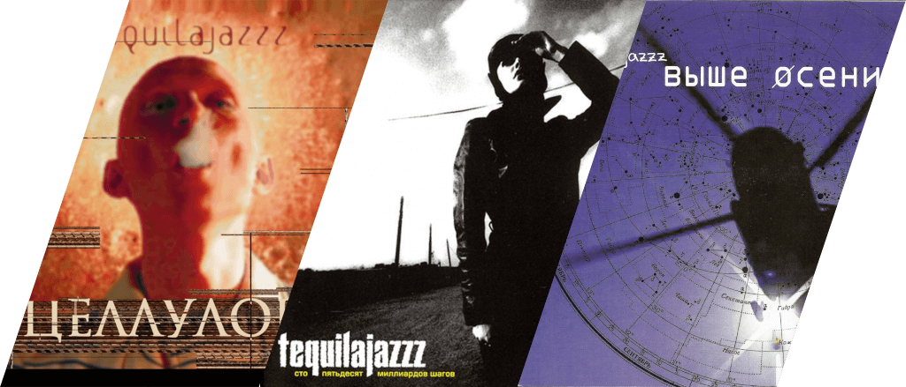
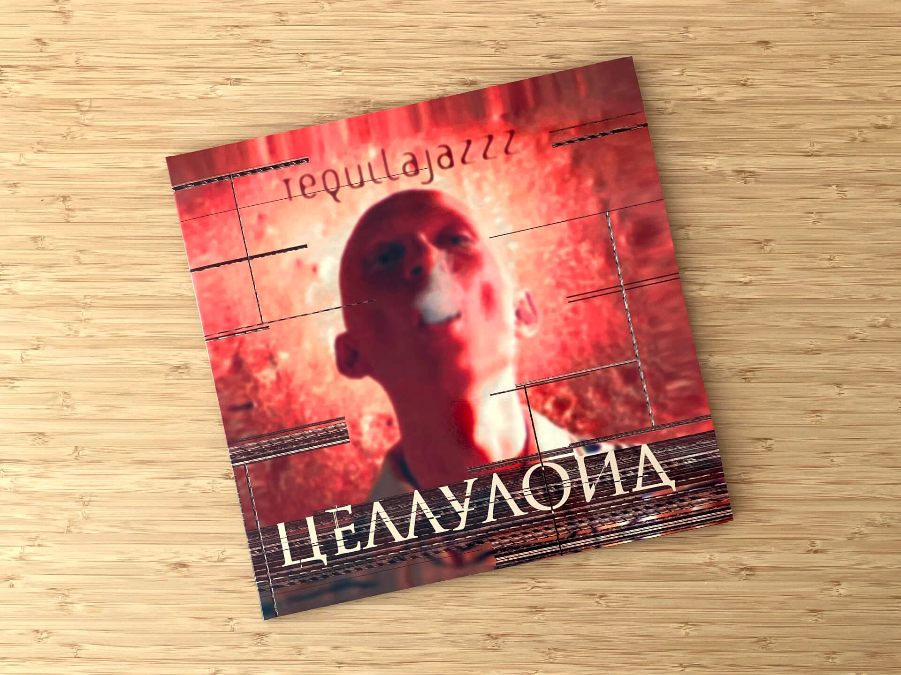
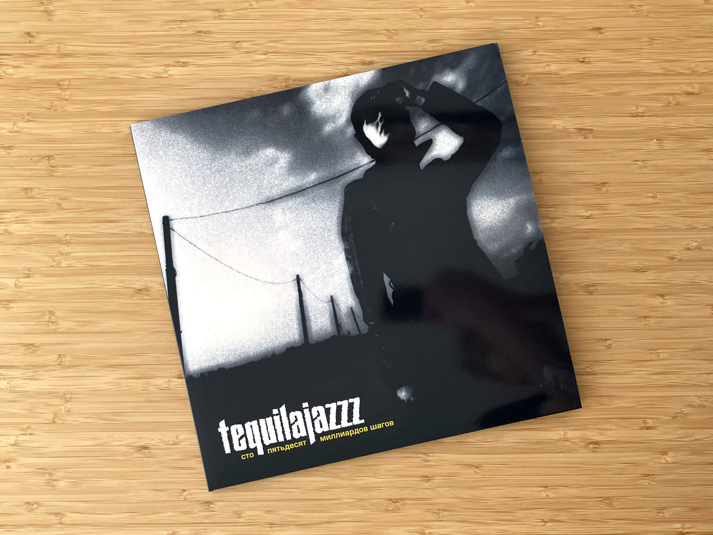
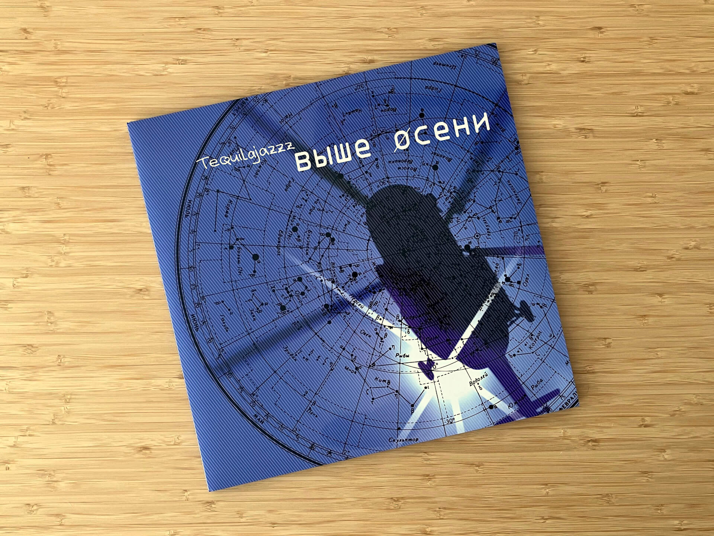

# Чего там по текиле? Спецвыпуск от июля 2024

***

Этот месяц особенный сразу по нескольким причинам: во-первых, впервые за всю историю тут не будет ни одной пластинки Katatonia.
Во-вторых, пост целиком будет посвящен главной для меня русскоязычной рок-группе, — Tequilajazzz, — и главным для меня трем ее альбомам.

***

Группа Tequilajazzz родом из Санкт-Петербурга, а ее основатель Евгений Федоров — вокалист и басист, поэт, театральный деятель и вообще личность творческая и непростая.
В девяностых группа преимущественно играла альтернативный рок и хардкор, стучали громко, пели агрессивно, били больно — именно такими были их первые релизы: «Стреляли?», «Абориген», «Вирус».
При этом, по словам Федорова, хардкором интересы группы не ограничивались: музыкальные вкусы участников разнились от авант-попа до джангла, от эйсид-джаза до эмбиента.

Результатом этого поиска и стал «Целлулоид» — первый альбомом Tequilajazzz, сделанный «больше для себя» и тяготеющий скорее к арт- и экспериментального року, нежели к жесткому и суровому хардкору.
Отход от клише альтернативного рока, с одной стороны, помог в краткосрочной перспективе расширить аудиторию как в России, так и за ее пределами, но многие старые фанаты остались недовольны и обвинили группу в том, что они «опопсели», «скатились» и «продались».

Об особой значимости «Целлулоида» для меня я писал в Телеграм-канале [три года назад](https://t.me/misha_talks/7), и с той поры мое мнение не изменилось ни на йоту:

> «Целлулоид» Tequilajazzz имеет для меня особое значение. 
> Это «комфортный» альбом, который я слушаю и когда грустно, и когда весело, и чтобы работалось лучше, и на отдыхе.
> «В ожидании праздника», открывающий трек с этой пластинки создает то самое настроение волнительного ожидания всего хорошего, что настанет потом.

<iframe src="https://www.youtube-nocookie.com/embed/cqmv3P6o8lk?si=5e19FUV2FkSdEI-U"></iframe>

Tequilajazzz же этот альбом подарил чувство свободы, которое оказалось настолько невероятно велико, что уже под конец работы над ним было предчувствие, что тематически всё в него уместить не получится.

Спиритуалистическая и мистическая атмосфера «Целлулоида» получила свое развитие на следующей пластинке — «150 миллиардов шагов», после которой окончательно сформировалась концепция альбома-трилогии.

«150 миллиардов шагов» — личное творение конкретно Евгения Федорова.
Он целиком посвящен его истории влюбленности в девушку, которую он встретил на гастролях в США и их романтическим отношениям на расстоянии.

Весь альбом, по словам Федорова, это попытка описать состояние, когда ты телом находишься в Санкт-Петербурге, а душой — где-то там, за океаном:

<iframe src="https://www.youtube-nocookie.com/embed/p2T4aYN9V40?si=KAqjNQA2BIzoQB9R"></iframe>

Заканчивается альбом прозаическим монологом, в котором раскрывается суть названия альбома, и одновременно задается подводка к следующему альбому.

«Выше осени» замыкает трилогию и одновременно зацикливает ее не просто на «Целлулоид», а на тот самый первый трек, с которого все началось:

<iframe src="https://www.youtube-nocookie.com/embed/F7CEdoOK8PI?si=WFTiXnezHxBv-Zab"></iframe>

Под конец альбома звучат «Водка-мандарины», «Зима» и «Кататься» (еще одна петля внутри трилогии, которая повторяет «Пароль», первый трек с «Выше осени»).
Неужели праздником, которого слушатель ждал четыре года между началом и завершением трилогии был всего-навсего Новый год?
Может ли эта спиритуалистическая история закончиться так прозаично?

Может, я что-то упускаю, а может, это непростая личность Евгений Федоров хитро подмигивает слушателю.

## Источники

Многое для этого поста я почерпнул из подкаста Медузы и лидера Tequilajazzz «Кроме звезд».
Рекомендую послушать его целиком, там есть немало баек про музыку в девяностые, личных размышлений и почти полчаса разговоров о любимой и важной музыке:

<iframe src="https://castbox.fm/app/castbox/player/id5643597/id654847185?v=8.22.11&autoplay=0" style="min-height: 500px;"></iframe>
