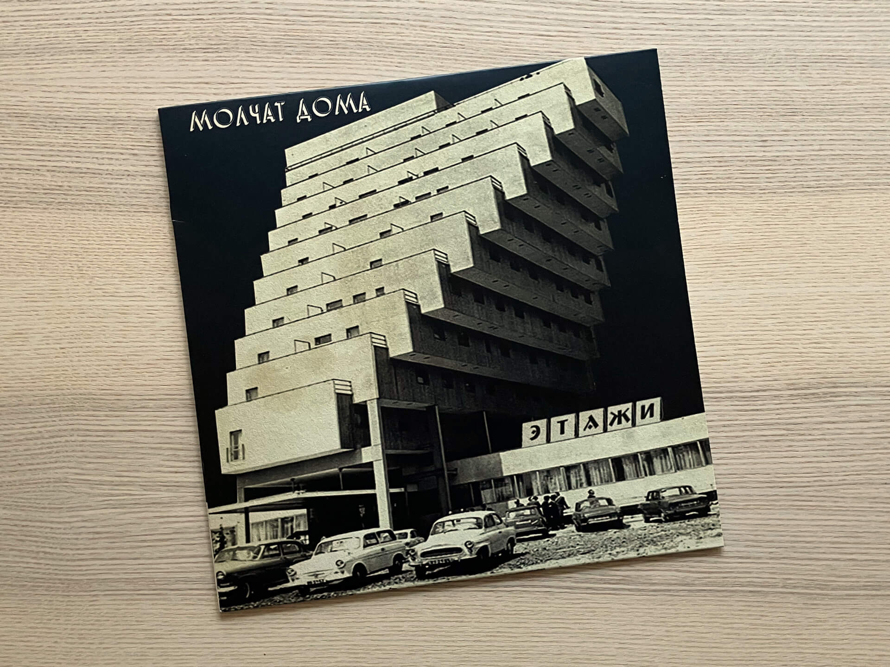
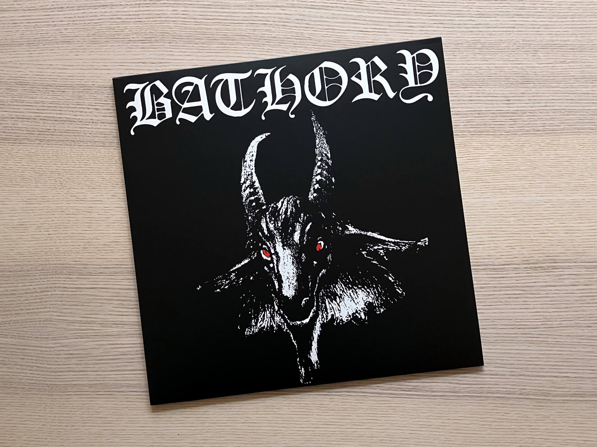

# Чего там по винилу? Отчет за ноябрь 2024

***

Винилопостинг возвращается после долгого перерыва, вызванного просмотром и прохождением Deus Ex, лечением депрессии, осенними походами по шведским лесным красотам, пригоранием от Catherine: Full Body и совершенным отвалом жопы от второго Alan Wake.

***

## Молчат дома — Этажи

«Этажи», по моему мнению, на сегодняшний день — последний альбом группы «Молчат дома».
«Монумент» и «Белая полоса» — вот совсем уже не то, слишком напевно, слишком мелодично, слишком качественно.
«Этажи» в этом плане все еще выдерживают нормальный баланс ударки из бочки, тун-дун баса и холодного бездушного кассетного звука.

Релиз от тех же [пыльных мракобесов](https://torunar.github.io/2024/02/29/vinyl-report/), что и «С крыш наших домов», так что пластинку можно прямиком из конверта сразу в мойку загружать.

Я кстати на их концерт в Копенгагене сходил, почитайте об этом в Телеге: [t.me/misha_talks/185](https://t.me/misha_talks/185?single).

## Bathory — Bathory

Общепринятое мнение о блэк-метале гласит, что жанр начался с одноименного релиза группы Venom 1982-го года.

Спустя два года Bathory успешно подрезали у Venom формат сатанинской вечеринки, добавили больше грязи, свиста, некромантии и черной магии.
Получилось по-домашнему уютно: будто собрались с друзьями теплым осенним вечерком в лесополосе, жжете палки, жарите маршмеллоу и орете в сумерках нетленные труды Егора Летова.

Занятный факт об альбоме, который я узнал из документалки [Hård rock på export](https://www.svtplay.se/hard-rock-pa-export-1): всю графику для обложки участники группы собирали из книг, которые они нашли в местной библиотеке, голова козла была иллюстрацией в какой-то книге о ведьмах, а готические буквы вырезали из каталога шрифтов.

## Lana Del Rey — Born to Die

Главный релиз всех стран, времен и народов.  
На двух винилах.  
С бонусными треками.  
С Summertime Sadness'ом.  
Вы только посмотрите, какая тут красота на развороте конверта:

Born to Die — странный сосед для Bathory, но как и грязный свистящий релиз из 80-х, этот томный сахарный барокко-поп (этот жанр не я придумал, спросите у Википедии) — максимально комфортный и ламповый для меня.
Критики и музыкальные издания ругали этот альбом за неоригинальность, фальшивость, скучность, а на Метакритике у него что-то в районе 60%, но как по мне, и с культурным влиянием, и с проверкой временем у Born to Die все хорошо.
На Summertime Sadness даже спустя восемь лет после релиза делали [необычные каверы](https://www.youtube.com/watch?v=VSewYsf3uDs), а Tiamat почти сразу после релиза альбома записали [свои версии](https://www.discogs.com/release/4492741-Tiamat-Born-To-Die) двух треков с него.

Ну и да, на этой картинке я — с обеих сторон:

