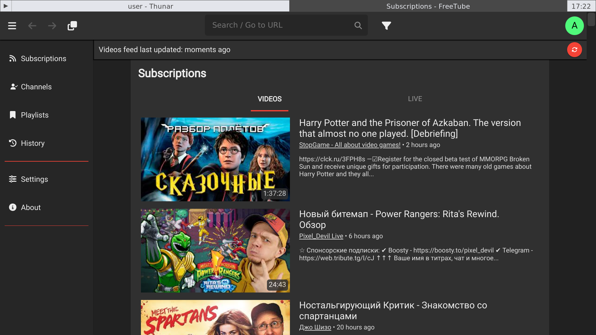

# Медиа-бокс из Raspbery Pi 4

***

Произошла классическая ситуация — программист дорвался до самого популярного одноплатного компьютера, и тут все как заверте...

***


Раньше для просмотра YouTube и сериалов с жесткого у меня к телевизору был подключен старый MacBook.
Рабочее решение, но есть несколько нюансов:

* Многовато шума: при просмотре видео разделочная доска идет на взлет.
* Ноутбук в доме один, поэтому одновременно играть в Half-Life 2 и что-то смотреть не получится.
* Хотя почти вся периферия (HDMI-кабель, колонки, зарядка) и подключена через Apple'овский хаб, приходится перетыкать несколько проводов, если ноут нужно куда-то отнести.

В общем, в какой-то момент я захотел замутить медиа-бокс, который будет воткнут в телевизор 24/7 чисто для просмотра видосов.
На местном аукционе получилось перехватить Raspberry Pi 4B с 8 ГБ ОЗУ процентов на 30% дешевле новой, и я засел красноглазить.

## Настройка

Первым делом я отформатировал первую попавшуюся под руку microSD карту и накатил на нее образ 64-битной Raspberry Pi OS Lite (бывший Raspbian).
Многократные попытки сделать загрузочную карту через Raspberry Pi Imager закончились провалом, поэтому просто использовал `dd`:

    $ wget https://downloads.raspberrypi.com/raspios_lite_arm64/images/raspios_lite_arm64-2024-11-19/2024-11-19-raspios-bookworm-arm64-lite.img.xz
    $ unxz 2024-11-19-raspios-bookworm-arm64-lite.img.xz
    $ dd -if=2024-11-19-raspios-bookworm-arm64-lite.img -of=/dev/mmcblk0

После загрузки с карты попал в голую консоль, через `raspi-config` настроил дату и время, подключился к Wi-Fi и включил вход в систему без логина.
Затем через `apt` скачал обновления, накатил `xinit`, установил Fluxbox как среду рабочего стола.
В `~/.xinitrc` прописал:

    if [ -f ~/.Xresources ]; then
        xrdb -merge ~/.Xresources
    fi
    startfluxbox

В `~/.bashrc` добавил:

    if [[ -z $DISPLAY && $XDG_VTNR -eq 1 ]]; then
        exec startx
    fi

Коробка подключена к телевизору с экраном 40" и разрешением 1920х1080.
С дивана в полутора метрах от телевизора интерфейс мелковат, поэтому сделал [отдельную тему](https://github.com/torunar/raspberry-pi-media-box/blob/master/.fluxbox/styles/TV/theme.cfg) для Fluxbox и настроил масштабирование для GTK и QT приложений в `~/.bashrc`:

    export GDK_SCALE=2
    export QT_SCALE_FACTOR=2
    
По мелочи еще подкрутил меню, автозапуск, все это тоже в репозитории можно посмотреть: [torunar/raspberry-pi-media-box](https://github.com/torunar/raspberry-pi-media-box/blob/master/.fluxbox/).

Для просмотра YouTube установил клиент [FreeTube](https://freetubeapp.io/), которым до этого пользовался на Windows, а для кино и сериалов взял VLC, потому что в нем есть ряд хаков для нормальной производительности на RPi.
Как файловый менеджер выбрал привычный Thunar; экранная клавиатура — легковесная `matchbox-keyboard`.

Я уже года два живу с колонками Logitech Z407.
Киллер-фича, из-за которой я их в свое время купил, — это работа сразу с тремя источниками: AUX (в него воткнут проигрыватель), Bluetooh (для подключения телефона с каким-нибудь Apple Music) и USB (воткнут в компьютер).
Для управления колонкой в комплекте идет «шайба»: с нее и источники можно менять, и громкостью рулить, и треки переключать.
RPi без проблем подхватил USB аудиоустройство, я только назначил его по умолчанию в `raspi-config`.
И хоть переключение паузы при нажатии на «шайбу» заработало в VLC из коробки, системная громкость при повороте «шайбы» не менялась.
Установил `volumeicon`, настроил в нем отображение уровня громкости при изменении.

Как все это выглядит в сборе:

<span class="gallery-2">
[](./img/desktop.png)
[](./img/terminal.png)
</span>

<span class="gallery-2">
[](./img/files.png)
[](./img/freetube.png)
</span>

## Косяки

Как известно, Linux, Linux never changes, поэтому *искаропке* заработало не все.
Часть проблем удалось если не решить, то обойти, часть остаются как есть.

RPi не подключается к Wi-Fi, если роутер выбирает *какой-то не тот* канал автоматически.
Подозреваю, что это как-то связано с региональными ограничениями по беспроводным каналам в разных странах.
Откровенно лень было разбираться с этим каждый раз, поэтому временно прибил гвоздями в настройках роутера один канал, с которым все работает.
Фу-фу.

Другая проблема — не подключалась по Bluetooth мышь Mi Silent Mouse.
Любые попытки спарить мышь с коробкой через `bluetoothctl` выдавали один и тот же результат:

    Attempting to pair with [mac address]
    [CHG] Device [mac address] Connected: yes
    Failed to pair: org.bluez.Error.[всякие типы ошибок]
    [CHG] Device [mac address] Connected: no

Не уверен, есть ли эта проблема из коробки в Raspbian, или это я что-то сломал, но стандартный пользователь не добавлен в группу `bluetooth`, которая, согласно политикам безопасности демона Bluetooth, дает к нему доступ. Через usermod добавился в нее, перезагрузился — и смог наконец подключить мышь:

```
usermod -a -G bluetooth user
```
    
Самая большая беда — Freetube почти не тянет видео в 1080p: аппаратной поддержки кодеков, которыми YouTube кодирует свою залупу, в RPi нет.
Проблема якобы как-то решена в LibreElec, Kodi и VLC, но я пока остановился на грустном смотрении в 720p.

## Что дальше

А собственно, на этом все.

Несмотря на реально гнилую карту памяти, с которой все запущено, работает система шустро (что логично, карта же в основном при старте системы используется), но при желании можно накатить Alpine и посмотреть, что будет в нем.
Если не найду решения для тормозящего YouTube, то попробую бахнуть LibreELEC, который позиционируется как ультимативное решение для медиа, и проверю, как обстоят дела в нем.
