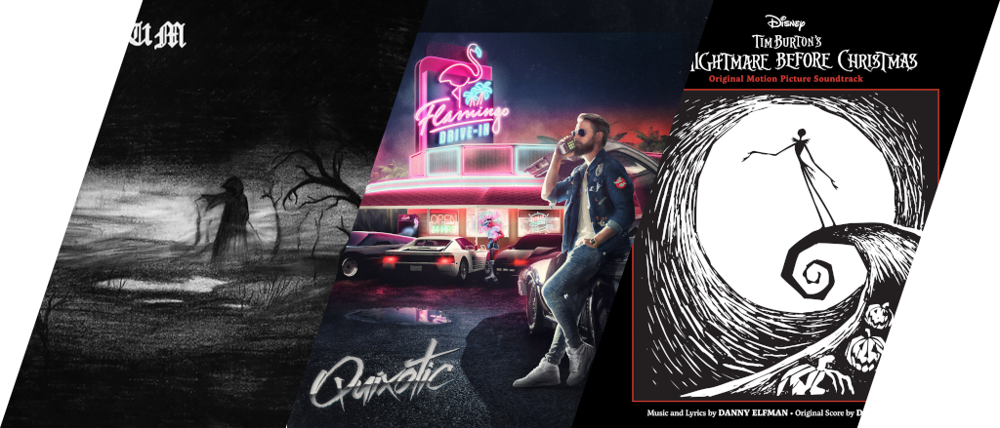
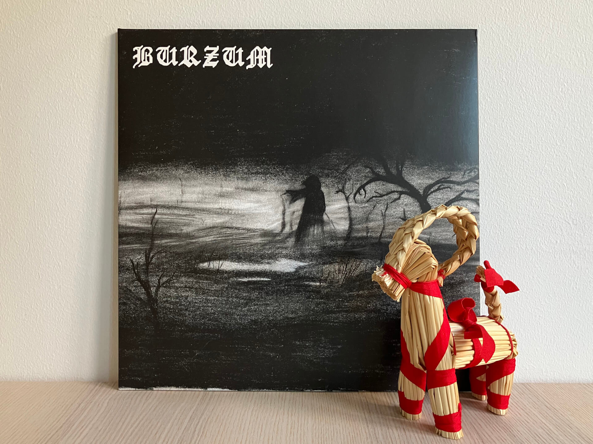
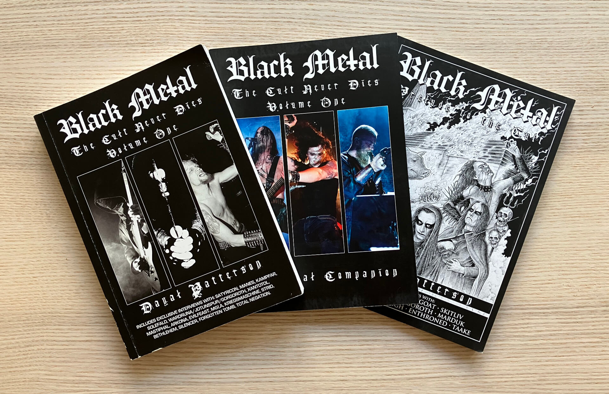
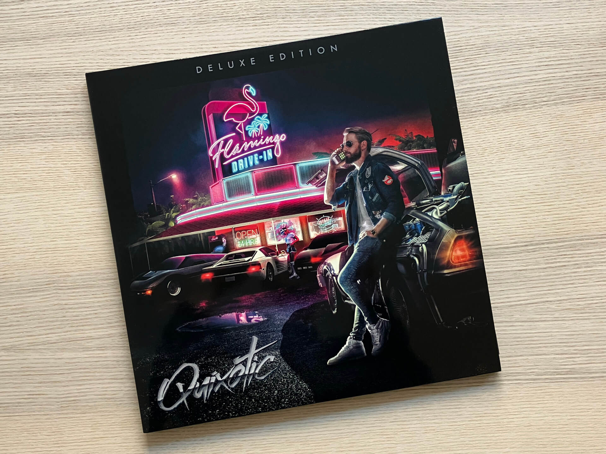
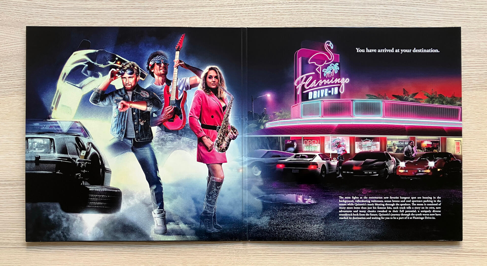
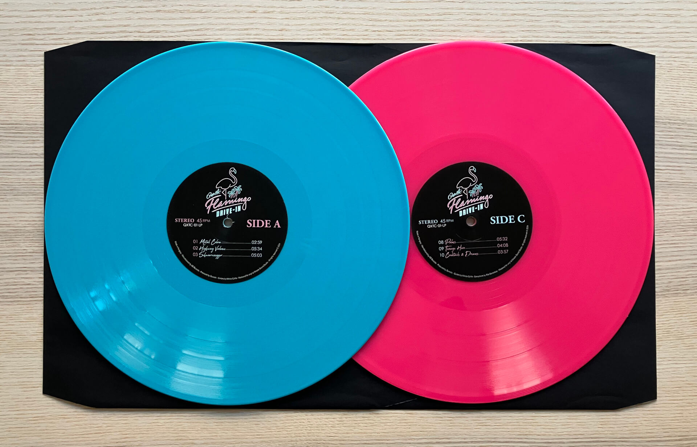
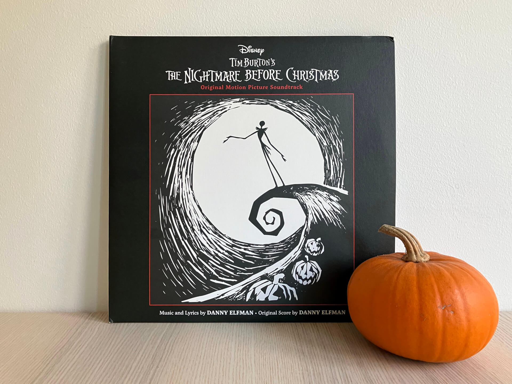

# Чего там по винилу? Рождественский спецвыпуск

***

***

Рождество — праздник, выпадающий плюс-минус на день зимнего солнцестояния, когда ночь самая длинная и самая темная.
Ничего удивительного, что большинство рождественских традиций так или иначе связаны с теплом и светом — ведь именно этого хочется больше всего, когда на улице холод и темень кромешная.
Все эти свечки, елки с гирляндами, уютные свитеры и горячие семейные ужины служат одной цели — дать отпор злобным потусторонним ебакам, что шарахаются там за окном во тьме и так и норовят залезть в избу через щель в окне.

В Мальме настоящей шведской зимой даже и не пахнет — слишком тепло для снега, по полдня льет дождь, а за окном — сплошные пятьдесят оттенков серого.
Зимой любой источник тепла и света на вес золота, поэтому и пластинки для сегодняшнего спецвыпуска выбраны соответствующие.

## Burzum — Burzum

Кристиан «Варг» Викернес aka Burzum на своем опыте познал, что только та церковь несет свет и тепло, что горит.
Раз уж «Крепкий орешек» считается рождественским фильмом, то и творчество Burzum можно считать рождественской музыкой: и трепетное отношение к христианской церкви, и традиционные верования в нем замешаны в правильных пропорциях.

И хотя Варг отбит наглухо, неприятен во многих аспектах и потерял в какой-то момент связь с реальностью, Burzum стал для меня в свое время, что называется, baby's first black metal, поэтому в отношении этого альбома я испытываю синдром утенка и кайфую с него каждый раз.
Пойду, пожалуй, завернусь в чорный плед, налью себе чорный чай и буду читать книжки про чорный метал, которые я откладывал до этого чорного дня:

## Quixotic — Flamingo Drive-In

Если ближайшая к вам церковь сделана из камня или тюрьмы в вашем регионе не настолько комфортабельны, как в Северной Европе, приходится искать другие источники тепла и света.
Некоторые люди уезжают на зиму в теплые края, где пальмы, яхты, томный лоск ночных пляжных вечеринок, коктейли и никакого снега, который нужно перекапывать каждый день, чтобы добраться до своей машины.

В 2019 году мы с Машей жили и горели синтвейвом, поэтому когда [SYNTHWAVE RADIO](https://vk.com/synthwave_radio) решили провести в Москве вечеринку с живой музыкой, танцами и мерчем, мы туда отправились не раздумывая.
Там-то я впервые и познакомился с Кристианом (как-то многовато Кристианов сегодня, не находите?) Миклоши, более известным как Quixotic.
В тот вечер сошлись все звезды: чилловая пульсация нео-диско, мягкие переливы фиолетового света, несколько бокалов фруктовой газировки и танцующие там и тут люди в прикидах «под 80-е».
В какой-то момент в толпу забросили несколько надувных пляжных мячей, и в зале началась та самая пляжная вечеринка.

Первый альбом Quixotic под названием Flamingo Drive-In — это квинтэссенция всего его творчества: на нем и расслабленные вайбы Palms, и оммаж на саундтреки старых боевиков Metal Cobra, и заряженный на успех Schwarzenegger.
В этом году он наконец получил лимитированное делюкс-издание на двух пластинках в модных дискотечных цветах.
Просто посмотрите на эту красоту:

## The Nightmare Before Christmas

Полагаю, не нужно объяснять, почему эта пластинка оказалась в этой подборке.
Бла-бла, пересматриваю этот мультфильм каждый год, бла-бла, Тим Бертон гений, бла-бла, каждый сам творец своего счастья.
Давайте лучше о самом издании расскажу.

Про цветной винил я уже много раз писал.
Классной полиграфией тоже никого не удивишь.
[Картонная пирамида](/2024/05/29/vinyl-report/) в конверте?
Уже интереснее, но тоже не то.
А что насчет зоотропического винила, где на поверхность диска нанесены отдельные кадры, которые при правильном просмотре складываются в коротенькую анимацию?
Такого у нас еще не было!
Зацените, как это улетно выглядит:

<video style="width: 100%" controls="controls" src="./img/the-nightmare-before-christmas-zoetrope-1.mp4"></video>
<video style="width: 100%" controls="controls" src="./img/the-nightmare-before-christmas-zoetrope-2.mp4"></video>

Важный момент: для плавного воспроизведения проигрыватель нужно переключить с 33 оборотов в минуту на 45, снять иглу с диска, потушить свет в комнате и осветить поверхность стробоскопическим светом с частотой 40 герц.
Так что слушать музыку одновременно с просмотром волшебных картинок не выйдет.
