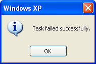

# Ratchet & Clank: språk apart

***

Прошел первую (вторую) игру на шведском.

Хвастаюсь (?)

***

Все началось с того, что мне в руки попал странный артефакт: Ratchet & Clank: Rift Apart, переведенный на языки Северной Европы: шведский, норвежский, финский и датский.
Само существование такого диска стало открытием, потому что за четыре года в Швеции я полностью смирился с тем, что на шведский ничего не переводят и не дублируют, за исключением совсем детского контента. 
Любой швед, достигший десятилетия, уже настолько хорошо знает английский, что в переводе не нуждается.
 
Почему это проблема для меня?
Потому что я, как настоящий потный геймер, учу языки, играя в игры.
Я английский учил по The Elder Scrolls, поэтому знаю, как называются разные металлы и техники выделки брони, всякие термины, связанные с боем на мечах и смешные вычурные словечки, типа whimsical или ominous.
Но вот именно со шведским, с языком, который, сука, мне нужен для жизни, это не работает.
В стране одна из крупнейших игровых индустрий в мире: Embracer, DICE, Arrowhead, Paradox, Machine Games, Mojang, — я могу перечислять названия дальше, даже не заглядывая в Википедию, — и все эти люди своего языка будто боятся и делают игры либо только на английском, либо в первую очередь на английском.
Да, шведский рынок маленький (10 миллионов человек, из них в игры играет процентов 30%), да, локализация это дорого. 
Но это не мешает CD Projekt Red делать игры на польском.
Это не мешает War Horse делать игры на чешском.
И это же не мешает, внезапно, норвежцам Hyper Games переводить свои игры про Снусмумрика на, внезапно, и шведский тоже.

За все время, что я тут живу, на шведском я прошел одну игру: простенькую адвенчурку TOEM про фотографирование зверушек и цветочков.
Сделали ее, кстати, пять чуваков из Щёвде, я все хочу как-нибудь к ним в студию в гости съездить.
В TOEM ровно ноль озвучки, весь сюжет подается текстом, на полноценное погружение в язык это не тянет.

Поэтому я очень удивился, что Sony решили расщедриться на локализацию Ratchet & Clank.
Видимо, игру посчитали достаточно детской, а о детях Sony заботятся, ведь дети сегодня — это потенциальные покупатели подписок завтра, их нужно брать и конвертировать в клиентов.
Раз это дает мне возможность побыть потным геймером на шведском — ей нужно пользоваться.
Тем более, что свой шведский после окончания курсов я почти никак не использовал, так что любая практика пойдет на пользу.
Да?

Сначала о главном: игру я прошел, сюжет в целом понял, в словарь особо не заглядывал (об этом дальше).
Но это не я умный, это в основном заслуга того, как Rift Apart себя подает: катсцены в игре по большей части не требуют особого знания языка. 
Поначалу было сложно играть больше часа-двух, мозг пух от количества информации, а жопа горела от fear of missing out, был огромный соблазн переключиться на английский, но я себя бил по рукам.

Сильно кайфануть, конечно, не вышло, и причин тому несколько, но ни одна из них не связана ни с геймплеем, ни с сюжетом, все касаются только локализации.

Во-первых, тайминги диалогов в катсценах фиксированные, но длина фраз в шведском и английском очень сильно различается.
Большую часть времени шведский сильно длиннее, поэтому актерам приходится торопиться, чтобы влезать в тайминги.
В итоге слова сливаются вместе еще сильнее обычного, страдает четкость речи.

Во-вторых, весь дубляж будто бы делали силами всего четырех актеров, которым приходилось очень театрально <del>пыжиться</del> играть голосом, а где не вывозили — голоса примачивали фильтрами.
Все эти фильтры прекращают звук в такую кашу, что даже Маша, которая уже очень хорошо понимает речь на слух, призналась, что ни фига не разумеет.

Естественно, я играл в наушниках, с выключенными музыкой и эффектами, чтобы они не отвлекали от речи.
Естественно, я играл со включенными субтитрами, чтобы подглядывать в них тогда, когда что-то не понимал на слух (почти всегда).
И тут мы подходим ко «в-третьих»: в-третьих, в шведском большинство новых не заимствованных слов образуются через sammansättning, то есть склейку существующих слов.
Знаете, как по-шведски будет «сопротивление»?
Motståndsrörelse! (mot — против, stånd — стоять, rörelse — движение, то бишь, «движение противостояния»). 
Если в предложении встречаются два-три таких слова, то они занимают обе строки титров и показываются на экране лишь на мгновение.
За то время, что я слышу какое-то «гырглггырглггырглг», вижу в титрах gyrgålgyrgålgyrgål, ставлю игру на паузу, разблокирую телефон и открываю переводчик, чтобы посмотреть, что это вообще значит, я уже тысячу раз забыл, что там было написано, а подсмотреть обратно уже не могу, потому что меню паузы перекрывает весь экран.

Еще одна проблема, которая кусает меня за жопу еще со времен GTA V — экспозиция во время экшена.
У тебя напряженная погоня? Тебе ссут в уши.
Ты прыгаешь между укрытиями, чтобы не словить маслину? Тебе объясняют детали текущего квеста.
Ты бегаешь электровеником в поисках аптечки, а экран пульсиует в тебя брусничным джемом? Давай я тебе расскажу предысторию персонажа.
И вот экшон заканчивается, я потираю ладошки: ну вот, начало я пропустил, но сейчас хотя бы концовку дочитаю — а концовки-то, как и ног у Буббы, нет.

Вот, собственно, и все.
За те четыре дня, что я играл, я понял, что для комфортного прохождения мне нужны:

1. Пауза в катсценах, которая не скрывает картинку с экрана. В какой-то игре я даже такое видел, но не могу вспомнить, в какой.
2. Продвижение катсцены только по кнопке (X). Да, это сломает динамику и режиссуру, но кому не насрать?
3. История диалогов, которую можно промотать и посмотреть, кто там чего сказал. Такое точно было то ли в Yakuza, то ли в Judgment.

Вывод: с моим текущим навыком мне светит играть только в вижуал новелы.
А знаете, сколько вижуал новел переведено хотя бы текстом на шведский?
А знаете, сколько вижуал новел еще и продублировано на шведском?
Игорь тонет, короче.

Надо качать навык слушанья на чем-то другом, те же новости и документалки хотя бы фоном слушать.
